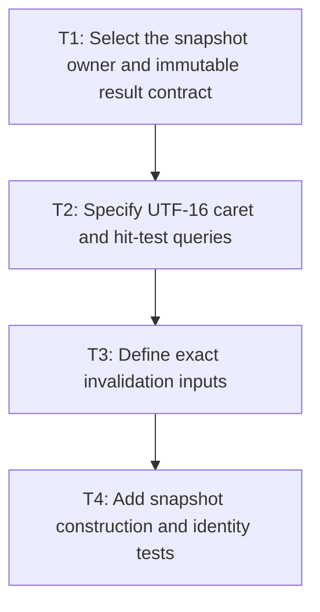

# P1: Define snapshot ownership and invalidation

## Goal

Define a core-owned immutable editable-control text snapshot and exact naturally bounded invalidation contract.

## Non-Goals

- Integrating all renderer/event consumers in this phase.
- Retaining snapshot histories or introducing a global control-layout cache.

## Context

- Parent milestone: `docs/work/E5/M4 - Share immutable editable-control text snapshots.md`.
- Renderer and event code both need line, run, caret, hit-test, and extent data without a core NanoVG dependency.

## Phase Tasks

### T1: Select the snapshot owner and immutable result contract
**Purpose:** Make one result reachable to rendering and event behavior through core boundaries.

**Depends on:** M2/P3/T4.
**Enables:** T2.
**Parallelizable with:** None.

**Changes:**
- [ ] Compare control-node ownership with a core control-text service and record the narrowest viable owner.
- [ ] Define immutable value, typography, lines/ranges/runs, content extents, and cumulative caret boundaries.

**Acceptance Checks:**
- [ ] Input, textarea, behavior, viewport, and backend code can query the owner without core depending on NanoVG.
- [ ] Each control retains at most its current snapshot or a naturally bounded equivalent.

**Risks:** Stop if ownership requires renderer state or hidden global control identity maps.

### T2: Specify UTF-16 caret and hit-test queries
**Purpose:** Ensure all consumers use one code-point-safe geometry result.

**Depends on:** T1.
**Enables:** T3.
**Parallelizable with:** None.

**Changes:**
- [ ] Define line lookup, index-to-caret, point-to-index, line start/end, vertical movement, and prefix width queries.
- [ ] Specify explicit newline, wrapped boundary, half-advance, fallback, and replacement-marker behavior.

**Acceptance Checks:**
- [ ] Queries return only valid UTF-16 boundaries and match M2/current control fixtures.
- [ ] Queries perform no full-value or prefix-substring remeasurement after snapshot creation.

**Risks:** Preserve current caret semantics; grapheme editing remains out of scope.

### T3: Define exact invalidation inputs
**Purpose:** Separate text layout identity from presentation and viewport state.

**Depends on:** T2.
**Enables:** T4.
**Parallelizable with:** None.

**Changes:**
- [ ] Invalidate for exact value, typography values, and font-registry generation changes.
- [ ] Add textarea content width and wrapping policy; explicitly exclude caret, selection, focus, color, scroll, and unchanged frames.

**Acceptance Checks:**
- [ ] A mutation table covers every input/control state field and expected reuse/rebuild result.
- [ ] Keys use immutable values, not mutable `ResolvedStyle` identity.

**Risks:** M6 introduces the font generation; define an injectable/version boundary now without adding stale reuse.

### T4: Add snapshot construction and identity tests
**Purpose:** Prove the contract before consumers migrate.

**Depends on:** T3.
**Enables:** M4/P2, M4/P3.
**Parallelizable with:** None.

**Changes:**
- [ ] Build snapshot fixtures for single-line/multiline, wrapping, fallback, supplementary text, and empty values.
- [ ] Add identity/build-count assertions for invalidating and non-invalidating transitions.

**Acceptance Checks:**
- [ ] Snapshot structure matches current control metrics and M2 results.
- [ ] Repeated edits/resizes replace the current result without history growth.

**Risks:** Keep temporary test construction helpers out of public API unless consumers require them.

## Verification Strategy

- Run `./gradlew :spinygui.core:test --tests '*TextInput*' --tests '*Textarea*' --tests '*MultilineTextControlMetricsTest' --tests '*FontServiceImplTest'`.

## Review Boundaries

- Review ownership/API, query semantics, invalidation table, and construction tests separately.

## Deferred Work

- Consumer migrations belong to P2/P3; persistent general caches belong to M6.

## Dependency Graph

