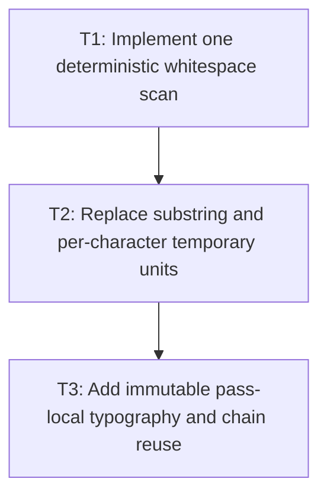

# P2: Implement Single-Pass Preparation and Pass-Local Reuse

**Status:** Complete

## Goal

Produce prepared text, ranges, and mappings in one deterministic scan, eliminate temporary
substring/per-UTF-16-character units, and reuse immutable typography/font chains within one UI-thread
layout pass.

## Non-Goals

- Persisting prepared values beyond the pass; M7 owns bounded persistence.
- Changing durable fragment output or coalescing fragments.

## Context

- Parent milestone: `docs/work/E5/M4 - Prepare inline text with ranges and code points.md`.
- Phase entry gate: M4/P1 mappings/ranges/fragment fixtures and M3/P2 central resolver/mutation
  ownership are complete.
- Registry mutation is prohibited during a UI-thread pass by M3, allowing coherent pass-local chain
  values without concurrent invalidation.

## Phase Tasks

### T1: Implement one deterministic whitespace scan
**Purpose:** Replace chained replacement/regex passes with one append-only prepared builder and source
mapping construction.

**Depends on:** None.
**Enables:** T2.
**Parallelizable with:** None.

**Changes:**
- [x] Scan source code points once and apply approved CR/LF, tab expansion, form-feed, vertical-tab,
  collapse/preserve, and forced-break behavior while appending prepared text/range mapping metadata.
- [x] Represent collapsed/expanded source spans explicitly and preserve all P1 forward/reverse
  boundary rules.
- [x] Add normalization-scan/builder-append/freeze counters and freeze immutable prepared output once.

**Acceptance Checks:**
- [x] Every whitespace policy fixture reports one source normalization scan and exact prepared text/
  mappings.
- [x] Supplementary code points remain atomic and no regex/replacement pass rescans prepared output.

**Risks / Stop Criteria:** Stop if source must be rescanned to repair mappings or if builder freeze
copies growing prefixes repeatedly.

### T2: Replace substring and per-character temporary units
**Purpose:** Make inline work reference prepared ranges and M2's range-aware measurement boundary.

**Depends on:** T1.
**Enables:** T3.
**Parallelizable with:** None.

**Changes:**
- [x] Construct text/space/break/spacer/atomic units as ranges over the immutable prepared value.
- [x] Update splitting/deferred-wrap helpers to produce validated code-point-safe subranges rather
  than `substring` or one-unit-per-UTF-16-char objects.
- [x] Measure ranges through M2's internal range-aware overload/adapter without allocating a
  temporary `String`; materialize exactly one `String` only for each preserved text-bearing fragment
  that requires one, and zero for null-text spacer, element, or union fragments.
- [x] Count measurement-range calls, result reuse, temporary measurement materializations, and durable
  fragment materializations separately.

**Acceptance Checks:**
- [x] Break-all/preserved-space fixtures do not allocate one temporary unit/string per UTF-16 code
  unit.
- [x] All split boundaries validate against P1 mappings and M2 surrogate/replacement rules.
- [x] Many compatible measured ranges allocate zero temporary measurement strings; durable `String`
  materialization count equals the preserved text-bearing fragment subset, is zero for null-text
  spacer/element/union fragments, and never follows code-point/range count.

**Risks / Stop Criteria:** Stop if allocation is merely moved to hidden range-to-string conversion
inside every operation.

### T3: Add immutable pass-local typography and chain reuse
**Purpose:** Avoid repeated effective typography and resolver work among compatible units without
introducing persistent cache ownership.

**Depends on:** T2.
**Enables:** None.
**Parallelizable with:** None.

**Changes:**
- [x] Define immutable value keys for effective family list/style/weight/stretch, font size, line
  height, color where relevant to output, and measurement configuration inside one pass.
- [x] Resolve/reuse typography/font-chain values through M3's central owner while the pass generation
  is fixed; never key by mutable `ResolvedStyle` identity.
- [x] Restore pass-local measurement-result reuse for compatible source ranges/effective typography/
  measurement configuration so collection/wrap stages do not repeat equivalent range calls.
- [x] Clear/drop pass-local maps/builders at pass completion/failure and count chain resolutions.

**Acceptance Checks:**
- [x] Equal immutable typography inputs resolve once per pass; changed value inputs do not alias.
- [x] Compatible range measurements reuse one result/call as declared; changed source range,
  typography, configuration, or generation does not alias.
- [x] No pass-local entry survives into another layout pass or accepts registry mutation mid-pass.

**Risks / Stop Criteria:** Stop if reuse depends on object identity, crosses a pass, or adds a second
resolver owner.

## Verification Strategy

- Run `./gradlew :spinygui.core:test --tests 'com.spinyowl.spinygui.core.layout.impl.InlineWhitespaceTest'`.
- Run `./gradlew :spinygui.core:test --tests 'com.spinyowl.spinygui.core.layout.impl.InlineFormattingContextTest'`.
- Run `./gradlew :spinygui.core:test --tests 'com.spinyowl.spinygui.core.system.font.FontChainResolverTest'`.

## Review Boundaries

- Review scanner/mappings, then range-unit migration, then pass-local reuse.

## Deferred Work

- Full `InlineFormattingContext` integration and allocation proof belong to P3.
- Persistent prepared-node reuse belongs to M7/P4.

## Dependency Graph

