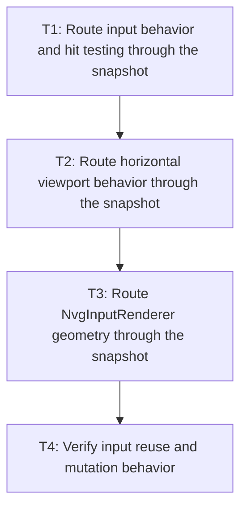

# P2: Route single-line input consumers through snapshots

## Goal

Use one immutable snapshot for input rendering, caret/selection geometry, hit testing, and viewport behavior.

## Non-Goals

- Textarea integration.
- Changing input editing or scrolling semantics.

## Context

- Parent milestone: `docs/work/E5/M4 - Share immutable editable-control text snapshots.md`.
- `NvgInputRenderer` currently measures the full value and prefix substrings during each render.

## Phase Tasks

### T1: Route input behavior and hit testing through the snapshot
**Purpose:** Give event behavior the same UTF-16-safe geometry used by rendering.

**Depends on:** M4/P1/T4.
**Enables:** T2.
**Parallelizable with:** M4/P3/T1 after the P1 contract is stable.

**Changes:**
- [ ] Replace compatible caret/index/prefix queries in input behavior with snapshot queries.
- [ ] Preserve keyboard/mouse selection, fallback, supplementary, and replacement behavior.

**Acceptance Checks:**
- [ ] Hit-test and caret indexes/positions match existing `TextInputBehaviorTest` coverage.
- [ ] Snapshot-backed queries do not call substring measurement.

**Risks:** Do not combine control editing state with snapshot invalidation state.

### T2: Route horizontal viewport behavior through the snapshot
**Purpose:** Reuse content extents and caret advances for scrolling decisions.

**Depends on:** T1.
**Enables:** T3.
**Parallelizable with:** None.

**Changes:**
- [ ] Replace full/prefix measurement in `TextInputViewportBehavior` with snapshot extent/caret queries.
- [ ] Preserve scroll clamping and button/non-text input distinctions.

**Acceptance Checks:**
- [ ] Existing viewport tests preserve scroll offsets across edits, caret movement, and resize.
- [ ] Scroll-only changes reuse the same snapshot.

**Risks:** Presentation width/box changes may affect viewport but must not invalidate single-line text metrics unnecessarily.

### T3: Route `NvgInputRenderer` geometry through the snapshot
**Purpose:** Eliminate render-time full-value and prefix remeasurement.

**Depends on:** T2.
**Enables:** T4.
**Parallelizable with:** None.

**Changes:**
- [ ] Source lines/runs, baseline, selection extents, and caret x from the current snapshot.
- [ ] Preserve button-input fallback, clipping, presented color/opacity, scroll, and draw order.

**Acceptance Checks:**
- [ ] Recording-sink operations and pixels remain equivalent.
- [ ] A rendered frame with a valid snapshot performs zero complete input layouts.

**Risks:** Keep NanoVG-specific color/clip state outside the core snapshot.

### T4: Verify input reuse and mutation behavior
**Purpose:** Complete the single-line integration with deterministic counts.

**Depends on:** T3.
**Enables:** M4/P4.
**Parallelizable with:** None.

**Changes:**
- [ ] Exercise unchanged, caret, selection, focus, color, scroll, value, typography, and font-generation scenarios.
- [ ] Confirm current-snapshot replacement under repeated edits.

**Acceptance Checks:**
- [ ] Only value/typography/font generation rebuild input snapshots.
- [ ] Build/layout counters and compatibility tests agree across behavior and renderer consumers.

**Risks:** None identified.

## Verification Strategy

- Run `./gradlew :spinygui.core:test --tests '*TextInputBehaviorTest' --tests '*TextInputViewportBehaviorTest'`.
- Run `./gradlew :spinygui.core.backend.lwjgl.nanovg:test --tests '*NvgInputRendererTest'`.

## Review Boundaries

- Review behavior, viewport, and renderer migrations separately; each must retain existing tests.

## Deferred Work

- Shared renderer staging belongs to M5; general caches belong to M6.

## Dependency Graph

