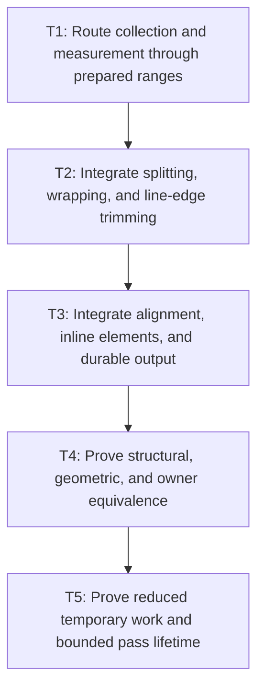

# P3: Integrate Ranges and Prove Durable-Fragment Compatibility

## Goal

Route inline measurement, wrapping, alignment, and fragment creation through prepared ranges and
prove reduced temporary work with unchanged durable fragment structure and owner identity.

## Non-Goals

- Eliminating durable fragment strings/runs or changing fragment count.
- Persisting full inline fragments or retained layout results.

## Context

- Parent milestone: `docs/work/E5/M4 - Prepare inline text with ranges and code points.md`.
- Phase entry gate: M4/P2 scanner/ranges/pass-local reuse are tested in isolation.
- M2 supplies linear resolved measurement; M1 counters distinguish normalization, resolver,
  measurement, temporary, and durable work.

## Phase Tasks

### T1: Route collection and measurement through prepared ranges
**Purpose:** Establish range/source translation and M2 measurement without changing line decisions.

**Depends on:** None.
**Enables:** T2.
**Parallelizable with:** None.

**Changes:**
- [ ] Update inline node/unit collection to retain prepared value/ranges, special-unit metadata, and
  original-node mappings without temporary substrings.
- [ ] Measure through M2's range-aware adapter and translate resolved offsets back through prepared,
  range, and original-node spaces.
- [ ] Reuse pass-local compatible-range results by exact range/effective typography/configuration/
  generation key and count calls, hits, and materializations.

**Acceptance Checks:**
- [ ] Collection/measurement fixtures cover text, spaces/breaks, atomic units, fallback/replacement,
  and supplementary code points with exact source/resolved mappings.
- [ ] Many compatible ranges produce zero temporary measurement strings and the expected bounded
  measurement-call/reuse counts.

**Risks / Stop Criteria:** Stop if collection/measurement drops source mapping or if the adapter/
reuse path materializes one string per code-point range.

### T2: Integrate splitting, wrapping, and line-edge trimming
**Purpose:** Apply line decisions to code-point-safe ranges without combining alignment/output work.

**Depends on:** T1.
**Enables:** T3.
**Parallelizable with:** None.

**Changes:**
- [ ] Convert split candidates, deferred suffixes, wrap boundaries, forced breaks, and line-edge
  whitespace trimming to prepared subranges/special units.
- [ ] Preserve M2 line-start kerning/cumulative-array semantics and all original/prepared/resolved
  offsets while ranges move between lines.
- [ ] Add structural checks immediately after line construction for range order, text coverage,
  widths, source boundaries, and no valid surrogate split.

**Acceptance Checks:**
- [ ] Normal/nowrap/pre/pre-line, break modes, narrow widths, tabs/form-feed/vertical-tab, collapse,
  fallback/replacement, and deferred suffix fixtures produce exact line ranges/widths.
- [ ] Splitting/wrapping/trimming creates no temporary measured-range string and does not repeat a
  compatible range measurement.

**Risks / Stop Criteria:** Stop if wrap/trim must infer lost source offsets or remeasure/materialize
the same compatible range.

### T3: Integrate alignment, inline elements, and durable output
**Purpose:** Apply geometry/ownership and materialize preserved fragments only after stable lines exist.

**Depends on:** T2.
**Enables:** T4.
**Parallelizable with:** None.

**Changes:**
- [ ] Integrate line alignment/baselines, inline and inline-block atomic placement, element union
  boxes, translation, and owner assignment over the line-range output from T2.
- [ ] Materialize exactly one `String` for each preserved text-bearing fragment that requires one at
  the existing output boundary, zero for null-text spacer/element/union fragments, and translate
  resolved-run offsets to fragment-local/original-node offsets.
- [ ] Add structural checks after output materialization for fragment order/count/text/geometry/runs,
  union boxes, and translation before broad compatibility comparison.

**Acceptance Checks:**
- [ ] Alignment/inline-block/translation fixtures preserve exact geometry and owner candidates without
  changing fragment count or materializing intermediate range strings.
- [ ] Measurement materialization count remains zero; durable `String` materialization equals the
  required text-bearing fragment subset and is zero for null-text spacer/element/union fragments.

**Risks / Stop Criteria:** Stop if alignment/translation changes source mappings, if inline-block work
re-enters collection/measurement, if required durable text is built other than once per text-bearing
fragment, or if a null-text fragment materializes a `String`.

### T4: Prove structural, geometric, and owner equivalence
**Purpose:** Ensure temporary allocation changes do not alter durable output.

**Depends on:** T3.
**Enables:** T5.
**Parallelizable with:** None.

**Changes:**
- [ ] Compare exact fragment count/text/x/y/size/baseline/font/color/runs for normal/nowrap/pre/pre-
  line, tabs/form-feed/vertical-tab, boundary spaces, alignment, break modes, fallback/replacement,
  and supplementary text.
- [ ] Use reference identity assertions for `InlineFragment.node`, text owners, inline element owners,
  and translated fragments; do not rely on equality that excludes `node`.
- [ ] Cover parsed nested inline/inline-block ownership and line-union boxes.

**Acceptance Checks:**
- [ ] All pre-M4 durable fixture expectations remain exact unless an M2-approved contract migration
  explicitly changes the expected source/result semantics.
- [ ] No fragment is coalesced, omitted, or reassigned to a merely equal but wrong owner.

**Risks / Stop Criteria:** Reject allocation improvements produced by fewer/different durable
fragments without a separate approved behavior change.

### T5: Prove reduced temporary work and bounded pass lifetime
**Purpose:** Validate the milestone's precise performance claim without overstating durable savings.

**Depends on:** T4.
**Enables:** None.
**Parallelizable with:** None.

**Changes:**
- [ ] Run scaled normal/collapsed/pre/tab/break-all/fallback inline workloads with counters for source
  scans, temporary units/strings/ranges, builder work, chain resolutions, range-measurement calls/
  reuse/materializations, and durable fragment/string creation.
- [ ] Verify one normalization scan, code-point-safe range traversal, value-based pass-local chain
  reuse, and pass cleanup after success/failure.
- [ ] Capture diagnostics-disabled allocation evidence separately and describe durable fragment/
  string allocations as intentionally retained.

**Acceptance Checks:**
- [ ] Temporary allocation/counts fall and scale linearly; durable fragment count and text-bearing/
  null-text `String` creation still match compatibility fixtures.
- [ ] Temporary measurement materializations remain zero, compatible-range calls are reused within
  the pass, durable strings are materialized exactly once per required text-bearing fragment, and
  null-text spacer/element/union fragments materialize zero.
- [ ] Pass-local values are unreachable/cleared after pass failure/completion and no registry mutation
  is accepted during a pass.

**Risks / Stop Criteria:** Do not claim full inline allocation elimination or retained fragment reuse;
stop if pass-local retention survives convergence/repeated layout calls.

## Verification Strategy

- Run `./gradlew :spinygui.core:test --tests 'com.spinyowl.spinygui.core.layout.impl.InlineFormattingContextTest' --tests 'com.spinyowl.spinygui.core.layout.impl.InlineWhitespaceTest'`.
- Run `./gradlew :spinygui.core:test --tests 'com.spinyowl.spinygui.core.layout.impl.ParsedInlineWhitespaceLayoutTest'`.
- Run `./gradlew :spinygui.benchmark:test`.

## Review Boundaries

- Review collection/measurement, wrap/trim, alignment/inline/output, exact owner compatibility, then
  counters/allocation as separate boundaries.

## Deferred Work

- Fragment coalescing/full retained fragments remain separately approved future work.
- Persistent prepared-node reuse belongs to M7/P4.

## Dependency Graph

