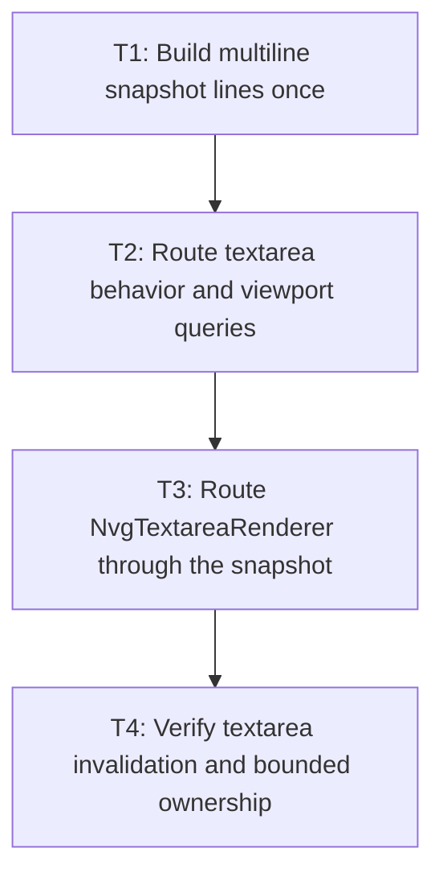

# P3: Route textarea consumers through snapshots

## Goal

Use one wrapped immutable snapshot across textarea rendering, selection, caret, hit testing, vertical
movement, line lookup, and viewport behavior.

## Non-Goals

- Input integration.
- Retaining multiple values or width variants per textarea.

## Context

- Parent milestone: `docs/work/E5/M4 - Share immutable editable-control text snapshots.md`.
- `MultilineTextControlMetrics` repeatedly splits/measures values, and `NvgTextareaRenderer` calls it
  independently for lines, selection carets, and the caret.

## Phase Tasks

### T1: Build multiline snapshot lines once
**Purpose:** Replace repeated paragraph splitting and wrapping with one immutable result.

**Depends on:** M4/P1/T4.
**Enables:** T2.
**Parallelizable with:** M4/P2/T1 after the P1 contract is stable.

**Changes:**
- [ ] Construct multiline lines/ranges/runs, y/baseline/height, extents, and caret advances once per valid state.
- [ ] Preserve explicit empty paragraphs, trailing newlines, wrap boundaries, and UTF-16 source offsets.

**Acceptance Checks:**
- [ ] Snapshot lines match `MultilineTextControlMetricsTest` results exactly.
- [ ] Width/wrap changes replace rather than append retained variants.

**Risks:** Avoid paragraph substring histories; retain only data required by the current snapshot.

### T2: Route textarea behavior and viewport queries
**Purpose:** Share line/caret geometry across editing and scrolling behavior.

**Depends on:** T1.
**Enables:** T3.
**Parallelizable with:** None.

**Changes:**
- [ ] Route line start/end, vertical movement, point-to-index, caret, and content extent queries through snapshots.
- [ ] Preserve selection extension, scroll clamping, resize, supplementary text, and fallback behavior.

**Acceptance Checks:**
- [ ] `TextareaBehaviorTest` and viewport-related coverage preserve indexes and offsets.
- [ ] Caret/selection/scroll-only changes cause no complete layout.

**Risks:** Maintain exact behavior at wrapped line ends versus explicit newline boundaries.

### T3: Route `NvgTextareaRenderer` through the snapshot
**Purpose:** Eliminate repeated line and caret layouts during drawing.

**Depends on:** T2.
**Enables:** T4.
**Parallelizable with:** None.

**Changes:**
- [ ] Draw lines/runs, selection rectangles, and caret from one snapshot instance.
- [ ] Preserve clipping, presented color/opacity, scrolling, fallback faces, and draw order.

**Acceptance Checks:**
- [ ] A K-line selection performs one complete layout for a newly built snapshot and zero when valid.
- [ ] Recording/pixel fixtures preserve line, run, selection, and caret geometry.

**Risks:** Keep viewport/culling optimization for M5; first preserve all current draws.

### T4: Verify textarea invalidation and bounded ownership
**Purpose:** Prove exact rebuild rules under edits and resize churn.

**Depends on:** T3.
**Enables:** M4/P4.
**Parallelizable with:** None.

**Changes:**
- [ ] Exercise value, typography, font generation, content width, wrap, caret, selection, focus, color, and scroll transitions.
- [ ] Add repeated edit/resize churn assertions for one-current-snapshot retention.

**Acceptance Checks:**
- [ ] Only approved text/typography/font/width/wrap transitions rebuild.
- [ ] Retained snapshot count/weight remains naturally bounded by control ownership.

**Risks:** None identified.

## Verification Strategy

- Run `./gradlew :spinygui.core:test --tests '*MultilineTextControlMetricsTest' --tests '*TextareaBehaviorTest'`.
- Run `./gradlew :spinygui.core.backend.lwjgl.nanovg:test` for renderer integration; add a targeted
  `NvgTextareaRendererTest` filter only after that planned test class exists.

## Review Boundaries

- Review multiline construction, behavior migration, renderer migration, and churn tests separately.

## Deferred Work

- Conservative line culling and native staging belong to M5.

## Dependency Graph

