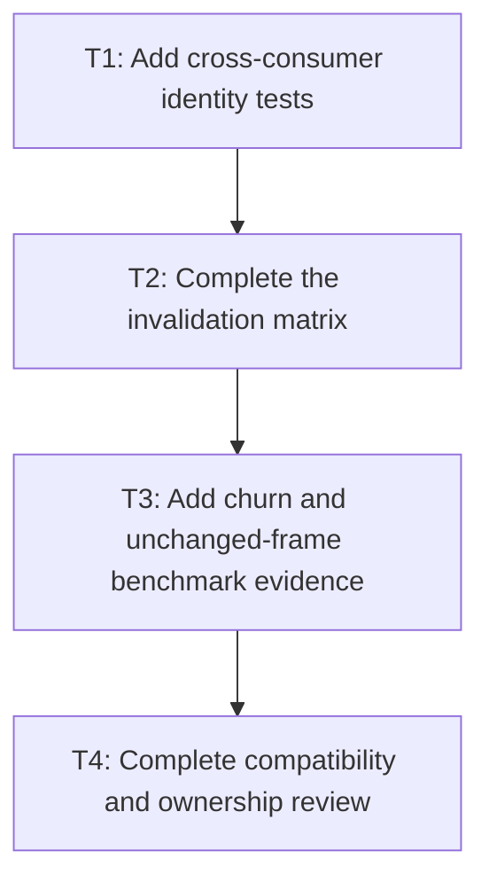

# P4: Prove exact reuse and invalidation

## Goal

Verify cross-consumer snapshot identity, exact invalidation, naturally bounded retention, and
unchanged-frame reuse for both editable controls.

## Non-Goals

- Adding a second global control-layout cache.
- Skipping general style/layout work outside control text snapshots.

## Context

- Parent milestone: `docs/work/E5/M4 - Share immutable editable-control text snapshots.md`.
- P2 and P3 migrate different consumers that must converge on one owner and build-count contract.

## Phase Tasks

### T1: Add cross-consumer identity tests
**Purpose:** Prove renderer, behavior, and viewport code observe one immutable result.

**Depends on:** M4/P2/T4, M4/P3/T4.
**Enables:** T2.
**Parallelizable with:** None.

**Changes:**
- [ ] Exercise behavior, viewport, and renderer reads in different orders for one control state.
- [ ] Assert snapshot identity/build count and identical line/caret geometry across consumers.

**Acceptance Checks:**
- [ ] One valid state produces at most one snapshot construction regardless of consumer order.
- [ ] No consumer silently falls back to complete/prefix remeasurement.

**Risks:** Avoid tests that depend on incidental object identity beyond the documented current snapshot.

### T2: Complete the invalidation matrix
**Purpose:** Verify every approved invalidating and non-invalidating transition.

**Depends on:** T1.
**Enables:** T3.
**Parallelizable with:** None.

**Changes:**
- [ ] Test value, typography fields, font generation, textarea width/wrap, caret, selection, focus,
  color, scroll, and unchanged-frame transitions.
- [ ] Verify mutation sequences, not only isolated changes, restore correct current results.

**Acceptance Checks:**
- [ ] Rebuild counts match the P1 mutation table exactly.
- [ ] No stale line/run/caret geometry survives an invalidating transition.

**Risks:** Font generation tests may use a narrow test version source until M6 provides the registry contract.

### T3: Add churn and unchanged-frame benchmark evidence
**Purpose:** Demonstrate reuse and bounded ownership without relying on timing alone.

**Depends on:** T2.
**Enables:** T4.
**Parallelizable with:** None.

**Changes:**
- [ ] Run unchanged, caret/selection/scroll-only, edit, and resize workloads with snapshot counters.
- [ ] Exercise repeated distinct values/widths and observe replacement/retained size.

**Acceptance Checks:**
- [ ] Unchanged/non-invalidating operations report zero rebuilds after warm construction.
- [ ] K-line selection reports one/zero complete layout as expected and retained state stays bounded.

**Risks:** Compare local latency/allocation only in equivalent environments with unchanged workload shape/counters.

### T4: Complete compatibility and ownership review
**Purpose:** Close M4 before renderer submission integration begins.

**Depends on:** T3.
**Enables:** M5/P1.
**Parallelizable with:** None.

**Changes:**
- [ ] Run focused and full regressions for font, control behavior, viewport, and backend rendering.
- [ ] Document snapshot owner, current-state bound, invalidation inputs, and M6 generation integration point.

**Acceptance Checks:**
- [ ] UTF-16/fallback/replacement/wrap/caret/selection/viewport/pixel behavior remains equivalent.
- [ ] No NanoVG state or historical value/width map is retained by the snapshot owner.

**Risks:** Stop on any renderer/event geometry disagreement.

## Verification Strategy

- Run `./gradlew :spinygui.core:test --tests '*TextInput*' --tests '*Textarea*' --tests '*MultilineTextControlMetricsTest'`.
- Run `./gradlew :spinygui.core.backend.lwjgl.nanovg:test`.
- Run `./gradlew :spinygui.benchmark:jmhCpu` locally and `./gradlew test`.

## Review Boundaries

- Review identity/invalidation tests before benchmark evidence; close with a separate ownership and
  broad-regression review.

## Deferred Work

- Native submission optimization belongs to M5; global primitive/sequence/wrap caches belong to M6.

## Dependency Graph

