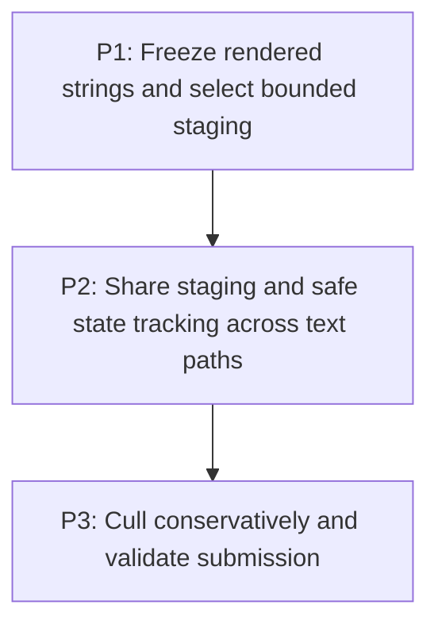

# M5: Bound and reduce NanoVG text submission work

## Goal

Reduce native UTF-8 allocation, repeated text construction, redundant NanoVG state, and provably
offscreen submission without changing run boundaries, ordering, state semantics, or pixels.

**Depends on:** M4.
**Enables:** M6.
**Parallelizable with:** M3.

## Context

- Parent epic: `docs/work/E5 - Text performance improvements.md`.
- Text, input, and textarea renderers currently allocate/free UTF-8 per run and repeat face, size,
  and color state.
- Persistent per-run native buffers, unsafe concatenation, and unbounded staging are forbidden.

## Phases

### P1: Freeze rendered strings and select bounded staging
**Document:** [P1 - Freeze rendered strings and select bounded staging](M5/P1%20-%20Freeze%20rendered%20strings%20and%20select%20bounded%20staging.md)
**Purpose:** Make run text immutable and choose the renderer-owned native lifetime contract.

**Depends on:** M4/P4.
**Enables:** P2.
**Parallelizable with:** M3/P3.

**Architectural Proposition:** `ResolvedTextRun` retains Java rendered text once; a renderer-level
frame arena or hard-capped reusable buffer owns temporary UTF-8 bytes with reset, fallback, and
destroy semantics.

**Key Work:**
- Freeze rendered strings without changing replacement markers or source ranges.
- Use M1 counters to choose staging bounds and verify NanoVG call-lifetime requirements.

**Validation:**
- Repeated `renderedText()` calls do not rebuild text.
- The selected staging design documents cap, oversized fallback, reset, and teardown behavior.

### P2: Share staging and safe state tracking across text paths
**Document:** [P2 - Share staging and safe state tracking across text paths](M5/P2%20-%20Share%20staging%20and%20safe%20state%20tracking%20across%20text%20paths.md)
**Purpose:** Integrate bounded staging and state suppression for text, input, and textarea draws.

**Depends on:** P1.
**Enables:** P3.
**Parallelizable with:** None.

**Architectural Proposition:** A renderer-owned submission boundary tracks only state proven valid
within save/restore, transform, clip, opacity, and ordering boundaries; it never merges runs.

**Key Work:**
- Route all three NanoVG text paths through shared staging with explicit lifecycle handling.
- Suppress only redundant adjacent face/size/color operations whose effective state is unchanged.

**Validation:**
- Recording sinks preserve draw order, x advances, faces, colors, clips, and save/restore effects.
- Native allocation and state counters fall without unbounded retained memory.

### P3: Cull conservatively and validate submission
**Document:** [P3 - Cull conservatively and validate submission](M5/P3%20-%20Cull%20conservatively%20and%20validate%20submission.md)
**Purpose:** Skip complete fragments and textarea lines only when established bounds prove invisibility.

**Depends on:** P2.
**Enables:** M6/P1.
**Parallelizable with:** None.

**Architectural Proposition:** Existing clip/content geometry may reject wholly offscreen work;
uncertain or boundary-touching text is always submitted.

**Key Work:**
- Add fragment and textarea-line culling with counters and boundary regressions.
- Validate transformed, clipped, animated-color, selection, caret, and fallback cases.

**Validation:**
- Offscreen scenarios submit fewer calls while boundary-touching content remains visible.
- Hidden-context pixels and equivalent-environment reports explain gains independently of GPU noise.

## Risks and Stop Criteria

- Stop reuse if NanoVG may retain a supplied UTF-8 pointer beyond the documented call lifetime.
- Never concatenate runs/fragments or retain one native buffer per run to reduce call counts.

## Dependency Graph

