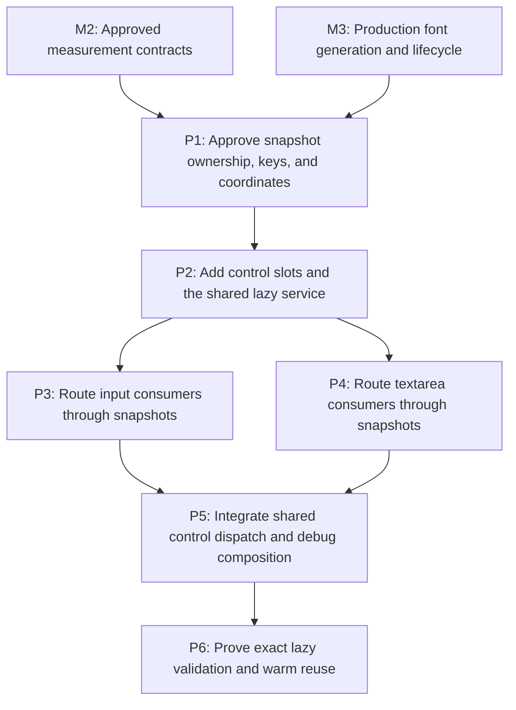

# M5: Share Bounded Editable-Control Snapshots

**Status:** Planned

Parent plan: `docs/work/E5 - Text performance improvements.md`

## Goal

Give every `InputElement` and `TextareaElement` one lazily validated immutable text-local layout
snapshot, managed by a shared core service and consumed consistently by renderer, editing, caret,
selection, hit-test, viewport, and scroll behavior.

## Context

- [M2/P1's approved measurement contract](M2/P1%20-%20Approve%20resolved-measurement%20contracts.md)
  supplies wrapping/replacement, absolute UTF-16, clamp-then-snap, text-local coordinate,
  per-final-line caret, and deep-immutability rules; M3 supplies the real semantic font generation.
  No temporary generation source is allowed.
- Current mutations are not comprehensively observable, so every service query performs complete
  effective-key validation rather than relying only on eager invalidation.
- The snapshot slot is naturally bounded to one current value per control, holds no history, and is
  excluded from generated equality, hash, and `toString` behavior.

## Phases

### P1: Approve snapshot ownership, keys, and coordinates

**Document:** [P1 - Approve snapshot ownership keys and coordinates](M5/P1%20-%20Approve%20snapshot%20ownership%20keys%20and%20coordinates.md)

**Purpose:** Define the node slot, core service, exact effective key, immutable geometry, mappings,
and consumer coordinate conversions before implementation.

**Depends on:** M2, M3.
**Enables:** P2.
**Parallelizable with:** None.

**Architectural Proposition:** A backend-neutral core service validates/builds one snapshot stored on
the queried control. Snapshot geometry is text-local; each consumer explicitly converts through
layout/content viewport, ancestor scroll, and presentation transforms.

**Key Work:**
- Define the slot type/visibility and Lombok exclusions, with no global identity map or retained
  previous values.
- Define a complete immutable key containing exact value, effective typography and line height,
  measurement context/configuration, real M3 font generation, and textarea content width/current
  actual wrap policy.
- Exclude placement/content height, color, focus, caret, selection, and scroll from the text-layout
  key; document why each excluded field affects consumption rather than text geometry.
- Specify whole-control, paragraph, visual-line, fragment/run, replacement, caret-boundary, and
  original-value UTF-16 mappings, including multi-paragraph wrapped fallback cases.

**Validation:** A reviewed key/coordinate/mapping table resolves every renderer/event consumer and
explicitly follows M2 surrogate-interior and textarea wrap-policy decisions.

**Risks / Stop Criteria:** Stop if any consumer needs backend state inside the core snapshot, if a
mutable key component is retained by reference, or if an actual key input is only lazily guessed.

### P2: Add control slots and the shared lazy service

**Document:** [P2 - Add control slots and the shared lazy service](M5/P2%20-%20Add%20control%20slots%20and%20the%20shared%20lazy%20service.md)

**Purpose:** Implement the naturally bounded node storage and one core query/build/validate boundary.

**Depends on:** P1.
**Enables:** P3, P4.
**Parallelizable with:** None.

**Architectural Proposition:** Every query recomputes the effective immutable key, reuses the slot on
exact match, and atomically replaces that one slot on mismatch under UI-thread confinement.

**Key Work:**
- Add one transient/current snapshot slot to each control and explicitly exclude it from generated
  equality, hash code, and string output.
- Implement the core service using M2 cumulative geometry and M3 resolver/generation ownership,
  including defensive immutable nested values.
- Build paragraph/visual-line/run/replacement/caret mappings once per replacement snapshot and expose
  text-local query methods without NanoVG types or global ownership.

**Validation:** Equality/hash/string behavior is unchanged by slot population; exact-key hits return
the same immutable snapshot; misses replace rather than append; core has no NanoVG dependency.

**Risks / Stop Criteria:** Stop if snapshot construction calls a fake generation source, if values
can mutate after publication, or if one control can retain more than its current snapshot.

### P3: Route input consumers through snapshots

**Document:** [P3 - Route input consumers through snapshots](M5/P3%20-%20Route%20input%20consumers%20through%20snapshots.md)

**Purpose:** Make input-specific renderers/builders/behaviors share the same current snapshot instead
of measuring full values and prefixes; shared listener/provider dispatch is reserved for P5.

**Depends on:** P2.
**Enables:** P5.
**Parallelizable with:** P4 after P2 only for control-specific renderer/builder/behavior files; shared
event listeners, providers, and `NvgRenderer` composition are reserved for P5.

**Architectural Proposition:** Input caret/selection x values are cumulative snapshot boundaries;
placement, horizontal scroll, color, focus, and transforms are applied by consumers after query.

**Key Work:**
- Route input renderer and `NvgDebugRenderer` input text/runs/caret/highlight geometry through the
  service/slot or remove/redirect independent debug measurement explicitly.
- Route char/key/mouse caret and viewport/scroll behavior through the same snapshot geometry and M2
  surrogate policy, excluding shared event-listener dispatch until P5.
- Remove prefix-substring measurement from warm input paths and test fallback/replacement and
  coordinate conversion through ancestor scroll/transforms.

**Validation:** One valid snapshot serves render and behavior queries; presentation/interaction-only
changes reuse it; exact value/typography/configuration/generation changes replace it.

**Risks / Stop Criteria:** Stop if renderer and event code derive caret positions from different
measurement paths or if layout-space positions enter the text-layout key.

### P4: Route textarea consumers through snapshots

**Document:** [P4 - Route textarea consumers through snapshots](M5/P4%20-%20Route%20textarea%20consumers%20through%20snapshots.md)

**Purpose:** Replace repeated paragraph splitting/wrapping/full-layout calls across textarea-specific
renderer/builders/behaviors; shared listener/provider dispatch is reserved for P5.

**Depends on:** P2.
**Enables:** P5.
**Parallelizable with:** P3 after P2 only for control-specific renderer/builder/behavior files; shared
event listeners, providers, and `NvgRenderer` composition are reserved for P5.

**Architectural Proposition:** One snapshot contains complete text-local multiline geometry and
source mappings; visible placement and scroll offsets are consumer calculations, not snapshot
rebuild causes.

**Key Work:**
- Route multiline metrics, textarea renderer, char/key/mouse/cursor/scroll/viewport consumers through
  control-specific service adapters and node slot, excluding shared listener dispatch until P5.
- Cover empty paragraphs, multiple paragraphs, wrapped visual lines, fallback transitions,
  replacement glyphs, selections spanning lines, and line boundary ambiguity.
- Key the current actual wrap behavior/width; do not invent or test a mutable wrap-policy transition
  unless M2 explicitly approved a public API.

**Validation:** A K-line selection/query reuses one complete snapshot instead of performing repeated
complete layouts; text-local mappings agree across renderer and event behavior.

**Risks / Stop Criteria:** Stop if textarea consumers split or remeasure text independently after
snapshot query or if scroll/viewport placement contaminates reusable text geometry.

### P5: Integrate shared control dispatch and debug composition

**Document:** [P5 - Integrate shared control dispatch and debug composition](M5/P5%20-%20Integrate%20shared%20control%20dispatch%20and%20debug%20composition.md)

**Purpose:** Migrate listeners/providers and shared renderer/debug composition that dispatch both
control types only after P3/P4 control-specific contracts are stable.

**Depends on:** P3, P4.
**Enables:** P6.
**Parallelizable with:** None.

**Architectural Proposition:** `SystemCharEventListener`, `SystemKeyEventListener`, cursor/mouse/
scroll listeners, providers, and `NvgRenderer`/debug composition receive one shared service and no
longer construct independent input/textarea metrics.

**Key Work:**
- Migrate shared listener/provider dispatch for char/key/mouse/cursor/scroll/viewport behavior after
  both control-specific paths are complete.
- Wire `NvgRenderer` and `NvgDebugRenderer` through the same service/slot and remove independent
  `TextMeasurer`/resolver control measurement.
- Add listener/debug integration fixtures for both controls, invalidating edits, and warm non-key
  queries before aggregate proof.

**Validation:** Shared dispatch constructs no independent control metrics; debug/input/textarea
renderer and listener paths use the same slot. Invalidating edit/key/char operations rebuild exactly
once at the next required query; warm non-key paths call zero `TextMeasurer` entry points.

**Risks / Stop Criteria:** Stop if shared listeners choose different service instances, if debug
measurement bypass remains, or if integration changes control dispatch ordering.

### P6: Prove exact lazy validation and warm reuse

**Document:** [P6 - Prove exact lazy validation and warm reuse](M5/P6%20-%20Prove%20exact%20lazy%20validation%20and%20warm%20reuse.md)

**Purpose:** Verify key completeness, natural bounds, consumer agreement, zero measurement work for
warm non-key queries, and exactly one rebuild after invalidation.

**Depends on:** P5.
**Enables:** None.
**Parallelizable with:** None.

**Architectural Proposition:** Because aliases remain observable only at query time, correctness is
proved by mutating each effective input and asking again. Warm non-key reuse calls no
`TextMeasurer`; invalidating edits rebuild once before returning to the warm state.

**Key Work:**
- Build a key-equivalence matrix for exact value, all effective typography/line-height inputs,
  measurement configuration/context, real generation, and textarea width/wrap policy.
- Verify excluded placement/content-height/color/focus/caret/selection/scroll changes preserve the
  current slot while consumers produce updated coordinates/presentation.
- Count every default and abstract `TextMeasurer` entry point across warm non-key render/debug/cursor/
  selection/hit-test/scroll/viewport scenarios and separately across invalidating edits/key/char.
- Run multi-paragraph wrapped fallback/replacement integration fixtures and slot-retention/churn tests.

**Validation:** Warm non-key scenarios call no entry point; each invalidating edit/key/char or key
mutation causes exactly one replacement/build and subsequent warm calls return to zero; each non-key
mutation reuses. No global control cache/history or backend dependency exists.

**Risks / Stop Criteria:** Do not proceed to M6/M7 if any consumer bypasses the service, any key input
can change without a query-time mismatch, or retained snapshots exceed one per live control.

## Milestone Validation

- `./gradlew :spinygui.core:test --tests 'com.spinyowl.spinygui.core.system.input.TextInputBehaviorTest' --tests 'com.spinyowl.spinygui.core.system.input.TextInputViewportBehaviorTest'`
- `./gradlew :spinygui.core:test --tests 'com.spinyowl.spinygui.core.system.input.TextareaBehaviorTest' --tests 'com.spinyowl.spinygui.core.system.input.MultilineTextControlMetricsTest'`
- `./gradlew :spinygui.core:test --tests 'com.spinyowl.spinygui.core.system.event.listener.SystemCharEventListenerTest' --tests 'com.spinyowl.spinygui.core.system.event.listener.SystemKeyEventListenerTest' --tests 'com.spinyowl.spinygui.core.system.event.listener.SystemCursorPosEventListenerTest' --tests 'com.spinyowl.spinygui.core.system.event.listener.SystemMouseClickEventListenerTest'`
- `./gradlew :spinygui.core.backend.lwjgl.nanovg:test --tests 'com.spinyowl.spinygui.core.backend.renderer.lwjgl.nanovg.NvgInputRendererTest'`
- `./gradlew :spinygui.core.backend.lwjgl.nanovg:test --tests 'com.spinyowl.spinygui.core.backend.renderer.lwjgl.nanovg.NvgDebugRendererTest'`
- `./gradlew :spinygui.benchmark:test`

## Dependency Graph

