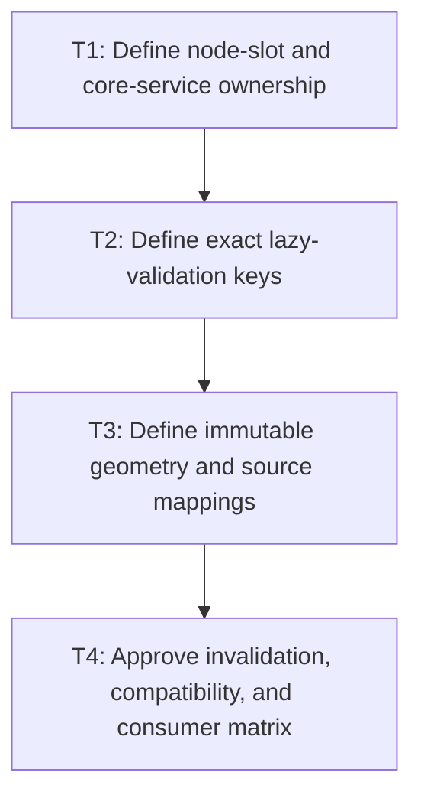

# P1: Approve Snapshot Ownership, Keys, and Coordinates

**Status:** Complete

## Goal

Approve one control-local slot, a shared backend-neutral core service, a complete query-time key, an
immutable text-local snapshot, and all source/geometry mappings before implementation.

## Non-Goals

- A global control identity map, historical snapshots, or NanoVG-dependent core data.
- Automatic observation/interception of every mutable style/node alias.

## Context

- Parent milestone: `docs/work/E5/M5 - Share bounded editable-control snapshots.md`.
- Phase entry gate: M2 contract and M3 production font generation/lifecycle are complete.
- Every query must validate the full effective key because mutation hooks are incomplete by design.

## Approved Contract

Ownership is `live control -> one transient ControlTextLayoutSnapshot`. The stateless
`ControlTextLayoutService` retains its `TextMeasurer` and an opaque immutable context token, never
controls or snapshots. A query
copies every mutable key input, compares the complete key, returns the identical snapshot on a hit,
or replaces the one slot on a miss. The slot is explicitly excluded from generated equality, hash,
and string output and can be cleared without history.

| Effective input | Key behavior | Computation |
| --- | --- | --- |
| Exact value | Miss | Immutable `String` value |
| Family order, style, weight, stretch | Miss | Copied effective style values and resolved ordered faces |
| Font size and line-height | Miss | Effective numeric values with exact float equality |
| Semantic font state | Miss | Real installed M3 owner generation; absence represented separately |
| Textarea content width and actual wrap policy | Miss | Exact content width and constant `wordWrap=false` |
| Placement, content height, color, opacity, focus | Hit | Applied while rendering/presenting |
| Caret, selection, scroll, viewport, transform | Hit | Applied by interaction/coordinate consumers |

Snapshot axes are text-local: x is cumulative advance from a visual-line start and y is cumulative
line height from the control text origin. Each visual line owns absolute UTF-16 start/end offsets,
immutable runs/replacement evidence, and M2 final caret stops. Newline separators belong to no line;
an index at a separator resolves to the preceding line end, while a trailing separator creates the
final empty line. Midpoint ties advance and surrogate interiors snap backward per M2.

| Consumer | Snapshot query | Consumer-time conversion |
| --- | --- | --- |
| Normal/debug renderers | lines, runs, caret/range boundaries | placement, centering, scroll, clip, transforms, color/focus |
| Char/key navigation | caret and line boundaries | index normalization only |
| Mouse/cursor hit test | line by y and caret stop by x | cursor minus content origin plus control scroll |
| Viewport/scroll | caret and extent | current content box and scroll |
| Shared listeners/providers | same service-backed adapters | existing dispatch ordering/reporting |

Compatibility preserves existing control setters and behavior constructors. The additive transient
slot is excluded from generated methods and serialization. Legacy `TextMeasurer` implementations
may use an allocating build-time compatibility path; production M3 capability is the one-measurement
path and all warm queries remain measurement-free.

## Phase Tasks

### T1: Define node-slot and core-service ownership
**Purpose:** Make snapshot retention naturally bounded and reachable by all core/backend consumers.

**Depends on:** None.
**Enables:** T2.
**Parallelizable with:** None.

**Changes:**
- [x] Define exactly one current snapshot slot on each `InputElement` and `TextareaElement`, its
  visibility/mutation owner, replacement/clear behavior, and no-history guarantee.
- [x] Require explicit Lombok/generated equality/hash/`toString` exclusion so cache state is not part
  of node identity/diagnostics output.
- [x] Define a shared core service composition/query API used by renderers and char/key/mouse/cursor/
  scroll/viewport behaviors plus `NvgDebugRenderer` control inspection with no NanoVG type or global
  node map.

**Acceptance Checks:**
- [x] An ownership diagram has one strong path from a live control to at most one snapshot and no
  service-global control references.
- [x] Population/clear cannot affect node equality, hash, or string representation.

**Risks / Stop Criteria:** Stop if a service needs to retain control identity or if equality excludes
the slot only accidentally through current Lombok defaults.

### T2: Define exact lazy-validation keys
**Purpose:** Ensure every text-layout-affecting input replaces the slot and every presentation-only
input reuses it.

**Depends on:** T1.
**Enables:** T3.
**Parallelizable with:** None.

**Changes:**
- [x] Define immutable key fields for exact value; effective family list/style/weight/stretch/font
  size/line height and any other typography; measurement context/configuration/rounding; real M3
  semantic generation; and textarea current content width/current actual wrap policy.
- [x] Explicitly exclude input placement and content height plus color, focus, caret, selection,
  scroll, viewport position, ancestor scroll, and presentation transforms; document consumer-time use.
- [x] Define exact float/value equality/canonicalization, defensive copying, null/default effective
  values, and validation on every service query.
- [x] Do not define a mutable textarea wrap-policy transition/test unless M2 approved adding such a
  public API; otherwise key the existing actual constant/policy.

**Acceptance Checks:**
- [x] A field-by-field matrix shows hit/miss expectations and the code path that computes each
  effective value without retaining mutable aliases.
- [x] Font validity comes from the real M3 generation, never a fake/local counter.

**Risks / Stop Criteria:** Stop if a key includes resolved style object identity, omits an effective
typography/configuration field, or uses approximate width equality.

### T3: Define immutable geometry and source mappings
**Purpose:** Make one snapshot sufficient for all rendering/editing/viewport consumers without storing
placement state.

**Depends on:** T2.
**Enables:** T4.
**Parallelizable with:** None.

**Changes:**
- [x] Define immutable whole-control extent, paragraph, visual-line, fragment/run, glyph/replacement,
  cumulative caret boundary, hit-test, and source UTF-16 mappings.
- [x] Define empty/trailing paragraphs, wrapped line boundary ownership, newline positions,
  multi-paragraph wrapped fallback/replacement, and M2 surrogate-interior behavior.
- [x] Define text-local axes/origins and explicit consumer conversions through content/layout
  placement, viewport, control scroll, ancestor scroll, and presentation transforms.

**Acceptance Checks:**
- [x] A multi-paragraph wrapped fallback fixture can answer line, caret, selection, hit-test, extent,
  and run queries without remeasurement or ambiguous boundary ownership.
- [x] No snapshot field stores absolute layout position, viewport origin, ancestor scroll, transform,
  color, focus, caret, or selection state.

**Risks / Stop Criteria:** Stop if two consumers require incompatible coordinate interpretations or
if replacement geometry loses original source positions.

### T4: Approve invalidation, compatibility, and consumer matrix
**Purpose:** Authorize implementation only after every consumer and mutation class has one path.

**Depends on:** T3.
**Enables:** None.
**Parallelizable with:** None.

**Changes:**
- [x] Map input/textarea renderer, char/key/mouse/cursor, selection, scroll, viewport, line navigation,
  hit-test, shared listener/provider dispatch, and debug renderer consumers to service queries and
  coordinate conversions.
- [x] Map key/non-key mutations, direct mutable aliases, query-time validation, explicit clear, and
  M3 generation changes to reuse/replacement behavior.
- [x] Record compatibility impact for node fields/generated methods, M2 surrogate setters, and any
  service/constructor injection changes.

**Acceptance Checks:**
- [x] No consumer remains authorized to instantiate independent multiline metrics or call
  `TextMeasurer` directly for control text geometry after migration.
- [x] Review explicitly confirms one slot, no history/global map, backend neutrality, and query-time
  full-key validation.

**Risks / Stop Criteria:** Do not start P2 while a consumer or mutation has “special case later”
ownership.

## Verification Strategy

- Run `./gradlew :spinygui.core:test --tests 'com.spinyowl.spinygui.core.system.input.*'`.
- Run `./gradlew :spinygui.core.backend.lwjgl.nanovg:test --tests 'com.spinyowl.spinygui.core.backend.renderer.lwjgl.nanovg.NvgInputRendererTest'`.
- Review current node Lombok annotations and M2/M3 contracts; no production snapshot code yet.

## Review Boundaries

- Review ownership, then key table, then geometry/mappings, then consumer/invalidation matrix.

## Deferred Work

- Slot/service implementation belongs to P2; control-specific routing belongs to P3/P4; shared
  listener/provider/debug integration belongs to P5; proof belongs to P6.
- Global control caching and full retained layout remain deferred.

## Dependency Graph

