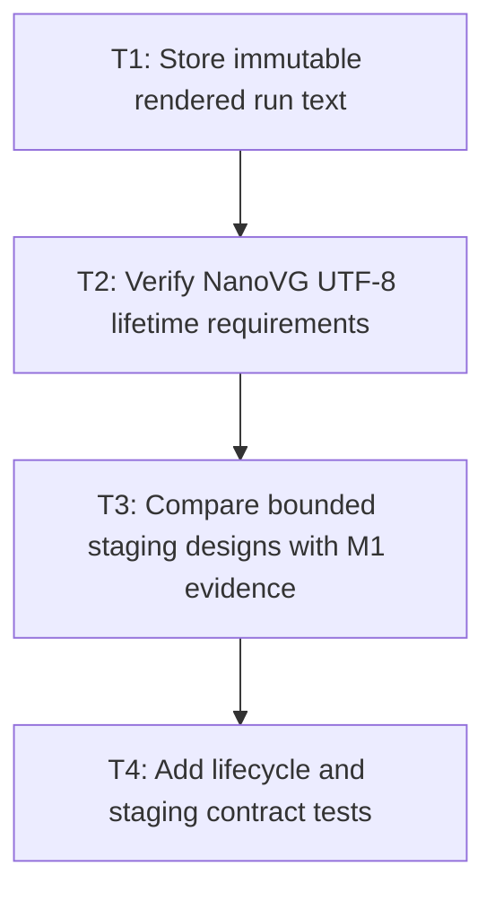

# P1: Freeze rendered strings and select bounded staging

## Goal

Prepare immutable rendered run strings once and choose a safe renderer-owned, bounded UTF-8 staging contract.

## Non-Goals

- Retaining native buffers per run.
- Concatenating runs/fragments or integrating all renderer paths yet.

## Context

- Parent milestone: `docs/work/E5/M5 - Bound and reduce NanoVG text submission work.md`.
- `ResolvedTextRun.renderedText()` currently rebuilds a string; NanoVG paths allocate/free UTF-8 per draw.

## Phase Tasks

### T1: Store immutable rendered run text
**Purpose:** Remove repeated Java string construction at every render.

**Depends on:** M4/P4/T4.
**Enables:** T2.
**Parallelizable with:** None.

**Changes:**
- [ ] Extend resolved-run construction to compute and retain rendered text once from resolved glyphs.
- [ ] Preserve source ranges, glyphs, advance, replacement markers, equality expectations, and immutable ownership.

**Acceptance Checks:**
- [ ] Repeated rendered-text access returns the prepared value without rebuilding.
- [ ] Fallback/replacement run text and structural fixtures remain equivalent.

**Risks:** Account for retained Java string weight in later cache/churn analysis.

### T2: Verify NanoVG UTF-8 lifetime requirements
**Purpose:** Establish how long staged bytes must remain valid for every supported backend path.

**Depends on:** T1.
**Enables:** T3.
**Parallelizable with:** None.

**Changes:**
- [ ] Confirm the documented `nvgText` consumption lifetime and any backend-specific constraints.
- [ ] Record required reset/destroy sequencing relative to frames, contexts, and renderer teardown.

**Acceptance Checks:**
- [ ] The staging lifetime covers the native call contract without assuming undocumented copying.
- [ ] Uncertainty defaults to longer safe lifetime or blocks reuse rather than risking use-after-free.

**Risks:** Stop staging selection if synchronous consumption cannot be established safely.

### T3: Compare bounded staging designs with M1 evidence
**Purpose:** Select the smallest safe renderer-owned design using allocations and workload sizes.

**Depends on:** T2.
**Enables:** T4.
**Parallelizable with:** None.

**Changes:**
- [ ] Evaluate frame arena, hard-capped reusable growable buffer, and stack/small-run paths against M1 counters.
- [ ] Define hard cap, growth, reset, oversized-run fallback, allocation accounting, and thread/context ownership.

**Acceptance Checks:**
- [ ] A decision record explains rejected options and proves no unbounded native growth.
- [ ] Oversized runs remain correct without retaining their peak allocation indefinitely.

**Risks:** Avoid optimizing only the 3,000-run scene; include mixed and unusually long runs.

### T4: Add lifecycle and staging contract tests
**Purpose:** Make the selected design ready for integration.

**Depends on:** T3.
**Enables:** M5/P2.
**Parallelizable with:** None.

**Changes:**
- [ ] Test encode/reuse/reset/cap/oversized fallback/destroy behavior and UTF-8 byte counts.
- [ ] Define behavior after destroy and on renderer/context replacement.

**Acceptance Checks:**
- [ ] Native memory is released deterministically and reuse never aliases live call data.
- [ ] Diagnostics report bytes, allocations/fallbacks, capacity, and resets.

**Risks:** Keep the staging type backend-local; core run models retain no native buffers.

## Verification Strategy

- Run `./gradlew :spinygui.core:test --tests '*FontServiceImplTest'`.
- Run `./gradlew :spinygui.core.backend.lwjgl.nanovg:test --tests '*NvgTextRendererTest' --tests '*NvgInputRendererTest'`.
- Run `./gradlew :spinygui.benchmark:jmhRendering` locally for staging design evidence in an equivalent environment.

## Review Boundaries

- Review immutable run text, native lifetime decision, staging selection, and lifecycle tests separately.

## Deferred Work

- Cross-path integration/state suppression belongs to P2; culling belongs to P3.

## Dependency Graph

