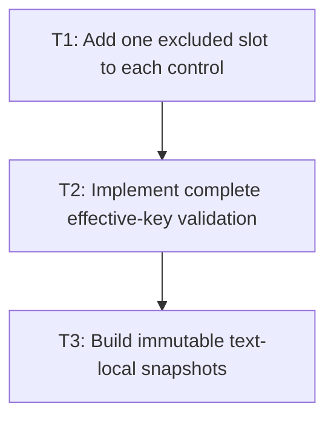

# P2: Add Control Slots and the Shared Lazy Service

**Status:** Complete

## Goal

Implement one generated-method-excluded slot per editable control and one core service that computes
the complete effective key on every query, builds immutable text-local geometry, and replaces only
the current slot.

## Non-Goals

- Routing every consumer; P3/P4 own control-specific migrations and P5 owns shared listener/provider/
  debug composition.
- Global/history caching or a core NanoVG dependency.

## Context

- Parent milestone: `docs/work/E5/M5 - Share bounded editable-control snapshots.md`.
- Phase entry gate: M5/P1 ownership/key/coordinate/consumer contract is approved.
- Snapshot construction must use M2 cumulative resolved measurement and the real M3 central resolver/
  generation.

## Phase Tasks

### T1: Add one excluded slot to each control
**Purpose:** Establish naturally bounded node-local retention without changing node value semantics.

**Depends on:** None.
**Enables:** T2.
**Parallelizable with:** None.

**Changes:**
- [x] Add the same backend-neutral current-snapshot slot contract to `InputElement` and
  `TextareaElement`, exposed only as needed by the service.
- [x] Explicitly exclude the slot from Lombok/generated equality, hash code, and `toString` and avoid
  public builder/attribute serialization participation.
- [x] Define deterministic clear/replacement on service query and node lifecycle without retaining a
  previous snapshot.

**Acceptance Checks:**
- [x] Tests populate/replace/clear slots and assert unchanged node equality/hash/string output.
- [x] Heap/ownership inspection or direct assertions show each control references at most one current
  snapshot and the service retains none.

**Risks / Stop Criteria:** Stop if generic node copying/serialization starts copying slot history or
if a public setter allows arbitrary mutable snapshot injection.

### T2: Implement complete effective-key validation
**Purpose:** Detect all observable and unobservable key changes lazily on every query.

**Depends on:** T1.
**Enables:** T3.
**Parallelizable with:** None.

**Changes:**
- [x] Compute immutable effective keys from exact value, complete typography/line height, measurement
  context/configuration/rounding, real M3 generation, and textarea width/actual wrap policy.
- [x] Compare exact keys on every query; return the current immutable snapshot on equality and build/
  replace once on mismatch.
- [x] Ensure key computation copies ordered family/configuration values and does not retain mutable
  `ResolvedStyle`, list, box, or context aliases.

**Acceptance Checks:**
- [x] Table-driven tests mutate every key field through both normal APIs and direct mutable aliases,
  then observe the correct next-query replacement.
- [x] Non-key fields do not enter equality; fake/local font generations are absent from production.

**Risks / Stop Criteria:** Stop if key validity depends solely on eager invalidation or if key
construction itself performs text measurement.

### T3: Build immutable text-local snapshots
**Purpose:** Produce all shared control geometry and mappings once per key miss.

**Depends on:** T2.
**Enables:** None.
**Parallelizable with:** None.

**Changes:**
- [x] Build input and textarea whole-control/paragraph/visual-line/run/replacement/cumulative-caret
  structures using M2 result primitives and M3 resolver ownership.
- [x] Store defensive immutable values and exact original-value UTF-16 mappings for empty/multiple/
  trailing paragraphs, wraps, fallback, replacement, and supplementary code points.
- [x] Expose text-local query methods for caret/hit test/line/range/extent/runs and conversion inputs,
  but no absolute placement, current scroll, transform, color, focus, caret, or selection state.

**Acceptance Checks:**
- [x] Snapshot and all nested values resist external/source mutation; one miss performs one complete
  build and fills every mapping needed by P3/P4.
- [x] Core module dependencies remain NanoVG-free and no global control map/history is added.

**Risks / Stop Criteria:** Stop if a later query must append mutable derived data to a snapshot or if
snapshot construction performs separate incompatible input/textarea measurement pipelines.

## Verification Strategy

- Run `./gradlew :spinygui.core:test --tests 'com.spinyowl.spinygui.core.system.input.TextInputBehaviorTest' --tests 'com.spinyowl.spinygui.core.system.input.TextareaBehaviorTest'`.
- Run `./gradlew :spinygui.core:test --tests 'com.spinyowl.spinygui.core.system.input.MultilineTextControlMetricsTest'`.
- Run `./gradlew :spinygui.core:test --tests 'com.spinyowl.spinygui.core.system.font.impl.FontServiceImplTest'`.

## Review Boundaries

- Review node generated-method compatibility, then key computation/validation, then snapshot geometry.

## Deferred Work

- Input consumers migrate in P3, textarea consumers in P4, shared dispatch/debug in P5, and complete
  reuse proof in P6.

## Dependency Graph

