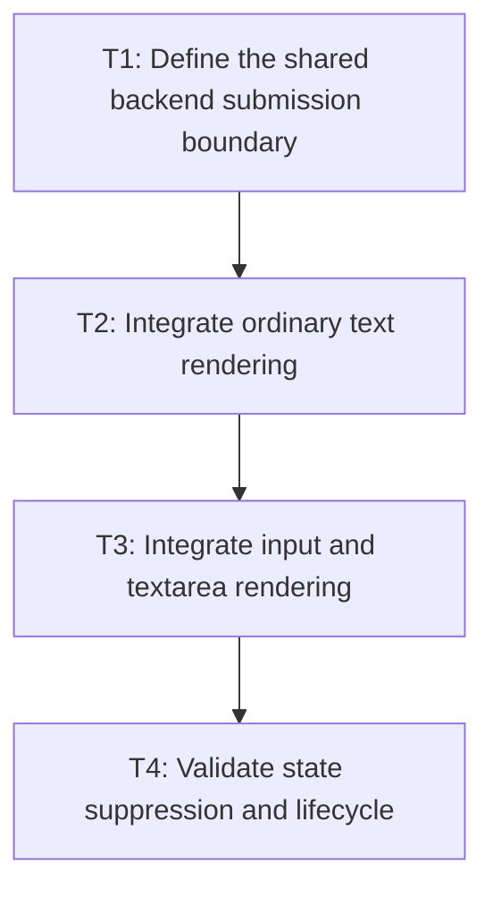

# P2: Share staging and safe state tracking across text paths

## Goal

Route text, input, and textarea submission through bounded UTF-8 staging and suppress only provably
redundant adjacent NanoVG state operations.

## Non-Goals

- Concatenating runs/fragments or reordering draws.
- Culling uncertain text bounds.

## Context

- Parent milestone: `docs/work/E5/M5 - Bound and reduce NanoVG text submission work.md`.
- Each renderer currently owns similar face/size/color/UTF-8 loops under different save/restore and clip boundaries.

## Phase Tasks

### T1: Define the shared backend submission boundary
**Purpose:** Centralize staging/lifecycle without erasing path-specific geometry and ordering.

**Depends on:** M5/P1/T4.
**Enables:** T2.
**Parallelizable with:** None.

**Changes:**
- [ ] Define a backend-local submission API for prepared run text, face, size, color, position, and staging lifecycle.
- [ ] Specify state invalidation on save/restore, context/frame changes, transform, clip, opacity, and unknown external calls.

**Acceptance Checks:**
- [ ] The API cannot concatenate/reorder runs and exposes explicit lifecycle/reset points.
- [ ] Recording tests can observe every submitted draw and state operation.

**Risks:** Avoid a speculative general renderer command buffer.

### T2: Integrate ordinary text rendering
**Purpose:** Prove staging/state semantics on the largest run scene first.

**Depends on:** T1.
**Enables:** T3.
**Parallelizable with:** None.

**Changes:**
- [ ] Route `NvgTextRenderer` resolved and legacy-compatible text through the submission boundary.
- [ ] Preserve inline offsets, presented color/opacity, transforms, clips, run order, and x advances.

**Acceptance Checks:**
- [ ] Recording/pixel fixtures are unchanged while UTF-8 allocation counters fall.
- [ ] Face/size/color suppression occurs only across adjacent equivalent effective state.

**Risks:** Legacy text paths must remain correct until all callers produce resolved runs.

### T3: Integrate input and textarea rendering
**Purpose:** Share staging while preserving control-specific selection/caret/clip ordering.

**Depends on:** T2.
**Enables:** T4.
**Parallelizable with:** None.

**Changes:**
- [ ] Route snapshot-backed input and textarea runs through the same submission boundary.
- [ ] Reset/validate tracked state around control save/restore, scissor, selection, caret, and color operations.

**Acceptance Checks:**
- [ ] Text, selection, and caret draw order and clips remain equivalent.
- [ ] All three paths obey one hard staging bound and teardown contract.

**Risks:** State written by selection/caret shape drawing may invalidate cached NanoVG assumptions.

### T4: Validate state suppression and lifecycle
**Purpose:** Prove reductions are safe under real frame/context behavior.

**Depends on:** T3.
**Enables:** M5/P3.
**Parallelizable with:** None.

**Changes:**
- [ ] Cover alternating faces/sizes/colors, transforms, clips, save/restore, animation, context reset, oversized runs, and destroy.
- [ ] Compare state/text/UTF-8 counters and hidden-context pixels.

**Acceptance Checks:**
- [ ] Counters explain fewer allocations/state calls without fewer required text calls.
- [ ] No native retention exceeds the cap after reset, oversized fallback, or teardown.

**Risks:** Stop suppression for any state whose effective NanoVG semantics cannot be proven.

## Verification Strategy

- Run `./gradlew :spinygui.core.backend.lwjgl.nanovg:test --tests '*NvgTextRendererTest' --tests '*NvgInputRendererTest' --tests '*NvgRendererTransformStateTest'`.
- Run `./gradlew :spinygui.core.backend.lwjgl.nanovg:test`.
- Run `./gradlew :spinygui.benchmark:jmhRendering` locally with equivalent scene shape/counters.

## Review Boundaries

- Review submission contract, text integration, control integration, and lifecycle/state proof separately.

## Deferred Work

- Fragment/line culling belongs to P3; persistent run-native buffers remain forbidden.

## Dependency Graph

