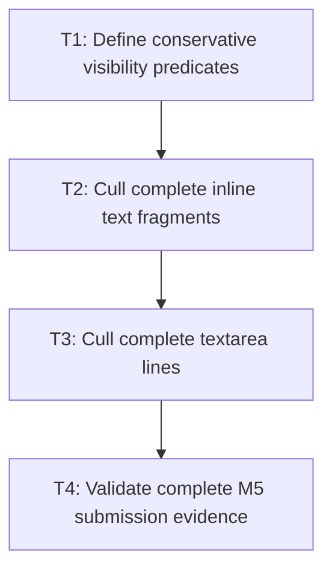

# P3: Cull conservatively and validate submission

## Goal

Skip only complete text fragments and textarea lines proven outside established clip/content bounds,
then validate the full NanoVG submission outcome.

## Non-Goals

- Glyph-level culling, speculative bounds, run concatenation, or draw reordering.
- General scene-graph culling outside text paths.

## Context

- Parent milestone: `docs/work/E5/M5 - Bound and reduce NanoVG text submission work.md`.
- Inline fragments and M4 textarea lines expose geometry suitable for conservative whole-item rejection.

## Phase Tasks

### T1: Define conservative visibility predicates
**Purpose:** Establish which existing geometry can safely prove a draw invisible.

**Depends on:** M5/P2/T4.
**Enables:** T2.
**Parallelizable with:** None.

**Changes:**
- [ ] Define fragment and textarea-line bounds relative to effective content clip, scroll, transform, and baseline geometry.
- [ ] Treat uncertain, transformed-without-safe-bounds, and boundary-touching cases as visible.

**Acceptance Checks:**
- [ ] Predicate fixtures cover inside, partial, exact-boundary, outside, scrolled, clipped, and transformed cases.
- [ ] Rejection requires complete disjointness from a trusted clip.

**Risks:** Stop culling for paths where current geometry is not a conservative glyph bound.

### T2: Cull complete inline text fragments
**Purpose:** Avoid staging/state/text calls for provably invisible fragments.

**Depends on:** T1.
**Enables:** T3.
**Parallelizable with:** None.

**Changes:**
- [ ] Apply the predicate before run staging/submission and increment candidate/culled counters.
- [ ] Preserve fragment/run order and all visible fallback transitions.

**Acceptance Checks:**
- [ ] Fully offscreen fragments submit no runs; partial/boundary fragments submit unchanged runs.
- [ ] Recording and pixel fixtures remain equivalent.

**Risks:** Culling whole fragments only; do not infer per-run/per-glyph clipping.

### T3: Cull complete textarea lines
**Purpose:** Avoid submitting vertically offscreen lines while preserving controls.

**Depends on:** T2.
**Enables:** T4.
**Parallelizable with:** None.

**Changes:**
- [ ] Reject whole snapshot lines outside the textarea content clip before text staging.
- [ ] Preserve selection/caret visibility and line draws at viewport boundaries and under horizontal scroll.

**Acceptance Checks:**
- [ ] Scrolled long textareas submit only visible/uncertain lines while selection/caret remain correct.
- [ ] Line culling does not change snapshot contents or event behavior.

**Risks:** T2 and T3 share renderer visibility contracts and remain sequential despite distinct paths.

### T4: Validate complete M5 submission evidence
**Purpose:** Close native staging, state, culling, and visual compatibility together.

**Depends on:** T3.
**Enables:** M6/P1.
**Parallelizable with:** None.

**Changes:**
- [ ] Run recording sinks, hidden-context pixels, native allocation/state/text/cull counters, and local CPU/GPU-complete reports.
- [ ] Exercise fallback, selection, caret, transforms, clips, animated colors, visible/offscreen mixes, and teardown.

**Acceptance Checks:**
- [ ] The 3,000-run and offscreen scenes show explained reductions with unchanged required draw order/pixels.
- [ ] Comparisons use equivalent environments and preserve scene/workload shape and counters.

**Risks:** Do not claim GPU improvement from CPU/state counters alone.

## Verification Strategy

- Run `./gradlew :spinygui.core.backend.lwjgl.nanovg:test`.
- Run `./gradlew :spinygui.benchmark:test`.
- Run `./gradlew :spinygui.benchmark:jmhRendering` and `./gradlew :spinygui.benchmark:benchmarkReport` locally.
- Run `./gradlew test` before completion.

## Review Boundaries

- Review visibility predicates first, then fragment and line integration, then complete benchmark/pixel evidence.

## Deferred Work

- General culling, batching, persistent native buffers, and concatenation remain out of scope.

## Dependency Graph

