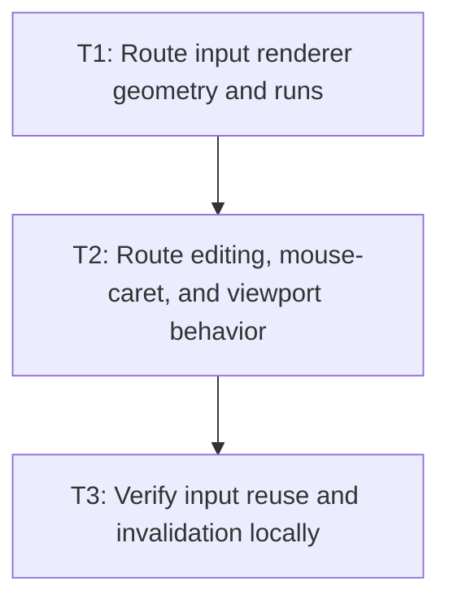

# P3: Route Input Consumers Through Snapshots

**Status:** Complete

## Goal

Make input rendering, caret/selection, key/char/mouse behavior, hit testing, horizontal scrolling,
and viewport logic use one service/slot and cumulative text-local geometry.

## Non-Goals

- Migrating textarea files or shared listeners/providers/`NvgRenderer` composition; M5/P4 can proceed
  in parallel only on control-specific files after the service is frozen, and P5 owns shared surfaces.
- Adding renderer UTF-8 staging/state suppression from M6.

## Context

- Parent milestone: `docs/work/E5/M5 - Share bounded editable-control snapshots.md`.
- Phase entry gate: M5/P2 slot/service/snapshot contract is complete.
- Phase-level parallelism: reciprocal with M5/P4 only for input-specific renderer/builder/behavior
  files. Shared event listeners/providers and `NvgRenderer` composition are reserved for M5/P5.

## Phase Tasks

### T1: Route input renderer geometry and runs
**Purpose:** Remove full-value plus prefix-substring measurement from input rendering.

**Depends on:** None.
**Enables:** T2.
**Parallelizable with:** None.

**Changes:**
- [x] Query the current snapshot once per input render and consume immutable runs/line metrics/
  cumulative caret boundaries for value, selection, and caret commands.
- [x] Route `NvgDebugRenderer` hovered-input fragment/caret geometry through the same snapshot contract
  or prepare the explicit feature redirection/removal consumed by P5 composition.
- [x] Convert text-local x/line geometry using content placement, vertical centering, horizontal
  scroll, ancestor scroll/clip, and presentation transforms at consumption time.
- [x] Keep color/focus/current caret/selection/scroll out of snapshot validity and preserve button-
  input versus text-input behavior.

**Acceptance Checks:**
- [x] Renderer recording output remains structurally equivalent and performs no prefix-substring
  `TextMeasurer` call on a warm snapshot.
- [x] Changing focus/color/caret/selection/scroll updates commands/coordinates while returning the
  same slot.

**Risks / Stop Criteria:** Stop if vertical placement/content height becomes a key field or if button
input semantics are accidentally folded into editable text behavior.

### T2: Route editing, mouse-caret, and viewport behavior
**Purpose:** Ensure input events and rendering share one geometry source.

**Depends on:** T1.
**Enables:** T3.
**Parallelizable with:** None.

**Changes:**
- [x] Route char/key movement/selection, mouse caret/hit testing, cursor behavior, horizontal viewport,
  and scroll clamping through snapshot boundary/extent queries.
- [x] Apply M2 surrogate-interior setter and code-point movement rules consistently for externally
  assigned and event-generated indices.
- [x] Convert cursor/layout coordinates into text-local coordinates using the P1 conversion contract,
  including control/ancestor scroll and presentation transforms.

**Acceptance Checks:**
- [x] Event and renderer caret/selection x positions agree for fallback/replacement and supplementary
  fixtures.
- [x] No migrated input consumer directly measures full values or substrings for text geometry.

**Risks / Stop Criteria:** Stop if event hit testing and renderer placement use different scroll/
transform orders or if a valid surrogate pair can be split.

### T3: Verify input reuse and invalidation locally
**Purpose:** Prove the input migration is complete before cross-control integration.

**Depends on:** T2.
**Enables:** None.
**Parallelizable with:** None.

**Changes:**
- [x] Count all `TextMeasurer` entry points separately during warm non-key render/debug/caret/
  selection/navigation/mouse/viewport/scroll sequences and during invalidating edit/key/char operations.
- [x] Mutate each input key field and each excluded presentation/interaction field and assert exact
  replacement/reuse behavior.
- [x] Cover direct mutable typography aliases, real font generation, empty/long/fallback/replacement/
  supplementary values, and coordinate transforms.

**Acceptance Checks:**
- [x] Every warm non-key migrated input sequence records zero calls to every `TextMeasurer` entry
  point, not only zero snapshot builds.
- [x] Each invalidating edit/key/char or key change rebuilds exactly once at the next required query;
  subsequent warm queries return to zero calls. Each non-key change preserves the slot.

**Risks / Stop Criteria:** Do not mark migration complete while a rare key/mouse/viewport branch
bypasses the service.

## Verification Strategy

- Run `./gradlew :spinygui.core:test --tests 'com.spinyowl.spinygui.core.system.input.TextInputBehaviorTest' --tests 'com.spinyowl.spinygui.core.system.input.TextInputViewportBehaviorTest'`.
- Run `./gradlew :spinygui.core.backend.lwjgl.nanovg:test --tests 'com.spinyowl.spinygui.core.backend.renderer.lwjgl.nanovg.NvgInputRendererTest'`.
- Run `./gradlew :spinygui.core.backend.lwjgl.nanovg:test --tests 'com.spinyowl.spinygui.core.backend.renderer.lwjgl.nanovg.NvgDebugRendererTest'`.

## Review Boundaries

- Review renderer migration, then event/viewport migration, then reuse/invalidation matrix.

## Deferred Work

- Textarea migration belongs to P4; shared listener/provider/debug composition belongs to P5;
  combined snapshot proof belongs to P6.
- UTF-8 staging/state reduction remains M6.

## Dependency Graph

