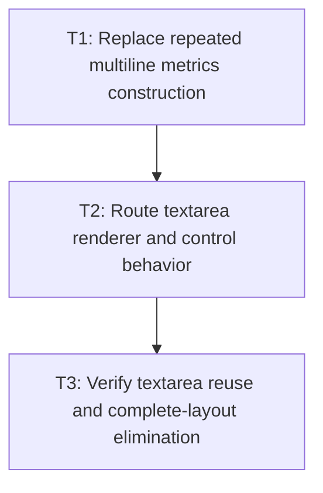

# P4: Route Textarea Consumers Through Snapshots

**Status:** Complete

## Goal

Make textarea metrics/rendering, caret/selection, line navigation, key/char/mouse/cursor behavior,
scrolling, viewport, and hit testing share one complete immutable multiline snapshot.

## Non-Goals

- Inventing a mutable textarea wrap-policy API that M2 did not approve.
- Adding NanoVG staging/state/culling optimizations from M6.

## Context

- Parent milestone: `docs/work/E5/M5 - Share bounded editable-control snapshots.md`.
- Phase entry gate: M5/P2 slot/service/snapshot contract is complete.
- Phase-level parallelism: this phase is reciprocal with M5/P3 because textarea and input files/tests
  are partitioned only for control-specific renderer/builder/behavior work; shared listeners/providers
  and `NvgRenderer` composition are reserved for M5/P5.

## Phase Tasks

### T1: Replace repeated multiline metrics construction
**Purpose:** Make paragraph/wrap/line/caret/hit-test queries read one snapshot rather than split and
measure repeatedly.

**Depends on:** None.
**Enables:** T2.
**Parallelizable with:** None.

**Changes:**
- [x] Route or replace `MultilineTextControlMetrics` methods with service snapshot queries for lines,
  caret, index-at, line start/end, vertical caret movement, content extent, and text style.
- [x] Preserve original-value UTF-16 paragraph/newline/visual-line boundaries and M2 surrogate policy
  across empty/trailing paragraphs and wraps.
- [x] Ensure the service keys the existing actual wrap policy/width and add no unsupported mutable
  wrap transition test/API.

**Acceptance Checks:**
- [x] Calling every multiline query on a warm slot performs no paragraph split or `TextMeasurer`
  entry-point call.
- [x] Multi-paragraph wrapped fallback/replacement fixtures return exact source indexes and text-local
  geometry.

**Risks / Stop Criteria:** Stop if a compatibility facade internally reconstructs complete layouts
or if visual-line boundaries cannot map unambiguously to source.

### T2: Route textarea renderer and control behavior
**Purpose:** Use the same snapshot for drawn runs/lines and every editing/viewport consumer.

**Depends on:** T1.
**Enables:** T3.
**Parallelizable with:** None.

**Changes:**
- [x] Route textarea renderer value/runs/visual lines, selection rectangles, and caret through one
  snapshot query and text-local geometry.
- [x] Route char/key line movement/selection, mouse/cursor hit testing, scroll/viewport/clamping, and
  content extent through the service/slot.
- [x] Apply content placement, control scroll, ancestor scroll/clip, and presentation transforms only
  during consumer conversion; keep color/focus/caret/selection/scroll outside the key.

**Acceptance Checks:**
- [x] Renderer and event behavior agree on line/caret/selection geometry over wrapped fallback and
  multi-line scroll fixtures.
- [x] No textarea consumer directly splits/wraps/measures the value after migration.

**Risks / Stop Criteria:** Stop if renderer visibility/scroll calculations modify snapshot geometry
or if event/render conversion order diverges.

### T3: Verify textarea reuse and complete-layout elimination
**Purpose:** Demonstrate one current snapshot replaces the repeated `2K + 3`-style layout pattern.

**Depends on:** T2.
**Enables:** None.
**Parallelizable with:** None.

**Changes:**
- [x] Count complete control layouts and every `TextMeasurer` entry point separately for warm non-key
  render, K-line selection, navigation, hit-test, scroll, and viewport queries and for invalidating
  edit/key/char operations.
- [x] Mutate every textarea key field—including exact width/actual wrap policy inputs—and every
  excluded placement/content-height/presentation/interaction field.
- [x] Cover direct mutable typography aliases, real M3 generation, empty/trailing/multiple paragraphs,
  narrow wraps, fallback/replacement, supplementary indices, and scroll/transform coordinates.

**Acceptance Checks:**
- [x] Warm non-key K-line and consumer queries perform zero complete layouts and zero calls to every
  `TextMeasurer` entry point.
- [x] Invalidating edit/key/char or key mutations rebuild exactly once at the next required query;
  subsequent warm queries return to zero. Non-key mutations reuse and no history is retained.

**Risks / Stop Criteria:** Do not accept a test that asserts only zero “snapshot builds” while a
consumer still calls another measurement entry point.

## Verification Strategy

- Run `./gradlew :spinygui.core:test --tests 'com.spinyowl.spinygui.core.system.input.MultilineTextControlMetricsTest' --tests 'com.spinyowl.spinygui.core.system.input.TextareaBehaviorTest'`.
- Run `./gradlew :spinygui.core.backend.lwjgl.nanovg:test` for the planned textarea recording tests.

## Review Boundaries

- Review metrics facade/replacement, then renderer/events, then call-count/invalidation proof.

## Deferred Work

- Shared listener/provider composition belongs to P5; combined churn/consumer proof belongs to P6.
- Visible-line culling belongs to M6 after bounds are proven.

## Dependency Graph

