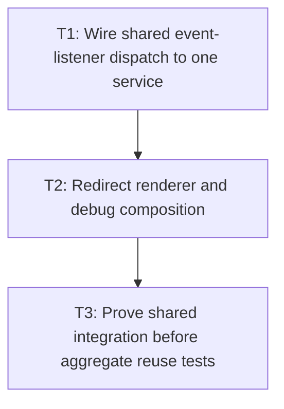

# P5: Integrate Shared Control Dispatch and Debug Composition

## Goal

Migrate event listeners/providers and shared renderer/debug composition that touch both input and
textarea only after both control-specific snapshot paths are stable.

## Non-Goals

- Reopening P3/P4 control-specific snapshot geometry.
- Adding M6 UTF-8 staging/state/culling work.

## Context

- Parent milestone: `docs/work/E5/M5 - Share bounded editable-control snapshots.md`.
- Phase entry gate: M5/P3 input-specific and M5/P4 textarea-specific migrations are complete.
- `SystemCharEventListener`, `SystemKeyEventListener`, cursor/mouse/scroll listeners, and renderer
  composition dispatch both control types; `NvgDebugRenderer` independently measures hovered input.

## Phase Tasks

### T1: Wire shared event-listener dispatch to one service
**Purpose:** Remove listener-owned input/textarea metric construction without overlapping P3/P4 work.

**Depends on:** None.
**Enables:** T2.
**Parallelizable with:** None.

**Changes:**
- [ ] Inject one `ControlTextLayoutService`-style instance through listener/provider composition for
  char, key, cursor-position, mouse-click, scroll, caret, and viewport dispatch.
- [ ] Replace listener construction of `TextInputViewportBehavior`, `MultilineTextControlMetrics`,
  textarea behavior/viewport/mouse helpers, or direct `TextMeasurer` control geometry with shared
  service-backed adapters.
- [ ] Preserve existing input-versus-textarea dispatch ordering, shortcut/action behavior, changed-
  element reporting, and null/optional measurement compatibility as approved.

**Acceptance Checks:**
- [ ] Listener tests dispatch both control types through the same service instance and create no
  independent complete control layout/measurement owner.
- [ ] An invalidating char/key edit causes one rebuild at the next required service query; subsequent
  warm non-key listener queries call zero `TextMeasurer` entry points.

**Risks / Stop Criteria:** Stop if listeners instantiate separate services/snapshots or if migration
changes event ordering/consumption behavior.

### T2: Redirect renderer and debug composition
**Purpose:** Make normal and debug control rendering consume the same slot/service.

**Depends on:** T1.
**Enables:** T3.
**Parallelizable with:** None.

**Changes:**
- [ ] Wire `NvgRenderer` control and debug composition to the shared core service instead of passing a
  raw `TextMeasurer` that permits independent control measurement.
- [ ] Route `NvgDebugRenderer` hovered-input fragment/caret geometry through the snapshot, or
  explicitly remove that independent measurement feature with approved compatibility tests.
- [ ] Preserve debug highlight/caret coordinates, scroll/transform conversion, and non-control inline
  fragment behavior without adding core NanoVG dependencies.

**Acceptance Checks:**
- [ ] Warm non-key normal/debug input rendering uses the same snapshot identity and records zero
  `TextMeasurer` entry-point calls.
- [ ] `NvgDebugRendererTest` covers hovered input geometry/caret and proves no direct full/prefix
  measurement or default resolver bypass remains.

**Risks / Stop Criteria:** Stop if debug mode silently rebuilds geometry, uses a different service, or
changes production snapshot validity.

### T3: Prove shared integration before aggregate reuse tests
**Purpose:** Establish one end-to-end control path for P6's key/call-count matrix.

**Depends on:** T2.
**Enables:** None.
**Parallelizable with:** None.

**Changes:**
- [ ] Run input/textarea listener sequences with normal/debug rendering, viewport/scroll, caret/
  selection, and direct shared-provider construction.
- [ ] Count complete layouts, snapshot builds, and every `TextMeasurer` entry point separately for
  warm non-key queries and invalidating edit/key/char operations.
- [ ] Search production listener/provider/normal/debug control paths for direct `TextMeasurer`,
  independent `MultilineTextControlMetrics`, or separate snapshot service construction.

**Acceptance Checks:**
- [ ] Warm non-key integration sequences call zero `TextMeasurer`; each invalidating operation causes
  exactly one snapshot rebuild/underlying measurement before returning to zero-call warm reuse.
- [ ] All control consumers are accounted for by the shared service/slot or explicitly removed with
  compatibility approval.

**Risks / Stop Criteria:** Do not start P6 while any shared dispatch/debug path bypasses the service or
while an invalidation triggers zero or multiple rebuilds.

## Verification Strategy

- Run `./gradlew :spinygui.core:test --tests 'com.spinyowl.spinygui.core.system.event.listener.SystemCharEventListenerTest' --tests 'com.spinyowl.spinygui.core.system.event.listener.SystemKeyEventListenerTest'`.
- Run `./gradlew :spinygui.core:test --tests 'com.spinyowl.spinygui.core.system.event.listener.SystemCursorPosEventListenerTest' --tests 'com.spinyowl.spinygui.core.system.event.listener.SystemMouseClickEventListenerTest'`.
- Run `./gradlew :spinygui.core:test --tests 'com.spinyowl.spinygui.core.system.event.listener.SystemScrollEventListenerTest'`.
- Run `./gradlew :spinygui.core.backend.lwjgl.nanovg:test --tests 'com.spinyowl.spinygui.core.backend.renderer.lwjgl.nanovg.NvgInputRendererTest' --tests 'com.spinyowl.spinygui.core.backend.renderer.lwjgl.nanovg.NvgDebugRendererTest'`.

## Review Boundaries

- Review shared listener/provider injection, then renderer/debug redirection, then end-to-end call
  counts/source search.

## Deferred Work

- Aggregate key/reuse/churn proof belongs to P6.
- Submission staging/state/culling remains M6.

## Dependency Graph

