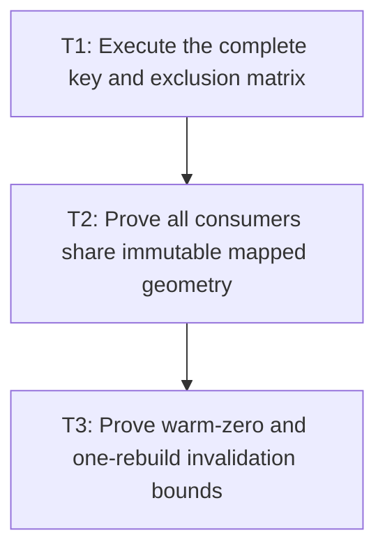

# P6: Prove Exact Lazy Validation and Warm Reuse

## Goal

Prove both controls use one naturally bounded slot/service with complete lazy keys, immutable mapped
geometry, zero warm non-key measurement calls, exactly one invalidation rebuild, and correct consumer
coordinate conversion.

## Non-Goals

- Adding a global control cache or retaining historical values/widths.
- Using M7 persistent caches to hide snapshot misses or measurement calls.

## Context

- Parent milestone: `docs/work/E5/M5 - Share bounded editable-control snapshots.md`.
- Phase entry gate: M5/P5 shared listener/provider/debug integration is complete.
- Proof must instrument every `TextMeasurer` entry point and run with future persistent caches absent/
  disabled.

## Phase Tasks

### T1: Execute the complete key and exclusion matrix
**Purpose:** Verify lazy query-time correctness under both API and direct-alias mutation.

**Depends on:** None.
**Enables:** T2.
**Parallelizable with:** None.

**Changes:**
- [ ] For input and textarea, mutate exact value; every effective family/style/weight/stretch/size/
  line-height field; measurement context/configuration/rounding; real M3 generation; and textarea
  exact width/actual wrap policy, then query each consumer.
- [ ] Mutate placement/content height/color/focus/caret/selection/control scroll/ancestor scroll/
  presentation transform and prove slot reuse with updated consumer results.
- [ ] Exercise direct mutable list/style/box aliases to prove complete key recomputation catches
  unobservable key changes without claiming automatic hooks.

**Acceptance Checks:**
- [ ] Every key mutation yields exactly one replacement at next query and subsequent exact queries hit.
- [ ] Every excluded mutation preserves snapshot identity and changes only the documented conversion/
  presentation/interaction output.

**Risks / Stop Criteria:** Stop if a mutation must be manually “noticed” by the snapshot service or if
key construction retains the mutable alias it is validating.

### T2: Prove all consumers share immutable mapped geometry
**Purpose:** Detect residual independent geometry/measurement paths and coordinate disagreement.

**Depends on:** T1.
**Enables:** T3.
**Parallelizable with:** None.

**Changes:**
- [ ] Cross-check normal/debug renderer, shared listener/provider char/key/mouse/cursor dispatch, line
  navigation, hit-test, scroll, viewport, caret, selection, and content extent against the same
  snapshot identity/mappings.
- [ ] Use multi-paragraph wrapped fallback/replacement/supplementary fixtures with control and ancestor
  scroll plus transforms to verify source/text-local/layout/viewport conversions.
- [ ] Attempt mutation through all snapshot/nested collections and source/key lists.

**Acceptance Checks:**
- [ ] All consumers agree on source indices and geometry, and no valid surrogate pair is split under
  M2 setter behavior.
- [ ] Snapshot state remains immutable and contains no current placement/scroll/transform/color/
  focus/caret/selection values.

**Risks / Stop Criteria:** Stop if one consumer needs a second “corrected” geometry structure or if
conversion depends on backend-specific snapshot fields.

### T3: Prove warm-zero and one-rebuild invalidation bounds
**Purpose:** Establish the reusable performance/retention boundary consumed by M6/M7.

**Depends on:** T2.
**Enables:** None.
**Parallelizable with:** None.

**Changes:**
- [ ] Run warm non-key input/textarea normal/debug render, navigation, caret/selection, hit-test,
  scroll, viewport, and listener-query sequences with a wrapper that counts every default and
  abstract `TextMeasurer` entry point.
- [ ] Run invalidating edit/key/char/value/typography/generation/width operations and assert exactly
  one rebuild/underlying measurement at the next required query, replacement of the old slot, then
  zero calls for subsequent warm queries.
- [ ] Compare complete-layout and measurement counters with M1 baseline using persistent M7 caches
  absent/disabled.

**Acceptance Checks:**
- [ ] Every warm non-key consumer sequence records zero calls to every `TextMeasurer` entry point and
  zero complete control layouts.
- [ ] Every invalidating edit/key/char/key-field change records exactly one rebuild/complete
  measurement, never zero or multiple, before returning to zero-call warm reuse.
- [ ] Churn retention is bounded by one immutable snapshot/key/value per control plus currently
  executing local temporaries.

**Risks / Stop Criteria:** Do not complete M5 if a warm path calls even a convenience/default
measurement method, if old snapshots remain retained, or if a global control map appears.

## Verification Strategy

- Run `./gradlew :spinygui.core:test --tests 'com.spinyowl.spinygui.core.system.input.*'`.
- Run `./gradlew :spinygui.core.backend.lwjgl.nanovg:test --tests 'com.spinyowl.spinygui.core.backend.renderer.lwjgl.nanovg.NvgInputRendererTest'`.
- Run `./gradlew :spinygui.core.backend.lwjgl.nanovg:test --tests 'com.spinyowl.spinygui.core.backend.renderer.lwjgl.nanovg.NvgDebugRendererTest'`.
- Run `./gradlew :spinygui.core:test --tests 'com.spinyowl.spinygui.core.system.event.listener.SystemCharEventListenerTest' --tests 'com.spinyowl.spinygui.core.system.event.listener.SystemKeyEventListenerTest'`.
- Run `./gradlew :spinygui.core.backend.lwjgl.nanovg:test` for textarea integration.
- Run `./gradlew :spinygui.benchmark:test`.

## Review Boundaries

- Review key/exclusion matrix, then mapping/immutability, then warm-call/retention evidence.

## Deferred Work

- M6 reuses snapshot lines/runs for submission/culling; M7 reuses current snapshots without another
  global control cache.
- Automatic interception of every mutable alias remains deferred.

## Dependency Graph

