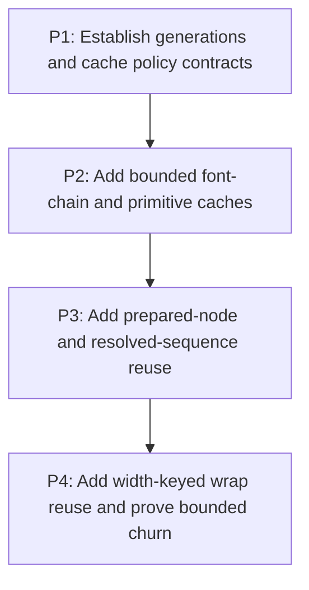

# M6: Add bounded text cache infrastructure with explicit generations

## Goal

Add only bounded, observable text reuse with exact value keys, font generations, deterministic
invalidation, clear/teardown paths, and cache-disabled comparison.

**Depends on:** M3, M5.
**Enables:** M7.
**Parallelizable with:** None.

## Context

- Parent epic: `docs/work/E5 - Text performance improvements.md`.
- M2-M5 first make uncached algorithms and naturally bounded snapshots efficient.
- Width belongs only in wrap keys; mutable `ResolvedStyle` identity is never a cache key.

## Phases

### P1: Establish generations and cache policy contracts
**Document:** [P1 - Establish generations and cache policy contracts](M6/P1%20-%20Establish%20generations%20and%20cache%20policy%20contracts.md)
**Purpose:** Define identity, ownership, bounds, diagnostics, and lifecycle before adding entries.

**Depends on:** M3/P3, M5/P3.
**Enables:** P2.
**Parallelizable with:** None.

**Architectural Proposition:** Font registration changes advance a monotonic generation; every cache
declares immutable keys, owner, weight/entry bound, eviction, clear, teardown, and disabled mode.

**Key Work:**
- Define stable font identity/generation and font-chain key values.
- Define common diagnostics and deterministic test controls without one speculative global cache.

**Validation:**
- Mutation tests prove generation changes are observable to all font-dependent owners.
- Policy review rejects width leakage and mutable style identity from non-wrap keys.

### P2: Add bounded font-chain and primitive caches
**Document:** [P2 - Add bounded font-chain and primitive caches](M6/P2%20-%20Add%20bounded%20font-chain%20and%20primitive%20caches.md)
**Purpose:** Reuse font-chain, metrics, glyph/miss, advance, and kerning primitives safely.

**Depends on:** P1.
**Enables:** P3.
**Parallelizable with:** None.

**Architectural Proposition:** Primitive caches live with the narrowest service/registry owner and
key font identity/generation plus only inputs that affect each primitive result.

**Key Work:**
- Add bounded family/style/weight/stretch chain reuse and metrics/glyph/miss/advance/kerning reuse.
- Include rounding and size only where semantically required; verify concurrency costs if shared.

**Validation:**
- Key-equivalence tests cover hits, misses, generation invalidation, eviction, clear, and disabled mode.
- Churn cannot exceed documented Java/native retention bounds.

### P3: Add prepared-node and resolved-sequence reuse
**Document:** [P3 - Add prepared-node and resolved-sequence reuse](M6/P3%20-%20Add%20prepared-node%20and%20resolved-sequence%20reuse.md)
**Purpose:** Reuse immutable preparation and resolution results without retaining full fragments.

**Depends on:** P2.
**Enables:** P4.
**Parallelizable with:** None.

**Architectural Proposition:** Prepared-node reuse keys exact content/whitespace/tab inputs under a
node-scoped, weak, or bounded owner; resolved-sequence keys exact UTF-16 text, ordered font
identities/generations, size, rounding, and reserved shaping values, never width.

**Key Work:**
- Choose owners based on churn/retention evidence and replace entries deterministically on mutation.
- Expose retained weight and hit/miss/eviction counters to M1 workloads.

**Validation:**
- Equivalent keys reuse immutable results; every differing semantic input misses.
- Full inline fragments and historical node values are not retained.

### P4: Add width-keyed wrap reuse and prove bounded churn
**Document:** [P4 - Add width-keyed wrap reuse and prove bounded churn](M6/P4%20-%20Add%20width-keyed%20wrap%20reuse%20and%20prove%20bounded%20churn.md)
**Purpose:** Reuse wrapped layouts by exact width while proving safe default operation.

**Depends on:** P3.
**Enables:** M7/P1.
**Parallelizable with:** None.

**Architectural Proposition:** Wrap keys combine resolved-sequence identity with exact width,
offset, wrapping mode, and line-breaking policy; retained width variants are strictly bounded.

**Key Work:**
- Add wrap reuse without duplicating M4 control snapshot ownership.
- Run cache-disabled, warm reuse, font churn, text churn, and resize churn comparisons.

**Validation:**
- Diagnostics prove bounded entries/weight, observable eviction, clear/teardown, and generation misses.
- Cached and disabled outputs are structurally and visually equivalent under unchanged workload shape.

## Risks and Stop Criteria

- Stop a cache family if its owner, exact key, bound, invalidation, clear, or disabled mode is unclear.
- Reject hit-rate gains that hide superlinear uncached behavior or allow a few strings/widths to
  dominate retained memory.

## Dependency Graph

