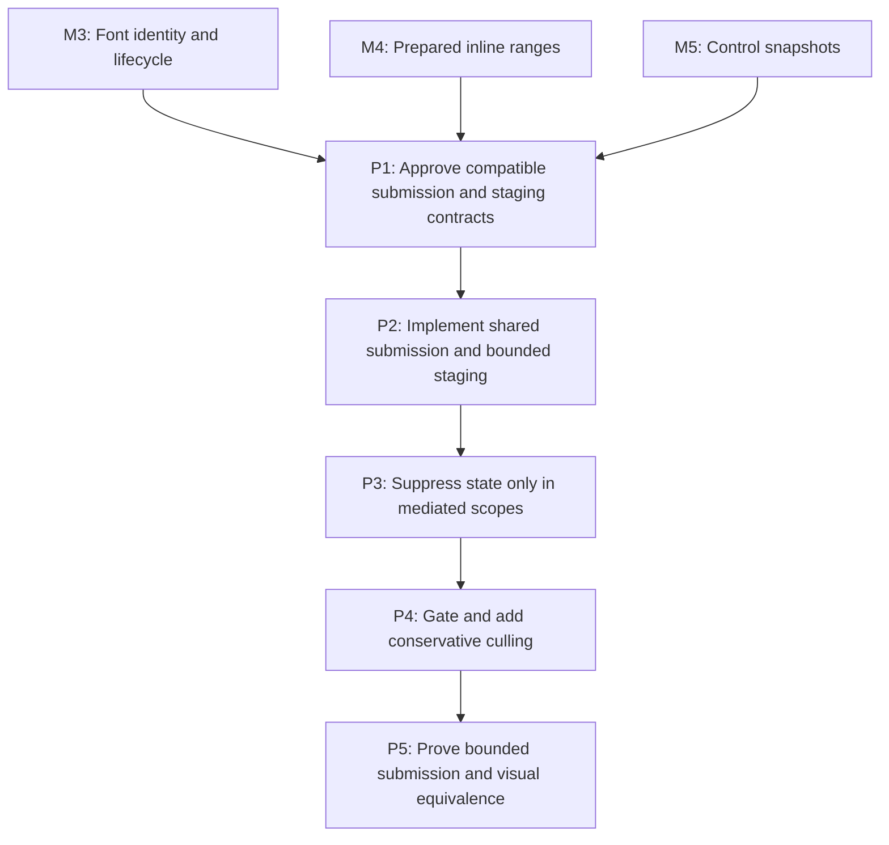

# M6: Bound NanoVG Text Submission

Parent plan: `docs/work/E5 - Text performance improvements.md`

## Goal

Reduce and hard-bound rendered-text preparation, UTF-8 staging, NanoVG text/state calls, and only
visibility work supported by conservative evidence, while preserving public resolved-run and
core/backend compatibility.

## Context

- M3 owns renderer/context/font teardown; M4 and M5 provide stable normal/control text outputs.
- `ResolvedTextRun` is a public record. Retaining rendered text must preserve its record components,
  canonical constructor, accessors, equality, hash, and string behavior.
- Normal text, input, and textarea currently use separate submission paths and per-run native UTF-8
  allocation. State suppression is safe only inside scopes where all relevant mutations are known.

## Phases

### P1: Approve compatible submission and staging contracts

**Document:** [P1 - Approve compatible submission and staging contracts](M6/P1%20-%20Approve%20compatible%20submission%20and%20staging%20contracts.md)

**Purpose:** Select a public-compatible rendered-text representation, native pointer lifetime,
staging bound, submission seam, state scope, and culling gate before backend implementation.

**Depends on:** M3, M4, M5.
**Enables:** P2.
**Parallelizable with:** None.

**Architectural Proposition:** Either a compatible external/prepared representation or a direct
glyph-to-staging path avoids rebuilding rendered text without adding an instance field to the public
record. A renderer/context owner supplies frame-scoped or hard-capped reusable staging with an
oversized one-shot fallback.

**Key Work:**
- Prove the `nvgText` source-buffer call lifetime from a pinned dependency source or reproducibly
  identified LWJGL/NanoVG version and record the citation/assumptions.
- Compare compatible rendered-text options against `ResolvedTextRun` constructor/record/equality
  semantics and M7's prohibition on cached final line-specific runs.
- Define staging cap/growth/admission/oversized/reset/teardown behavior and M3-aligned context states.
- Define the shared command seam, known save/restore/text scopes, face-failure x-advance behavior,
  alignment behavior, and criteria for textarea/general culling.

**Validation:** Architecture review can prove source lifetime, hard retention bounds, public
compatibility, and which state/culling optimizations are authorized.

**Risks / Stop Criteria:** Stop if native lifetime is inferred from timing, staging can grow without
a hard cap/reset, or the selected representation changes public record semantics.

### P2: Implement shared submission and bounded staging

**Document:** [P2 - Implement shared submission and bounded staging](M6/P2%20-%20Implement%20shared%20submission%20and%20bounded%20staging.md)

**Purpose:** Route normal text, input, and textarea text runs through one observable submission path
and renderer/context-owned staging strategy.

**Depends on:** P1.
**Enables:** P3.
**Parallelizable with:** M7/P2, M7/P3, M7/P4, M7/P5, M7/P6 after both P1 contracts; this phase is
backend-only while those phases are core-only.

**Architectural Proposition:** Shared commands encode face, size, color, alignment, position,
rendered bytes/text, and advance; staging retains only its documented cap and releases oversized
fallback allocations after the proven call lifetime.

**Key Work:**
- Add one recording/submission seam used by `NvgTextRenderer`, `NvgInputRenderer`, and
  `NvgTextareaRenderer` without moving NanoVG types into core.
- Implement frame reset or capped reusable UTF-8 staging, one-shot oversized fallback, diagnostics,
  and M3-compatible close/destroy behavior.
- Preserve run order and x advancement when a face cannot be created; preserve explicit alignment
  at every path boundary.

**Validation:** Structural recordings show all three paths use identical text-command semantics;
retained native capacity remains under policy; no native buffer is retained per run.

**Risks / Stop Criteria:** Stop if one path bypasses the seam, if face failure collapses later run x
positions incorrectly, or if staging is reused before the native call has finished reading it.

### P3: Suppress state only in mediated scopes

**Document:** [P3 - Suppress state only in mediated scopes](M6/P3%20-%20Suppress%20state%20only%20in%20mediated%20scopes.md)

**Purpose:** Remove redundant text face/size/color/alignment calls only where renderer state is known
and invalidated at every unknown boundary.

**Depends on:** P2.
**Enables:** P4.
**Parallelizable with:** M7/P2, M7/P3, M7/P4, M7/P5, M7/P6 because this phase remains in the backend
state/submission surface and avoids shared benchmark/report files.

**Architectural Proposition:** A scoped tracker begins after a known save/begin-text boundary,
observes every mediated mutation, invalidates on restore/external/unknown operations, and never
claims global NanoVG state ownership.

**Key Work:**
- Add explicit tracker scopes and invalidation for save/restore, clip/transform changes, renderer
  callbacks, debug/control transitions, and face-creation failure.
- Suppress only exactly equal face, size, color, and alignment commands inside a valid scope.
- Align tracker/staging reset and teardown with M3 renderer/context transitions.

**Validation:** Recording tests prove command reduction and exact ordering; injected unknown mutation
boundaries force state re-emission; repeated destroy/use-after-destroy follows M3.

**Risks / Stop Criteria:** Disable suppression where an external mutation is not mediated; never
extend tracking across a scope merely to improve a counter.

### P4: Gate and add conservative culling

**Document:** [P4 - Gate and add conservative culling](M6/P4%20-%20Gate%20and%20add%20conservative%20culling.md)

**Purpose:** Gate textarea-line and general fragment/run culling on conservative ink and Java-side
clip/transform evidence; defer either class when proof/data are unavailable.

**Depends on:** P3.
**Enables:** P5.
**Parallelizable with:** M7/P2, M7/P3, M7/P4, M7/P5, M7/P6 because this phase changes backend
visibility/submission files, not core cache families.

**Architectural Proposition:** Snapshot visual-line rectangles are not ink bounds. Textarea-line and
general text culling both require conservative vertical/horizontal ink bounds covering fallback
glyphs, overhang, antialias fringe, and fully propagated Java-side clip/transform state; line and
advance rectangles are never sufficient by themselves.

**Key Work:**
- Time-box conservative textarea vertical-ink/clip and general-fragment evidence independently;
  implement each only if fallback/overhang/antialias/transform conservatism is demonstrated.
- If either gate fails, record explicit deferral without a speculative API or mandated line-box cull.
- Count considered/submitted/culled commands by reason through the M1 diagnostics seam.

**Validation:** Boundary, fallback, overhang, transformed, clipped, and antialiased fixtures never
drop uncertain text. Textarea/general submission is reduced only for independently approved gates;
otherwise counters confirm explicit deferral.

**Risks / Stop Criteria:** Immediately defer general culling if conservative ink bounds or Java-side
clip/transform state is incomplete; never substitute advance geometry.

### P5: Prove bounded submission and visual equivalence

**Document:** [P5 - Prove bounded submission and visual equivalence](M6/P5%20-%20Prove%20bounded%20submission%20and%20visual%20equivalence.md)

**Purpose:** Integrate recordings, counters, lifecycle stress, and local image boundaries into one
submission proof without conflicting with M7 benchmark evidence work.

**Depends on:** P4.
**Enables:** None.
**Parallelizable with:** None.

**Architectural Proposition:** Portable structural recordings/counters prove semantics and bounded
work; opt-in images validate approved local boundary references; timings remain supporting evidence.

**Key Work:**
- Verify normal/input/textarea command order, x/baseline/alignment, fallback/replacement faces,
  state scopes, clipping, caret/selection, and face-failure advance behavior.
- Exercise small/oversized staging, frame reset, context destroy/recreate policy, partial failure,
  and aggregate native retention with M3 font resources.
- Run visible/offscreen/unchanged submission scenarios and opt-in image comparisons under M1 policy.

**Validation:** UTF-8 allocations/bytes and NanoVG text/state calls are reduced/explained, native
retention remains bounded, and no structural or approved image boundary regresses.

**Risks / Stop Criteria:** Do not approve if a local image pass hides a structural mismatch, if
context teardown leaks staging/font resources, or if a culling reduction lacks conservative proof.

## Milestone Validation

- `./gradlew :spinygui.core.backend.lwjgl.nanovg:test --tests 'com.spinyowl.spinygui.core.backend.renderer.lwjgl.nanovg.NvgTextRendererTest'`
- `./gradlew :spinygui.core.backend.lwjgl.nanovg:test --tests 'com.spinyowl.spinygui.core.backend.renderer.lwjgl.nanovg.NvgInputRendererTest'`
- `./gradlew :spinygui.core.backend.lwjgl.nanovg:test --tests 'com.spinyowl.spinygui.core.backend.renderer.lwjgl.nanovg.NvgFontRegistryTest'`
- `./gradlew :spinygui.benchmark:test`

## Dependency Graph

