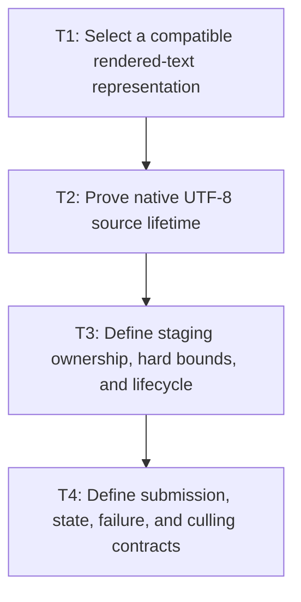

# P1: Approve Compatible Submission and Staging Contracts

**Status:** Complete

## Goal

Approve a public-compatible rendered-text path, proven native source-buffer lifetime, hard-bounded
staging owner, shared command seam, scoped state rules, face-failure advancement, and culling gates.

## Non-Goals

- Implementing backend submission changes or general glyph ink bounds.
- Changing `ResolvedTextRun` record/constructor/equality semantics for convenience.

## Context

- Parent milestone: `docs/work/E5/M6 - Bound NanoVG text submission.md`.
- Phase entry gate: M3 lifecycle and M4/M5 output contracts are complete.
- Java records cannot add arbitrary per-instance cache fields while preserving record shape; M7 also
  forbids caching final line-specific runs as reusable primitives.

## Phase Tasks

## Approved contract

- `ResolvedTextRun` remains unchanged. A call-local backend value selects either literal display
  text or an existing resolved run; resolved runs encode `ResolvedGlyph.renderedCodePoint()` directly
  and are never persistently cached by the submission layer.
- The renderer owns one lazily allocated UTF-8 buffer: 1 KiB initial capacity, power-of-two growth,
  and a hard 64 KiB retained cap. Larger values use exact-size one-shot allocation and synchronous
  cleanup. Empty values use a zero-length address/end range. No terminator is required because the
  selected LWJGL overload supplies an explicit end pointer.
- All text paths use the backend-local `NvgTextCommandSink`/`NvgTextSubmission` seam. A failed face
  emits no text but still contributes its resolved logical advance to the following run position.
- State knowledge exists only between the mediated text path's save/restore. Clip, transform,
  selection, caret, callback, debug, frame, failure, teardown, and explicit unknown boundaries
  invalidate it.
- Textarea-line and general culling require independent conservative ink plus effective Java-side
  clip/transform proof. Both default to deferral.

## Native source lifetime proof

The dependency catalog pins `org.lwjgl:lwjgl-nanovg:3.4.2-SNAPSHOT`. The resolved local artifact is
`Implementation-Version: build 13`; its sources JAR SHA-256 is
`BF871373453002543B367D3FDBC947436177F7298724FFBFFC670A330509E278`.

The generated `NanoVG.nvgText(ByteBuffer)` binding in that sources JAR calls `nnvgText` with
`memAddress(string)` and `memAddress(string) + string.remaining()`. NanoVG's `nvgText` synchronously
iterates the complete `[string,end)` range through FontStash, builds/transforms temporary vertices,
submits those vertices, and returns only after the iterator no longer reads the input bytes. See the
pinned upstream implementation at
<https://github.com/LWJGL/lwjgl3/blob/3.4.2/modules/lwjgl/nanovg/src/main/c/nanovg.c>
(`nvgText`) and the vendored origin at
<https://github.com/memononen/nanovg/blob/master/src/nanovg.c#L2326-L2394>.

Therefore reuse/free is safe immediately after the Java `nvgText` call returns. Artifact hash or
binding/source divergence fails closed: keep bytes alive for the complete call and do not reuse them
across an in-flight invocation.

### T1: Select a compatible rendered-text representation
**Purpose:** Avoid repeated `ResolvedTextRun.renderedText()` construction without breaking public
record behavior.

**Depends on:** None.
**Enables:** T2.
**Parallelizable with:** None.

**Changes:**
- [x] Characterize the current `ResolvedTextRun` components, canonical constructor, accessors,
  defensive glyph list, equality, hash code, `toString`, serialization/reflection assumptions, and
  `renderedText()` behavior.
- [x] Compare an external immutable prepared submission value, direct glyph-to-UTF-8 staging, and
  other compatible options; reject adding/changing a record component or instance cache.
- [x] Define ownership/lifetime and relationship to M2 final line runs and M7 width-independent
  primitives so final line-specific run values are not persistently cached by M7.

**Acceptance Checks:**
- [x] Compatibility tests construct/equal/hash/string/access a run exactly as before and obtain the
  same rendered code points/replacement behavior.
- [x] The selected option has a bounded/natural owner and cannot retain one rendered string/buffer per
  run without accounting.

**Risks / Stop Criteria:** Stop if reducing reconstruction requires source/binary/record equality
breakage or conflicts with M7 primitive boundaries.

### T2: Prove native UTF-8 source lifetime
**Purpose:** Establish when staging memory can be safely reused/freed.

**Depends on:** T1.
**Enables:** T3.
**Parallelizable with:** None.

**Changes:**
- [x] Pin or reproducibly identify the exact LWJGL and NanoVG source/version used by the dependency
  lock/catalog and trace `nvgText` Java/JNI/native calls to the point bytes are consumed/copied.
- [x] Record source links/commit/version, backend differences, null-termination/length requirements,
  synchronous/asynchronous assumptions, and minimum safe lifetime.
- [x] Add a focused reproducible probe/test only as supporting evidence; do not infer safety solely
  from passing timing or lack of crash.

**Acceptance Checks:**
- [x] Reviewers can reproduce the source proof from project dependency metadata and identify the
  exact earliest safe reuse/free point.
- [x] Unsupported backend/version behavior fails closed to per-call lifetime rather than optimistic
  reuse.

**Risks / Stop Criteria:** Stop staging reuse if the source path/version is ambiguous or if any
supported backend may retain the pointer past the proposed reset/reuse.

### T3: Define staging ownership, hard bounds, and lifecycle
**Purpose:** Prevent allocation reduction from becoming unbounded retained native memory.

**Depends on:** T2.
**Enables:** T4.
**Parallelizable with:** None.

**Changes:**
- [x] Select renderer/context-owned frame arena or capped reusable buffer strategy with exact initial/
  maximum capacity, growth, admission, reset, retained weight, and diagnostics.
- [x] Define oversized-run one-shot fallback, failure cleanup, zero/empty data, frame begin/end, and
  M3 context destroy/reinitialize/replacement behavior.
- [x] Define aggregate accounting with M3 font buffers/info/faces and prohibit persistent native
  buffers per run.

**Acceptance Checks:**
- [x] Retained native staging cannot exceed the hard cap per owner; oversized data frees after the T2
  lifetime and does not enlarge retained capacity beyond policy.
- [x] Teardown order joins M3 without releasing staging while a native call/context may use it.

**Risks / Stop Criteria:** Stop if the buffer can “grow to largest ever” without a hard cap or if
frame reset semantics depend on immediate-mode host behavior not guaranteed by the renderer API.

### T4: Define submission, state, failure, and culling contracts
**Purpose:** Freeze one observable path and authorize only safe call reduction.

**Depends on:** T3.
**Enables:** None.
**Parallelizable with:** None.

**Changes:**
- [x] Define shared normal/input/textarea command fields/order, alignment, clip/transform context,
  face/size/color, text bytes/value, x/baseline, and logical run advance.
- [x] Define face-creation failure behavior: failed text emits no draw but x advancement for following
  runs follows the existing/approved resolved advance contract.
- [x] Limit state tracking to known mediated save/restore/text scopes and define invalidation at every
  unknown/external mutation boundary.
- [x] Define independent evidence gates for textarea-line and general fragment/run culling using
  conservative ink (fallback faces, vertical/horizontal overhang, antialias fringe) plus effective
  Java-side clip/transform state; explicitly reject line and advance rectangles as sufficient ink.

**Acceptance Checks:**
- [x] Structural fixture expectations cover all three paths, alignment, face failure with following
  runs, unknown state mutation, and boundary-touching visibility.
- [x] Textarea-line and general culling are each explicitly deferred unless every applicable ink/
  clip/transform gate input is available and conservative.

**Risks / Stop Criteria:** Do not start P2 with global-state assumptions, ambiguous x advancement, or
advance-box culling.

## Verification Strategy

- Run `./gradlew :spinygui.core:test --tests 'com.spinyowl.spinygui.core.system.font.impl.FontServiceImplTest'`.
- Run `./gradlew :spinygui.core.backend.lwjgl.nanovg:test --tests 'com.spinyowl.spinygui.core.backend.renderer.lwjgl.nanovg.NvgTextRendererTest' --tests 'com.spinyowl.spinygui.core.backend.renderer.lwjgl.nanovg.NvgInputRendererTest'`.
- Inspect pinned dependency/source evidence; do not implement staging in this phase.

## Review Boundaries

- Review public representation, then native lifetime, then staging bounds/lifecycle, then submission/
  state/culling policy.

## Deferred Work

- Submission/staging implementation belongs to P2; state to P3; culling to P4; proof to P5.
- General culling remains deferred if the P4 evidence gate fails.

## Dependency Graph

