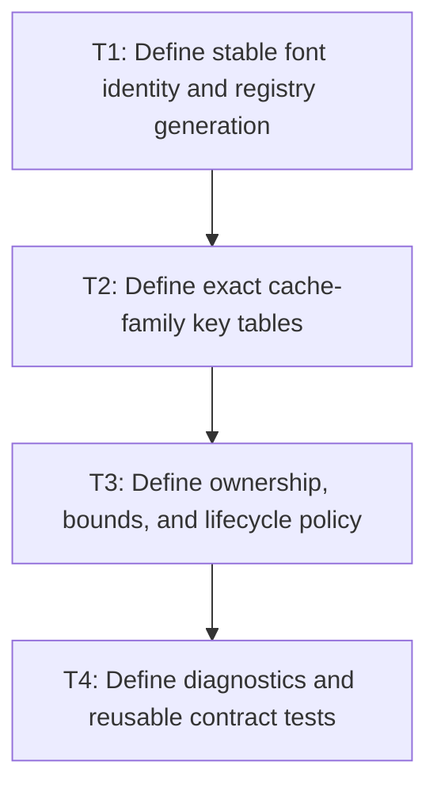

# P1: Establish generations and cache policy contracts

## Goal

Define font generations and mandatory key/owner/bound/diagnostic/lifecycle contracts before any
persistent text cache is introduced.

## Non-Goals

- Implementing cache families.
- Creating one unbounded or universal cache abstraction.

## Context

- Parent milestone: `docs/work/E5/M6 - Add bounded text cache infrastructure with explicit generations.md`.
- `FontStorage`/font resolution are mutable but currently expose no generation suitable for cache invalidation.

## Phase Tasks

### T1: Define stable font identity and registry generation
**Purpose:** Give every font-dependent result a monotonic invalidation input.

**Depends on:** M3/P3/T4, M5/P3/T4.
**Enables:** T2.
**Parallelizable with:** None.

**Changes:**
- [ ] Define stable font identity values and the exact successful registry/storage mutations that advance generation.
- [ ] Specify initial value, monotonicity, visibility/thread-safety, overflow posture, and failed/duplicate load behavior.

**Acceptance Checks:**
- [ ] Tests prove relevant successful mutations advance generation and no-op/failed operations follow the recorded contract.
- [ ] M4 snapshots can consume generation without depending on backend registry implementation details.

**Risks:** Reconcile core font storage and NanoVG face registration boundaries; do not expose context handles as font identity.

### T2: Define exact cache-family key tables
**Purpose:** Prevent width leakage, mutable identity, and accidental key omissions.

**Depends on:** T1.
**Enables:** T3.
**Parallelizable with:** None.

**Changes:**
- [ ] Tabulate font-chain, metrics, glyph/miss, advance, kerning, prepared-node, resolved-sequence, and wrap key fields.
- [ ] Mark width as legal only for wrap keys and exclude mutable `ResolvedStyle` identity everywhere.

**Acceptance Checks:**
- [ ] Every semantic input is either in a key/generation or explicitly proven irrelevant.
- [ ] Reserved shaping fields do not imply shaping implementation in this epic.

**Risks:** Stop a family if key equivalence cannot be expressed with immutable values.

### T3: Define ownership, bounds, and lifecycle policy
**Purpose:** Make retained memory and invalidation deterministic for each family.

**Depends on:** T2.
**Enables:** T4.
**Parallelizable with:** None.

**Changes:**
- [ ] Record owner, lifetime, synchronization, entry/weight bound, replacement, eviction, clear, and teardown for each family.
- [ ] Define cache-disabled mode and behavior under large strings, many widths, font churn, and concurrent service use.

**Acceptance Checks:**
- [ ] No family is approved without a hard bound or naturally bounded owner.
- [ ] A few large values cannot bypass weight policy and dominate retained memory silently.

**Risks:** Avoid shared global ownership unless concurrency and teardown are justified by measured reuse.

### T4: Define diagnostics and reusable contract tests
**Purpose:** Make every cache observable and comparable without coupling implementations.

**Depends on:** T3.
**Enables:** M6/P2.
**Parallelizable with:** None.

**Changes:**
- [ ] Define hit/miss/eviction/retained-entry/weight/clear diagnostics and deterministic reset semantics.
- [ ] Create contract-test patterns for key equivalence, generation misses, bounds, churn, clear, teardown, and disabled mode.

**Acceptance Checks:**
- [ ] Diagnostics can feed M1 workloads without becoming always-on heavyweight telemetry.
- [ ] Policy review confirms algorithmic fixes remain measurable with caches disabled.

**Risks:** Keep diagnostics narrow and near-zero-cost when disabled.

## Verification Strategy

- Run `./gradlew :spinygui.core:test --tests '*Font*' --tests '*TextInput*' --tests '*Textarea*'`.
- Run `./gradlew :spinygui.core.backend.lwjgl.nanovg:test --tests '*NvgFontRegistryTest'`.

## Review Boundaries

- Require separate reviews for generation ownership, key tables, policy/bounds, and diagnostics before cache implementation.

## Deferred Work

- Cache implementations belong to P2-P4; full fragment caching remains deferred.

## Dependency Graph

