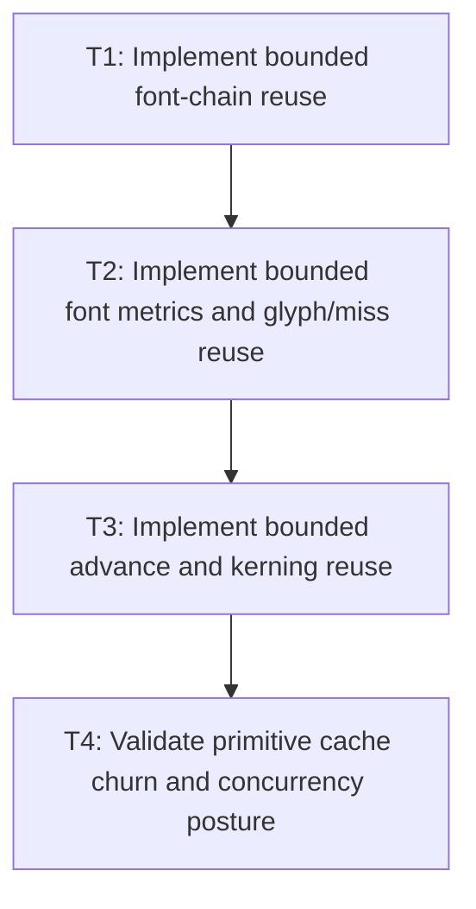

# P2: Add bounded font-chain and primitive caches

## Goal

Implement bounded font-chain, metrics, glyph/miss, advance, and kerning reuse under the approved
generation and lifecycle contracts.

## Non-Goals

- Prepared-node, resolved-sequence, or wrapped-layout reuse.
- Width-dependent primitive keys.

## Context

- Parent milestone: `docs/work/E5/M6 - Add bounded text cache infrastructure with explicit generations.md`.
- `FontServiceImpl` currently performs native metrics/glyph/advance/kerning calls repeatedly.

## Phase Tasks

### T1: Implement bounded font-chain reuse
**Purpose:** Reuse ordered fallback resolution by immutable typography values and generation.

**Depends on:** M6/P1/T4.
**Enables:** T2.
**Parallelizable with:** None.

**Changes:**
- [ ] Key ordered family names, requested style/weight/stretch, and registry generation exactly.
- [ ] Add bound/eviction/clear/disabled behavior and immutable returned chains.

**Acceptance Checks:**
- [ ] Equivalent requests hit; order/value/generation differences miss.
- [ ] Churn respects the approved retained-entry/weight bound.

**Risks:** Do not key on callers' mutable list or `ResolvedStyle` identity.

### T2: Implement bounded font metrics and glyph/miss reuse
**Purpose:** Avoid repeated native calls for stable font primitives, including absent glyphs.

**Depends on:** T1.
**Enables:** T3.
**Parallelizable with:** None.

**Changes:**
- [ ] Key metrics by font identity/generation, size, line height, and rounding mode.
- [ ] Key glyph indices, including misses/replacement lookup outcomes as specified, by identity/generation and code point.

**Acceptance Checks:**
- [ ] Missing glyphs are cached safely and invalidated by generation changes.
- [ ] Exact size/line-height/rounding differences produce correct misses for metrics.

**Risks:** Never allow a cached miss to survive a font registry generation change.

### T3: Implement bounded advance and kerning reuse
**Purpose:** Reuse scaled glyph and pair measurements with exact output-affecting inputs.

**Depends on:** T2.
**Enables:** T4.
**Parallelizable with:** None.

**Changes:**
- [ ] Key advances by identity/generation, glyph, size, and rounding; key kerning by ordered glyph pair plus required values.
- [ ] Preserve line/run kerning reset behavior and replacement/fallback font boundaries.

**Acceptance Checks:**
- [ ] Pair order, font, size, rounding, and generation differences cannot collide.
- [ ] Cached and disabled line widths/runs are exactly equivalent.

**Risks:** Weight pair caches appropriately to avoid high-cardinality text dominating memory.

### T4: Validate primitive cache churn and concurrency posture
**Purpose:** Prove bounds, lifecycle, diagnostics, and service-use assumptions.

**Depends on:** T3.
**Enables:** M6/P3.
**Parallelizable with:** None.

**Changes:**
- [ ] Run font/code-point/pair churn, generation changes, clear/teardown, and disabled-mode comparisons.
- [ ] Test or document synchronization based on actual `FontServiceImpl`/registry concurrency guarantees.

**Acceptance Checks:**
- [ ] Hit/miss/eviction/weight diagnostics match operations and all bounds hold.
- [ ] No stale native/font references remain after generation change or teardown.

**Risks:** Reject shared locking whose cost erases measured gains; prefer narrower ownership if necessary.

## Verification Strategy

- Run `./gradlew :spinygui.core:test --tests '*FontServiceImplTest' --tests '*FontChainResolverTest'`.
- Run `./gradlew :spinygui.core.backend.lwjgl.nanovg:test --tests '*NvgFontRegistryTest'`.
- Run `./gradlew :spinygui.benchmark:jmhCpu` locally with caches enabled/disabled and equivalent workload shape.

## Review Boundaries

- Review each cache family separately; do not merge primitive families into one opaque implementation change.

## Deferred Work

- Prepared/resolved reuse belongs to P3; width-keyed wrap reuse belongs to P4.

## Dependency Graph

