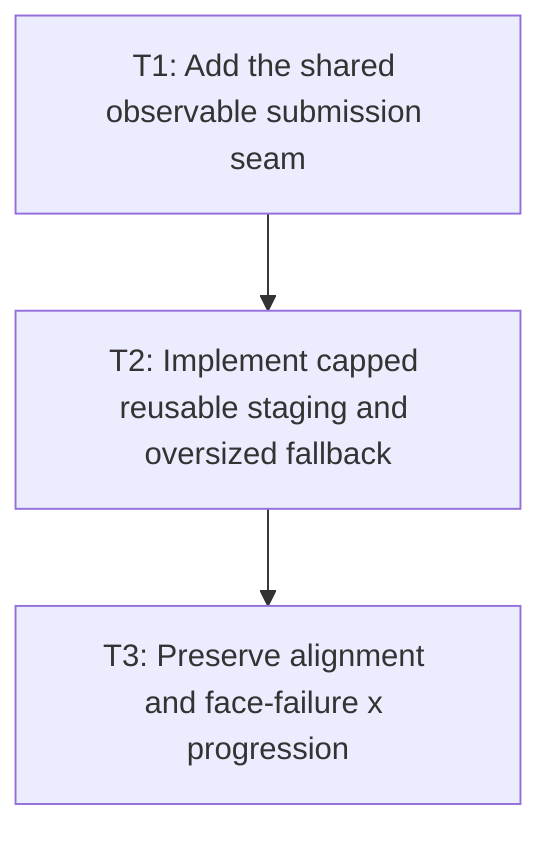

# P2: Implement Shared Submission and Bounded Staging

## Goal

Route normal text, input, and textarea runs through one observable command/submission seam and one
renderer/context-owned hard-bounded UTF-8 staging strategy with safe oversized fallback.

## Non-Goals

- Stateful command suppression or culling; P3/P4 own those changes.
- Backend types in core snapshots or changes to public `ResolvedTextRun` record shape.

## Context

- Parent milestone: `docs/work/E5/M6 - Bound NanoVG text submission.md`.
- Phase entry gate: M6/P1 contracts/source proof are approved.
- Phase-level parallelism: backend-only work may overlap M7/P2-P6 after both P1 contracts while
  shared benchmark/report files are untouched.

## Phase Tasks

### T1: Add the shared observable submission seam
**Purpose:** Give all text paths identical command semantics and structural recording.

**Depends on:** None.
**Enables:** T2.
**Parallelizable with:** None.

**Changes:**
- [ ] Define/implement backend command and sink interfaces carrying context scope, face/font identity,
  size, color, alignment, x/baseline, compatible rendered source/glyph data, and logical advance.
- [ ] Migrate `NvgTextRenderer`, `NvgInputRenderer`, and `NvgTextareaRenderer` to the same production
  sink, retaining selection/caret/clip ordering around text commands.
- [ ] Adapt M1 recordings/counters to the seam rather than parallel test-only renderer logic.

**Acceptance Checks:**
- [ ] All three paths produce equivalent command fields/order for the same resolved run fixture and
  no direct `nvgText` call remains outside the selected sink except documented non-text uses.
- [ ] Core module dependency graph remains NanoVG-free.

**Risks / Stop Criteria:** Stop if migration changes command ordering or leaves a control-specific
UTF-8/native allocation bypass.

### T2: Implement capped reusable staging and oversized fallback
**Purpose:** Encode/submit bytes without unbounded or per-run persistent native buffers.

**Depends on:** T1.
**Enables:** T3.
**Parallelizable with:** None.

**Changes:**
- [ ] Implement P1's renderer/context-owned frame/capped staging capacity, growth/admission, reset,
  diagnostics, and exact source lifetime.
- [ ] Encode the compatible rendered representation directly/once into staging with correct UTF-8
  length/termination and byte/allocation counters.
- [ ] Allocate/free an oversized one-shot buffer at the proven call lifetime without growing retained
  capacity past the cap; handle encode/native/face failures safely.

**Acceptance Checks:**
- [ ] Small runs reuse bounded storage, oversized runs free immediately after safe submission, and
  retained capacity never exceeds policy.
- [ ] UTF-8 byte content matches supplementary/replacement/control fixtures and no buffer is retained
  per run.

**Risks / Stop Criteria:** Stop if one frame can overwrite bytes still used by a native call or if a
single oversized value permanently raises retained capacity.

### T3: Preserve alignment and face-failure x progression
**Purpose:** Integrate failure and positioning behavior consistently across the shared path.

**Depends on:** T2.
**Enables:** None.
**Parallelizable with:** None.

**Changes:**
- [ ] Emit required left/baseline alignment at approved path/scope boundaries before text commands.
- [ ] When face creation fails, suppress only the failed draw while applying the approved logical run
  advance before following runs; record failure/advance explicitly.
- [ ] Handle empty runs/legacy no-run paths according to M2/M6 contracts without rebuilding display
  text repeatedly or changing fallback/replacement output.

**Acceptance Checks:**
- [ ] Recording tests cover a failed middle run followed by a successful run at the correct x,
  alignment restoration, and normal/input/textarea equivalence.
- [ ] M3 context/font failure/teardown paths release staging and never mutate core generation.

**Risks / Stop Criteria:** Stop if a face failure changes later run placement differently among text,
input, and textarea.

## Verification Strategy

- Run `./gradlew :spinygui.core.backend.lwjgl.nanovg:test --tests 'com.spinyowl.spinygui.core.backend.renderer.lwjgl.nanovg.NvgTextRendererTest'`.
- Run `./gradlew :spinygui.core.backend.lwjgl.nanovg:test --tests 'com.spinyowl.spinygui.core.backend.renderer.lwjgl.nanovg.NvgInputRendererTest'`.
- Run `./gradlew :spinygui.core.backend.lwjgl.nanovg:test` for shared/textarea/lifecycle tests.

## Review Boundaries

- Review seam migration, then staging/encoding bounds, then alignment/failure behavior.

## Deferred Work

- Scoped state suppression belongs to P3; culling to P4; integrated counters/images to P5.

## Dependency Graph

