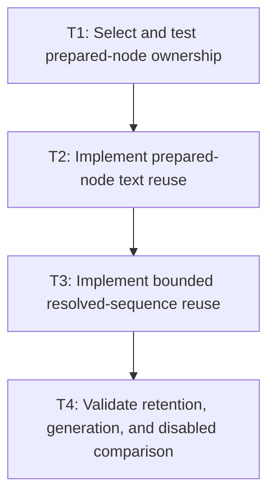

# P3: Add prepared-node and resolved-sequence reuse

## Goal

Reuse immutable prepared-node text and resolved glyph/run sequences under exact value keys without
retaining full inline fragments or width-dependent variants.

## Non-Goals

- Wrapped-layout reuse or full inline-fragment caching.
- Keying by mutable style identity.

## Context

- Parent milestone: `docs/work/E5/M6 - Add bounded text cache infrastructure with explicit generations.md`.
- M3 established pass-local prepared text; M2 established efficient uncached resolved sequences.

## Phase Tasks

### T1: Select and test prepared-node ownership
**Purpose:** Reuse normalization without retaining arbitrary historical node values.

**Depends on:** M6/P2/T4.
**Enables:** T2.
**Parallelizable with:** None.

**Changes:**
- [ ] Compare node-scoped replacement, weak ownership, and bounded service ownership using churn evidence.
- [ ] Key exact content, `white-space`, and `tab-size`; define node removal/clear behavior.

**Acceptance Checks:**
- [ ] Owner retains only approved current/bounded values and can clear deterministically.
- [ ] Content/whitespace/tab differences miss; unrelated style/presentation changes reuse.

**Risks:** Prefer node-scoped current-value replacement unless measured cross-node reuse justifies more retention.

### T2: Implement prepared-node text reuse
**Purpose:** Integrate the selected owner with M3 preparation and diagnostics.

**Depends on:** T1.
**Enables:** T3.
**Parallelizable with:** None.

**Changes:**
- [ ] Reuse immutable prepared results by the exact key and replace/evict under the approved policy.
- [ ] Expose hit/miss/eviction/weight/clear and cache-disabled behavior to workloads.

**Acceptance Checks:**
- [ ] Cached and disabled prepared text/fragments are structurally equivalent.
- [ ] Edit churn cannot retain an unbounded history of prior content.

**Risks:** Prepared results must not capture mutable node/style objects accidentally.

### T3: Implement bounded resolved-sequence reuse
**Purpose:** Reuse width-independent glyph/font/run resolution.

**Depends on:** T2.
**Enables:** T4.
**Parallelizable with:** None.

**Changes:**
- [ ] Key exact UTF-16 text, ordered font identities/generations, size, rounding mode, and reserved shaping attributes.
- [ ] Reuse immutable resolved glyph/run data without width, offset, wrap mode, or full fragment geometry.

**Acceptance Checks:**
- [ ] Width changes hit the same sequence while any text/font/order/generation/size/rounding difference misses.
- [ ] Fallback, misses, replacement markers, UTF-16 ranges, and runs match disabled mode.

**Risks:** Weight by retained text/glyph/run content, not entry count alone.

### T4: Validate retention, generation, and disabled comparison
**Purpose:** Prove both reuse layers remain bounded and observable under churn.

**Depends on:** T3.
**Enables:** M6/P4.
**Parallelizable with:** None.

**Changes:**
- [ ] Exercise many nodes, edits, mixed scripts, font changes, large strings, clear/teardown, and disabled mode.
- [ ] Compare operation counts and output without allowing cache hits to hide M2 complexity regressions.

**Acceptance Checks:**
- [ ] Bounds and eviction remain observable under adversarial churn.
- [ ] Cache-disabled size scaling remains linear and structurally equivalent.

**Risks:** Stop if a few large sequences can exceed the documented weight ceiling.

## Verification Strategy

- Run `./gradlew :spinygui.core:test --tests '*Inline*' --tests '*FontServiceImplTest'`.
- Run `./gradlew :spinygui.benchmark:jmhCpu` locally with enabled/disabled modes and equivalent workload shape/counters.
- Run `./gradlew :spinygui.core:test` before phase completion.

## Review Boundaries

- Review ownership decision, prepared reuse, resolved reuse, and churn evidence separately.

## Deferred Work

- Wrapped-layout reuse belongs to P4; retained inline fragments remain deferred beyond M7.

## Dependency Graph

