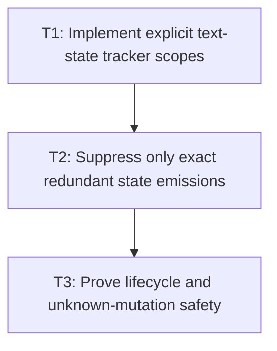

# P3: Suppress State Only in Mediated Scopes

**Status:** Complete

## Goal

Suppress redundant NanoVG text state commands only inside explicit scopes that mediate every
relevant mutation and invalidate tracking at save/restore, external, callback, and unknown boundaries.

## Non-Goals

- Global NanoVG state ownership or interception of arbitrary external native calls.
- Culling or concatenating runs/fragments.

## Context

- Parent milestone: `docs/work/E5/M6 - Bound NanoVG text submission.md`.
- Phase entry gate: M6/P2 shared submission/staging is structurally correct.
- Phase-level parallelism: backend state files can overlap M7/P2-P6 core cache work when tests/report
  files remain disjoint.

## Phase Tasks

### T1: Implement explicit text-state tracker scopes
**Purpose:** Make cached state validity local, observable, and fail-closed.

**Depends on:** None.
**Enables:** T2.
**Parallelizable with:** None.

**Changes:**
- [x] Define tracker start/end/reset at known renderer begin/end, `nvgSave`/`nvgRestore`, clip,
  transform, control, debug, callback, and external/unknown mutation boundaries.
- [x] Track face, size, color, and alignment only after a successful mediated emission; invalidate
  affected/all fields after failures or unknown state changes.
- [x] Join tracker reset/close with M3 renderer/context and P2 frame/staging lifecycle.

**Acceptance Checks:**
- [x] State begins unknown in every scope, cannot leak across restore/context/frame boundaries, and
  re-emits after injected unknown mutation.
- [x] Face-creation failure does not mark the failed face as active.

**Risks / Stop Criteria:** Disable tracking for a boundary if any relevant external state mutation can
occur without mediation/invalidation.

### T2: Suppress only exact redundant state emissions
**Purpose:** Reduce calls without changing command semantics/order.

**Depends on:** T1.
**Enables:** T3.
**Parallelizable with:** None.

**Changes:**
- [x] Compare exact approved values for face, size, color, and alignment and skip only a command whose
  state is known equal in the current scope.
- [x] Preserve required re-emission after control/path transitions, save/restore, clip/transform
  boundaries, callbacks, and failed face creation.
- [x] Reconcile recording/counter semantics so suppressed commands are distinguishable from logical
  requested state and actual native calls.

**Acceptance Checks:**
- [x] Recording fixtures show identical logical draw order/values with fewer native state commands;
  every boundary fixture re-emits required state.
- [x] Normal/input/textarea produce the same alignment/face/size/color behavior under mixed scopes.

**Risks / Stop Criteria:** Stop if floating/color equality canonicalization is not exact enough to
preserve native behavior or if suppression changes the first command after a scope.

### T3: Prove lifecycle and unknown-mutation safety
**Purpose:** Verify state suppression remains correct through renderer failures and context changes.

**Depends on:** T2.
**Enables:** None.
**Parallelizable with:** None.

**Changes:**
- [x] Test frame reset, context destroy/reinitialize/replacement policy, partial initialization,
  repeated destroy, use-after-destroy, and staging failure with tracker diagnostics.
- [x] Inject unknown/external mutations at every supported callback/custom renderer boundary and
  assert fail-closed re-emission.
- [x] Compare native state-call counts to structural recordings for normal/input/textarea mixed scenes.

**Acceptance Checks:**
- [x] No context/frame/scope starts with stale known state and lifecycle cleanup releases tracker/
  staging/font state in M3 order.
- [x] Counter reductions reconcile exactly with skipped equal commands and never hide missing commands.

**Risks / Stop Criteria:** Do not expand tracker scope to gain benchmark reductions when unknown
mutation coverage is incomplete.

## Verification Strategy

- Run `./gradlew :spinygui.core.backend.lwjgl.nanovg:test --tests 'com.spinyowl.spinygui.core.backend.renderer.lwjgl.nanovg.NvgTextRendererTest' --tests 'com.spinyowl.spinygui.core.backend.renderer.lwjgl.nanovg.NvgInputRendererTest'`.
- Run `./gradlew :spinygui.core.backend.lwjgl.nanovg:test --tests 'com.spinyowl.spinygui.core.backend.renderer.lwjgl.nanovg.NvgRendererTransformStateTest'`.
- Run `./gradlew :spinygui.core.backend.lwjgl.nanovg:test` for textarea/lifecycle recording coverage.

## Review Boundaries

- Review scope/invalidation model, then exact suppression, then lifecycle/external-boundary tests.

## Deferred Work

- Conservative culling belongs to P4; full submission/image proof belongs to P5.

## Dependency Graph

