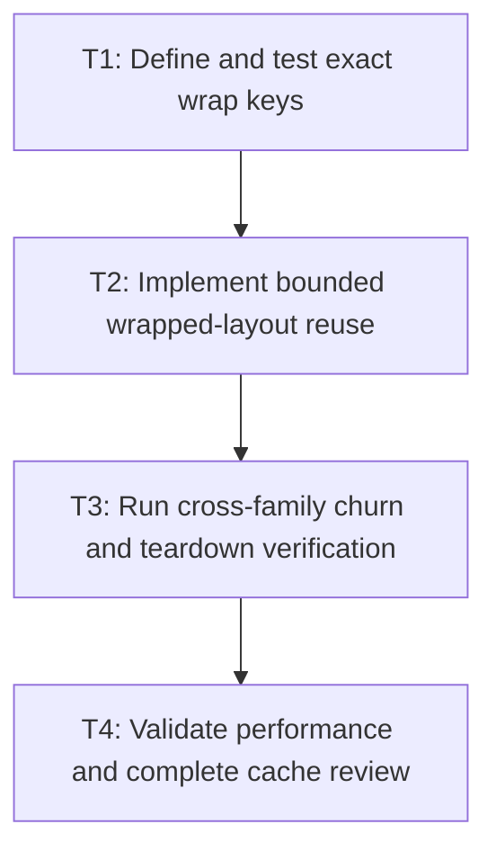

# P4: Add width-keyed wrap reuse and prove bounded churn

## Goal

Add bounded exact-width wrapped-layout reuse, integrate diagnostics/lifecycle across cache families,
and prove correct cache-enabled and disabled operation under churn.

## Non-Goals

- A second control-layout cache or unbounded resize history.
- Full inline-fragment/layout-result caching.

## Context

- Parent milestone: `docs/work/E5/M6 - Add bounded text cache infrastructure with explicit generations.md`.
- M4 snapshots already own current control layout; general wrap reuse must not duplicate that owner.

## Phase Tasks

### T1: Define and test exact wrap keys
**Purpose:** Isolate width-dependent line breaking from width-independent resolution.

**Depends on:** M6/P3/T4.
**Enables:** T2.
**Parallelizable with:** None.

**Changes:**
- [ ] Key resolved-sequence identity/key plus exact width, offset, wrapping mode, and line-breaking policy.
- [ ] Define float canonicalization/equality and maximum retained widths/results per owner.

**Acceptance Checks:**
- [ ] Width/offset/wrap/policy differences miss; typography/text/font changes flow through sequence identity.
- [ ] Width appears in no font-chain, primitive, prepared, or resolved-sequence key.

**Risks:** Exact float semantics must match measurement inputs; avoid approximate reuse that changes wrapping.

### T2: Implement bounded wrapped-layout reuse
**Purpose:** Reuse immutable lines/runs/geometry without accumulating resize variants.

**Depends on:** T1.
**Enables:** T3.
**Parallelizable with:** None.

**Changes:**
- [ ] Integrate the approved owner/bound/eviction/clear/disabled contract.
- [ ] Reuse M4 current snapshots for controls rather than layering another general cache over them.

**Acceptance Checks:**
- [ ] Warm identical requests hit and resize churn evicts/replaces within the documented width bound.
- [ ] Cached/disabled wraps preserve exact lines, ranges, widths, runs, and pixels.

**Risks:** Weight wrapped results by retained line/run content as well as entry count.

### T3: Run cross-family churn and teardown verification
**Purpose:** Prove combined cache behavior remains bounded and diagnosable.

**Depends on:** T2.
**Enables:** T4.
**Parallelizable with:** None.

**Changes:**
- [ ] Exercise font registration, family/code-point/pair churn, node edits, large sequences, width churn,
  clear, teardown, and cache-disabled mode.
- [ ] Verify aggregate retained Java/native state and per-family hit/miss/eviction/weight diagnostics.

**Acceptance Checks:**
- [ ] Every family remains within its bound and clear/teardown releases owned state.
- [ ] Generation changes invalidate all font-dependent results, including cached misses.

**Risks:** Stop default enablement if aggregate retention cannot be explained from diagnostics.

### T4: Validate performance and complete cache review
**Purpose:** Confirm reuse helps unchanged-value workloads without hiding algorithmic regressions.

**Depends on:** T3.
**Enables:** M7/P1.
**Parallelizable with:** None.

**Changes:**
- [ ] Compare cold, warm, churn, and disabled workload counters/allocation/latency in equivalent environments.
- [ ] Run structural, control, renderer, and pixel regressions and document selected default bounds.

**Acceptance Checks:**
- [ ] Warm scenarios reduce native/preparation work while disabled scenarios retain linear behavior.
- [ ] Workload shape/counters remain identical across enabled/disabled comparisons and outputs match.

**Risks:** Local timing is informational; default decisions require bounds, correctness, counters, and churn evidence.

## Verification Strategy

- Run `./gradlew :spinygui.core:test`.
- Run `./gradlew :spinygui.core.backend.lwjgl.nanovg:test`.
- Run `./gradlew :spinygui.benchmark:jmhCpu`, `./gradlew :spinygui.benchmark:jmhRendering`, and
  `./gradlew :spinygui.benchmark:benchmarkReport` locally with equivalent environments/workloads.
- Run `./gradlew test`.

## Review Boundaries

- Review wrap keys before implementation; review cross-family churn before any default enablement.

## Deferred Work

- Dirty style/layout ownership belongs to M7; full inline-fragment caching remains deferred.

## Dependency Graph

