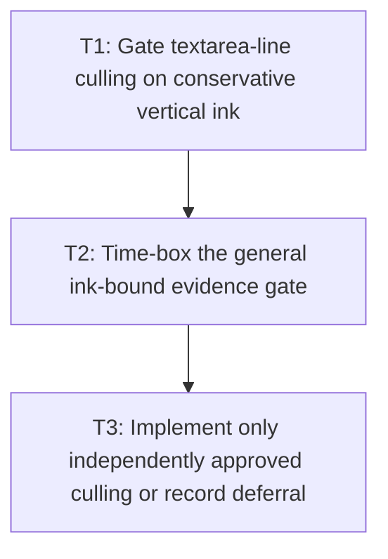

# P4: Gate and Add Conservative Culling

**Status:** Complete

## Goal

Gate complete textarea-line and general text culling independently on conservative ink plus effective
Java-side clip/transform evidence, implementing only the classes whose proof is complete.

## Non-Goals

- Using advance rectangles as glyph ink bounds.
- Speculative textarea-line or general fragment/run culling when any conservative input is unavailable.

## Context

- Parent milestone: `docs/work/E5/M6 - Bound NanoVG text submission.md`.
- Phase entry gate: M6/P3 shared submission and scoped state tracking are complete.
- Phase-level parallelism: backend visibility/submission files may overlap M7/P2-P6 core cache work
  while benchmark/report proof files remain separate.

## Phase Tasks

## Gate decisions

- **Textarea-line culling: deferred.** Snapshots expose line layout geometry, not a conservative
  union of fallback glyph ink. The Java renderer also does not retain a complete effective nested
  clip/transform value at the line submission seam. Vertical overhang and antialias fringe therefore
  cannot be proven outside.
- **General fragment/run culling: deferred.** Resolved advances and fragment rectangles are not ink
  bounds; left/right fallback overhang, antialias fringe, and a complete effective clip/transform
  remain unavailable at the shared command seam.

No production culling API or advance/line-box substitute was introduced. Existing diagnostics keep
`considered = submitted + face-selection-failed` and all cull counters at zero; offscreen and
boundary fixtures continue to submit in original order.

### T1: Gate textarea-line culling on conservative vertical ink
**Purpose:** Determine whether M5 line/source data plus font metrics can conservatively bound all ink
for a visual line; a line rectangle alone is not sufficient.

**Depends on:** None.
**Enables:** T2.
**Parallelizable with:** None.

**Changes:**
- [x] Inventory conservative top/bottom ink extents for every fallback/replacement face/run, glyph
  overhang, requested/fallback vertical metrics, antialias fringe, font size, and transforms in a line.
- [x] Prove effective nested content clip/transform conversion on the Java side, including control/
  ancestor scroll and boundary-touching ink.
- [x] Produce an explicit textarea-line approval or deferral decision; if approved, define the
  conservative union/expansion and independent selection/caret visibility behavior.

**Acceptance Checks:**
- [x] Above/below/touching/partially visible/scrolled/transformed fixtures include fallback vertical
  overhang and antialias fringe and prove all ink outside before approval.
- [x] If required font/run ink data are unavailable, textarea line culling is explicitly deferred and
  no line-rectangle substitute is authorized.

**Risks / Stop Criteria:** Default to deferral if conservative vertical ink or effective clip/
transform conversion cannot be represented for the textarea path.

### T2: Time-box the general ink-bound evidence gate
**Purpose:** Decide implement/defer from concrete conservative data rather than performance pressure.

**Depends on:** T1.
**Enables:** T3.
**Parallelizable with:** None.

**Changes:**
- [x] Inventory available glyph/font ink extents across fallback/replacement faces, left/right/top/
  bottom overhang, antialias fringe, font size/transform, and effective nested clip/transform state.
- [x] Build boundary fixtures for italic/overhang/fallback/antialias/transformed/clipped fragments and
  document a conservative expansion/calculation only if every input is available.
- [x] Produce an explicit approval or deferral decision; reject advance/run width rectangles as ink.

**Acceptance Checks:**
- [x] Approval includes a proof that any culled ink is wholly outside the effective clip under all
  supported transformations; otherwise deferral is recorded with missing evidence.
- [x] No production general-culling API/code is added merely to preserve a future placeholder.

**Risks / Stop Criteria:** Default outcome is deferral when conservative ink or Java-side state is
incomplete.

### T3: Implement only independently approved culling or record deferral
**Purpose:** Keep production behavior aligned with the gate outcome.

**Depends on:** T2.
**Enables:** None.
**Parallelizable with:** None.

**Changes:**
- [x] If textarea-line culling is approved, integrate the conservative line ink union before shared
  submission; otherwise document/test that every line remains submitted.
- [x] If general culling is approved, integrate conservative fragment/run ink bounds; otherwise
  document/test that no line/advance-rectangle or speculative general culling is active.
- [x] Retain uncertain/boundary text and record considered/submitted/culled commands with exact gate/
  reason independently for textarea and general text.
- [x] Verify culling decisions do not alter scoped state correctness for following commands.

**Acceptance Checks:**
- [x] Structural recordings show exact retained order/x progression/state after culling and no
  boundary-touching ink disappears.
- [x] The implemented feature set exactly matches both independent approval/deferral artifacts.

**Risks / Stop Criteria:** Revert/defer general culling on any unexplained image/structural boundary
mismatch; correctness dominates call reduction.

## Verification Strategy

- Run `./gradlew :spinygui.core.backend.lwjgl.nanovg:test` for textarea/general recording fixtures.
- Run `./gradlew :spinygui.core.backend.lwjgl.nanovg:test --tests 'com.spinyowl.spinygui.core.backend.renderer.lwjgl.nanovg.NvgTextRendererTest'`.
- Run local image comparison only under M1's opt-in matching-environment policy.

## Review Boundaries

- Review textarea vertical-ink evidence, then general ink evidence, then each approved implementation/
  deferral separately.

## Deferred Work

- Textarea-line and general culling each remain deferred unless their independent evidence gate
  explicitly approves them.
- Full counters/lifecycle/image proof belongs to P5.

## Dependency Graph

