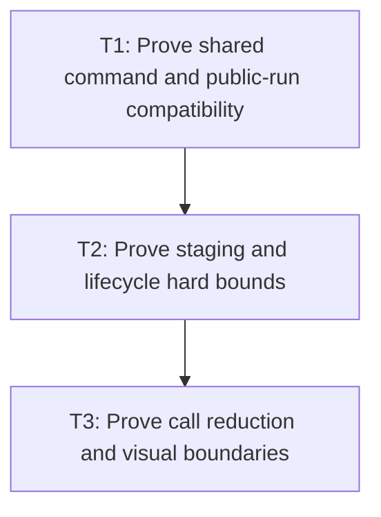

# P5: Prove Bounded Submission and Visual Equivalence

## Goal

Prove shared text submission preserves structure/visual boundaries and M3 lifecycle while reducing
and bounding rendered-text, UTF-8, state-call, and approved culling work.

## Non-Goals

- Using image comparison as the primary portable oracle.
- Sharing benchmark/report proof edits concurrently with M7/P7.

## Context

- Parent milestone: `docs/work/E5/M6 - Bound NanoVG text submission.md`.
- Phase entry gate: M6/P4 has either implemented only approved culling or recorded general deferral.
- Structural recordings and deterministic counters are primary; local images are opt-in boundary
  evidence under M1 fingerprints/reference tolerance.

## Phase Tasks

### T1: Prove shared command and public-run compatibility
**Purpose:** Verify all renderer paths and `ResolvedTextRun` consumers remain behaviorally compatible.

**Depends on:** None.
**Enables:** T2.
**Parallelizable with:** None.

**Changes:**
- [ ] Compare normal/input/textarea command streams for run order, rendered code points/bytes, face,
  size, color, alignment, x/baseline, logical advances, clips/transforms, selection, and caret.
- [ ] Test public run canonical construction/components/accessors/equality/hash/`toString` and retained
  `renderedText()` behavior under the selected compatible representation.
- [ ] Cover empty/legacy, fallback/replacement, supplementary, face-creation failure with following
  runs, unknown state mutation, and culling boundaries.

**Acceptance Checks:**
- [ ] Portable structural output is exact except authorized omission of proven culled commands and
  exact suppression of redundant native state emissions.
- [ ] Public run compatibility tests pass without additional record components/instance cache.

**Risks / Stop Criteria:** Stop if compatibility relies on callers avoiding constructor/equality/
reflection behavior that remains public.

### T2: Prove staging and lifecycle hard bounds
**Purpose:** Demonstrate native allocation reduction does not leak or over-retain memory.

**Depends on:** T1.
**Enables:** T3.
**Parallelizable with:** None.

**Changes:**
- [ ] Exercise empty/small/cap-sized/oversized/many-run frames, encode/native failure, frame reset,
  context destroy/reinitialize/replacement policy, repeated destroy, and use-after-destroy.
- [ ] Reconcile staging capacity/allocations/frees with UTF-8 byte/allocation counters and M3 font
  buffer/info/face retention.
- [ ] Verify context delete precedes font backing release and staging respects the proven native call
  lifetime in all paths.

**Acceptance Checks:**
- [ ] Retained staging stays below the configured hard cap, oversized allocations free after call,
  and no per-run native buffer remains.
- [ ] Aggregate lifecycle tests show once-only cleanup in M3 order with no stale tracker state.

**Risks / Stop Criteria:** Do not accept GC/process-exit as teardown evidence or omit hidden/native
backing capacity from retention accounting.

### T3: Prove call reduction and visual boundaries
**Purpose:** Explain performance changes with counters and validate approved local rendering edges.

**Depends on:** T2.
**Enables:** None.
**Parallelizable with:** None.

**Changes:**
- [ ] Run identified normal/input/textarea visible/offscreen/unchanged scenes and report UTF-8 bytes/
  allocations, text calls, each state call, considered/submitted/culled work, and face failures.
- [ ] Reconcile each counter with structural recordings and distinguish state suppression, staging,
  and culling contributions.
- [ ] Run local opt-in image references for overhang/fallback/antialias/clip/transform/selection/caret
  boundaries on an exactly matching fingerprint; retain mismatch artifacts.
- [ ] Capture diagnostics-disabled local timing/allocation evidence separately after deterministic
  proof.

**Acceptance Checks:**
- [ ] Counter reductions are attributable and structural recordings remain correct; image comparison
  passes or is explicitly unvalidated on incompatible environment.
- [ ] Textarea-line and general culling claims each match P4 approval/deferral and never rely on line/
  advance rectangles as ink bounds.

**Risks / Stop Criteria:** Stop if a non-black/image pass masks structural drift, if counters do not
reconcile, or if a call reduction changes visible boundaries.

## Verification Strategy

- Run `./gradlew :spinygui.core.backend.lwjgl.nanovg:test`.
- Run `./gradlew :spinygui.benchmark:test`.
- Run local image comparison only with M1 opt-in/reference/environment match.
- Invoke `./gradlew :spinygui.benchmark:benchmarkReport` only as one diagnostics-disabled paired run
  after deterministic proof; coordinate with M7/P7 to avoid overlapping report edits/runs.

## Review Boundaries

- Review structural/public compatibility, then staging/lifecycle, then counters/images/timing.

## Deferred Work

- Any textarea-line or general culling class that failed P4 remains deferred.
- M7 owns bounded persistent calculation caches; M8 owns whole-frame orchestration.

## Dependency Graph

