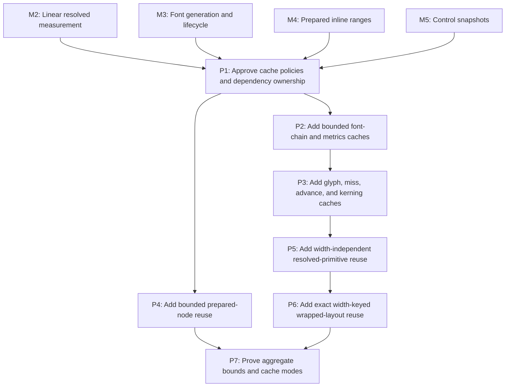

# M7: Add Bounded Generation-Safe Text Caches

**Status:** Planned

Parent plan: `docs/work/E5 - Text performance improvements.md`

## Goal

Add independently reviewable, UI-thread-owned cache families with corrected immutable keys,
explicit hard bounds and lifecycle, and cold/warm/churn/disabled evidence after uncached algorithms,
font generations, prepared ranges, and control snapshots are stable.

## Context

- M2-M5 supply the primitive, lifecycle, prepared-text, and naturally bounded control contracts.
- Width-independent resolved primitives contain source boundaries, face/glyph selection, base
  advances, and pair-kerning inputs. Final line-specific `ResolvedTextRun` advances are materialized
  only after wrapping and line-start kerning reset.
- M3 font/native caches/resources participate in aggregate retention and teardown claims; M5's one
  current snapshot per control is reused rather than wrapped by a global control cache.

## Phases

### P1: Approve cache policies and dependency ownership

**Document:** [P1 - Approve cache policies and dependency ownership](M7/P1%20-%20Approve%20cache%20policies%20and%20dependency%20ownership.md)

**Purpose:** Freeze family key tables, owners, bounds/admission, diagnostics, reference direction,
weight accounting, disabled behavior, and teardown before any cache is enabled.

**Depends on:** M2, M3, M4, M5.
**Enables:** P2, P4.
**Parallelizable with:** None.

**Architectural Proposition:** Every family has an immutable value key, one UI-thread owner, hard
entry and/or retained-weight policy, oversized admission behavior, hit/miss/eviction/weight
diagnostics, independent clear, close order, and true disabled mode.

**Key Work:**
- Tabulate exact keys for font chain, metrics, glyph including misses, advance, kerning, prepared node
  text, resolved primitives, and wrapped layout; width is legal only in wrap keys.
- Select the immutable semantic resolved-primitive value key/value references used by wrap and cross-
  cache dependencies; prohibit cache-entry identity in persistent keys/references. Define upstream/
  downstream direction, explicit shared-object weight, independent clear, and teardown.
- Include M3 bytes/STB/NanoVG retention in aggregate budgets and reject weak-key-only bounds.
- Define oversized values, admission/eviction, diagnostics reset, generation transition, and disabled
  behavior for every family.

**Validation:** No family proceeds without an exact key/owner/bound/lifecycle row and a contract-test
matrix; no persistent key/reference contains cache-entry identity, and clearing any family leaves no
dangling downstream reference.

**Risks / Stop Criteria:** Stop a family whose weight cannot be explained, whose key contains mutable
identity, or whose independent clear requires clearing unrelated owners to remain correct.

### P2: Add bounded font-chain and metrics caches

**Document:** [P2 - Add bounded font-chain and metrics caches](M7/P2%20-%20Add%20bounded%20font-chain%20and%20metrics%20caches.md)

**Purpose:** Cache ordered resolver output and font metrics under the real M3 identity/generation and
the P1 policies.

**Depends on:** P1.
**Enables:** P3.
**Parallelizable with:** P4 and M6/P2, M6/P3, M6/P4; those phases use disjoint prepared-text or
backend-only files after contracts are frozen.

**Architectural Proposition:** Font-chain keys contain ordered requested families and effective
style/weight/stretch plus semantic generation; metrics keys contain semantic font identity,
generation, exact size/line-height, and measurement configuration/rounding identity—never width.

**Key Work:**
- Implement bounded chain and metric families with immutable values, generation-safe misses, clear/
  close, diagnostics, oversized behavior, and disabled mode.
- Prove no-op/failed registry actions retain validity while successful semantic changes miss by key
  or clear according to P1.
- Include existing resolver/font-resource retention in family and aggregate accounting.

**Validation:** Key-equivalence, generation, bound, eviction, clear, teardown, and disabled contract
tests pass without changing M2 results.

**Risks / Stop Criteria:** Stop if a chain/metric entry references mutable registry collections or if
generation is replaced by context-local NanoVG face identity.

### P3: Add glyph, miss, advance, and kerning caches

**Document:** [P3 - Add glyph miss advance and kerning caches](M7/P3%20-%20Add%20glyph%20miss%20advance%20and%20kerning%20caches.md)

**Purpose:** Bound repeated native primitive probes/calls while preserving fallback semantics and
line-start kerning behavior.

**Depends on:** P2.
**Enables:** P5.
**Parallelizable with:** P4 and M6/P2, M6/P3, M6/P4 because prepared-node/backend files and tests are
partitioned from font primitive implementation.

**Architectural Proposition:** Glyph keys include semantic font identity/generation and code point
and cache both hits and misses; advance/kerning keys include exact glyph/size/configuration inputs,
with no line width or final line-specific run value.

**Key Work:**
- Add hard-bounded glyph/miss caching that preserves the distinction between logical fallback
  resolution and each candidate's native probe.
- Add hard-bounded base-advance and pair-kerning input caches with exact rounding/configuration keys.
- Verify generation, clear independence, oversized/admission, diagnostics, disabled mode, and
  line-start reset materialization.

**Validation:** Warm primitives reduce native probes/advance/kerning calls; cached misses remain
generation-safe; final lines do not inherit kerning across wraps.

**Risks / Stop Criteria:** Stop if misses survive a semantic generation change, if pair keys omit
ordering, or if cached values embed final line position/width.

### P4: Add bounded prepared-node reuse

**Document:** [P4 - Add bounded prepared-node reuse](M7/P4%20-%20Add%20bounded%20prepared-node%20reuse.md)

**Purpose:** Persist M4 prepared text/range/mapping results under exact content/whitespace policy
without weak-only or unbounded node ownership.

**Depends on:** P1.
**Enables:** P7.
**Parallelizable with:** P2, P3, P5, P6 and M6/P2, M6/P3, M6/P4 because the prepared-inline owner and
tests are disjoint from font/resolved/wrap/backend families after P1.

**Architectural Proposition:** Prepared-node keys contain exact source content and every effective
preparation policy (`white-space`, tab size, and approved normalization policy); the owner is
node-current or hard-bounded independently of weak reachability.

**Key Work:**
- Implement immutable prepared value reuse with hard/natural replacement bounds, oversized behavior,
  diagnostics, clear/teardown, and disabled mode.
- Preserve M4 original/prepared/range/fragment mappings and current durable fragment materialization.
- Prove direct content/policy mutations are caught by exact key validation even without observable
  mutation hooks.

**Validation:** Warm preparation skips normalization scans; churn remains bounded; exact policy or
content changes miss; disabled output/counters match M4.

**Risks / Stop Criteria:** Weak keys alone are not sufficient; stop if prepared results retain DOM
nodes beyond the documented owner or if durable fragments are cached implicitly.

### P5: Add width-independent resolved-primitive reuse

**Document:** [P5 - Add width-independent resolved-primitive reuse](M7/P5%20-%20Add%20width-independent%20resolved-primitive%20reuse.md)

**Purpose:** Reuse M2 source-boundary/face/glyph/base-advance/pair-input sequences across measurements
without caching final wrapped runs.

**Depends on:** P3.
**Enables:** P6.
**Parallelizable with:** P4 and M6/P2, M6/P3, M6/P4 because prepared-node/backend surfaces remain
disjoint from the resolved-primitive owner.

**Architectural Proposition:** The key contains exact UTF-16 source, ordered semantic font identities/
generations, exact size, measurement configuration/rounding, and approved resolution policy. It
contains no width, offset, or final line state.

**Key Work:**
- Implement the bounded primitive family with immutable source/glyph data and P1 lifecycle policy.
- Materialize line-specific runs after wrapping, resetting first-pair kerning per line rather than
  storing final `ResolvedTextRun` outputs in the cache.
- Prove fallback transitions, replacement source boundaries, supplementary code points, generation,
  independent clear, and disabled mode.

**Validation:** Different widths/offsets share primitive identity while producing independently
correct final lines; retained weight and eviction remain bounded/explainable.

**Risks / Stop Criteria:** Stop if width leaks into this key, if values reference cache-entry identity
that breaks independent clear, or if final run advances are retained as reusable primitives.

### P6: Add exact width-keyed wrapped-layout reuse

**Document:** [P6 - Add exact width-keyed wrapped-layout reuse](M7/P6%20-%20Add%20exact%20width-keyed%20wrapped-layout%20reuse.md)

**Purpose:** Cache final wrapped layout only under exact line-affecting inputs and a hard width/result
retention policy.

**Depends on:** P5.
**Enables:** P7.
**Parallelizable with:** P4 and M6/P2, M6/P3, M6/P4 because cache implementation remains in core and
does not touch M6 backend staging/state/culling files.

**Architectural Proposition:** Wrap keys contain P1's immutable semantic resolved-primitive value key,
exact width, offset, line-height/vertical-metrics identity, wrap mode, and line-breaking policy. Width
appears in no upstream family; cache-entry identity is prohibited in persistent keys/references.

**Key Work:**
- Implement bounded wrap reuse with exact floating/key semantics, hard entry/weight/admission,
  oversized behavior, diagnostics, clear/teardown, and disabled mode.
- Reference the selected immutable semantic primitive value key/value and account shared weight
  exactly once; never retain cache-entry identity.
- Prove many-width resize churn, offsets, vertical metrics, wrapping policies, generation changes,
  and line-start kerning reset.

**Validation:** Exact warm widths hit; any line-affecting field misses; width churn evicts under the
hard bound; upstream clears do not leave dangling entry references.

**Risks / Stop Criteria:** Stop if approximate width equality changes layout, if a resize sequence
retains unbounded widths, or if wrap values bypass M2 immutable-result rules.

### P7: Prove aggregate bounds and cache modes

**Document:** [P7 - Prove aggregate bounds and cache modes](M7/P7%20-%20Prove%20aggregate%20bounds%20and%20cache%20modes.md)

**Purpose:** Integrate all families with M3 resources/M5 snapshots and prove exact cold, warm, churn,
clear, teardown, and disabled behavior using workloads that actually invoke preparation/measurement.

**Depends on:** P4, P6.
**Enables:** None.
**Parallelizable with:** None.

**Architectural Proposition:** Aggregate retention includes shared values once, M3 existing/native
owners, and one current M5 snapshot per control. Pre-laid-out rendering scenes are not evidence of
cache reuse because they may avoid the cached calculation paths entirely.

**Key Work:**
- Add explicit cold, warm, churn, and disabled modes for each family and mixed measurement/inline/
  control workload, including generation and width churn.
- Assert hard entry/weight/admission, oversized rejection/fallback, hit/miss/eviction, independent
  clear, cross-cache references, and downstream-to-upstream teardown.
- Compare disabled counters/results to M2/M4/M5 uncached behavior and report aggregate Java/native
  retention including M3 resources.

**Validation:** Every mode invokes the intended cache path, warm work falls for explainable reasons,
churn stays under aggregate bounds, disabled remains linear/correct, and no global control cache is
introduced.

**Risks / Stop Criteria:** Do not enable a family by default if its benchmark does not exercise it,
aggregate weight double-counting/omission is unresolved, or disabled mode changes behavior.

## Milestone Validation

- `./gradlew :spinygui.core:test --tests 'com.spinyowl.spinygui.core.system.font.*'`
- `./gradlew :spinygui.core:test --tests 'com.spinyowl.spinygui.core.layout.impl.InlineFormattingContextTest'`
- `./gradlew :spinygui.core:test --tests 'com.spinyowl.spinygui.core.system.input.*'`
- `./gradlew :spinygui.benchmark:test`
- Invoke paired performance reporting only after deterministic mode/churn tests pass.

## Dependency Graph

