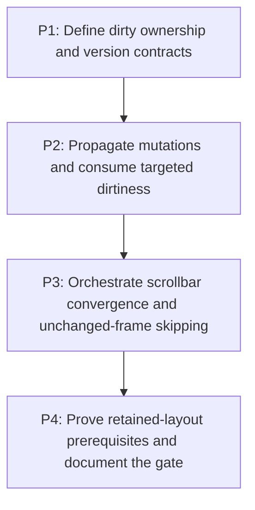

# M7: Establish dirty style and layout ownership for future retained layout reuse

## Goal

Introduce explicit style, text/intrinsic, geometry, overflow, and paint invalidation ownership so
unchanged work can be skipped and future full inline-fragment caching has trustworthy prerequisites.

**Depends on:** M6.
**Enables:** None.
**Parallelizable with:** None.

## Context

- Parent epic: `docs/work/E5 - Text performance improvements.md`.
- `StyleManagerImpl` and `LayoutServiceImpl` currently traverse whole frames, while layout may repeat
  for bounded scrollbar convergence.
- This later architecture initiative must not retroactively block M2-M6 or authorize fragment caching.

## Phases

### P1: Define dirty ownership and version contracts
**Document:** [P1 - Define dirty ownership and version contracts](M7/P1%20-%20Define%20dirty%20ownership%20and%20version%20contracts.md)
**Purpose:** Record version owners, mutation classes, propagation, service ordering, and host behavior.

**Depends on:** M6/P4.
**Enables:** P2.
**Parallelizable with:** None.

**Architectural Proposition:** Monotonic style, text/intrinsic, geometry, overflow, and paint versions
have explicit producers and consumers; versions may live on nodes or a runtime side table only if
manual service composition remains supported.

**Key Work:**
- Map DOM/value, stylesheet/inheritance, font generation, viewport, control, scroll, and animation
  mutations to dirty domains and propagation directions.
- Define successful, failed, and repeated-pass clear/commit semantics.

**Validation:**
- Architecture review resolves ownership and manual-host compatibility before implementation.
- Paint-only mutations do not invalidate M4/M6 text results.

### P2: Propagate mutations and consume targeted dirtiness
**Document:** [P2 - Propagate mutations and consume targeted dirtiness](M7/P2%20-%20Propagate%20mutations%20and%20consume%20targeted%20dirtiness.md)
**Purpose:** Wire mutation entry points and services to the approved dirty-domain contract.

**Depends on:** P1.
**Enables:** P3.
**Parallelizable with:** None.

**Architectural Proposition:** Downward inherited-style effects and upward intrinsic/overflow effects
are explicit; service consumers clear only versions whose work completed successfully.

**Key Work:**
- Integrate node/control/style/font/viewport mutation sources and targeted subtree propagation.
- Teach style, text, layout, overflow, and paint consumers to explain performed or skipped work.

**Validation:**
- Targeted mutations invalidate the smallest safe subtree without leaving stale descendants/ancestors.
- Independently composed style/layout services preserve documented correctness.

### P3: Orchestrate scrollbar convergence and unchanged-frame skipping
**Document:** [P3 - Orchestrate scrollbar convergence and unchanged-frame skipping](M7/P3%20-%20Orchestrate%20scrollbar%20convergence%20and%20unchanged-frame%20skipping.md)
**Purpose:** Separate bounded convergence retries from persistent dirtiness and skip explainable work.

**Depends on:** P2.
**Enables:** P4.
**Parallelizable with:** None.

**Architectural Proposition:** Frame orchestration distinguishes initial dirty work from internal
scrollbar-gutter retries, commits stable versions only after convergence, and skips unchanged domains.

**Key Work:**
- Integrate `StyleManagerImpl`, `LayoutServiceImpl`, optional frame runtime, and manual hosts.
- Cover gutter changes, failed/maxed passes, viewport changes, scroll-only, and paint-only frames.

**Validation:**
- Unchanged frames skip style/layout predictably and counters identify why work ran.
- Scrollbar convergence remains bounded and cannot commit stale geometry or overflow.

### P4: Prove retained-layout prerequisites and document the gate
**Document:** [P4 - Prove retained-layout prerequisites and document the gate](M7/P4%20-%20Prove%20retained-layout%20prerequisites%20and%20document%20the%20gate.md)
**Purpose:** Verify mutation coverage and state explicit prerequisites for any future fragment cache.

**Depends on:** P3.
**Enables:** None.
**Parallelizable with:** None.

**Architectural Proposition:** Full inline-fragment retention remains deferred until executable
unchanged-frame and targeted-mutation evidence proves no relevant mutation bypasses versions.

**Key Work:**
- Exercise text, typography, fonts, widths, inheritance, DOM, overflow, controls, animation, and
  scrollbar-gutter scenarios with cache-disabled comparison.
- Document unresolved selector targeting or host integration limits as follow-up, not hidden scope.

**Validation:**
- Stale style/text/geometry/overflow/paint cannot survive covered mutations.
- The completion record authorizes only prerequisites, not full fragment caching itself.

## Risks and Stop Criteria

- Stop implementation if mutation entry points cannot be enumerated or service success cannot be
  distinguished from failed/repeated passes.
- Do not expand into parser/style cleanup, general layout optimization, or fragment caching without
  separate evidence and planning.

## Dependency Graph

