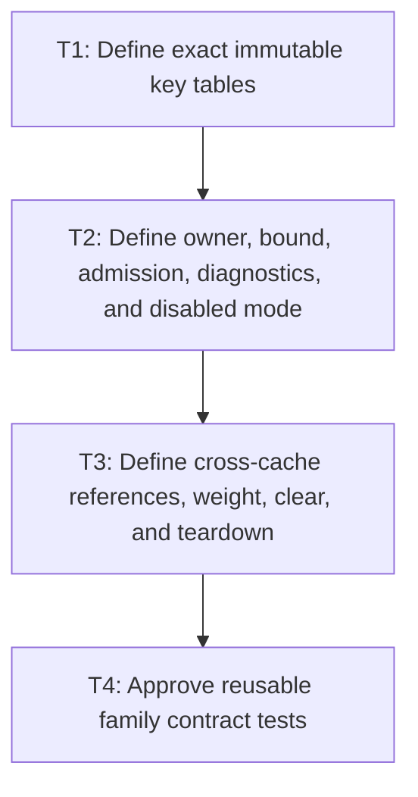

# P1: Approve Cache Policies and Dependency Ownership

**Status:** Complete

## Goal

Approve exact immutable key tables, UI-thread owners, hard bounds/admission, diagnostics, disabled
mode, cross-cache references/weights, independent clear, and teardown for every cache family.

## Non-Goals

- Implementing cache entries or one universal cache abstraction.
- Treating weak keys as a hard bound or adding a global control-layout cache.

## Context

- Parent milestone: `docs/work/E5/M7 - Add bounded generation-safe text caches.md`.
- Phase entry gate: M2-M5 data/lifecycle/snapshot contracts are complete.
- Existing M3 core/backend font resources/caches are prerequisites and participate in aggregate
  retention; M5's one current snapshot per control remains the only control-layout reuse owner.

## Phase Tasks

### T1: Define exact immutable key tables
**Purpose:** Prevent omitted inputs, mutable identity, width leakage, and final-run misuse.

**Depends on:** None.
**Enables:** T2.
**Parallelizable with:** None.

**Changes:**
- [x] Define font-chain keys from ordered requested families, effective style/weight/stretch, resolver
  policy, and real M3 semantic generation.
- [x] Define metrics keys from semantic font identity/generation, exact size/line height/vertical
  metric policy, and measurement configuration/rounding; glyph/miss from identity/generation/code
  point; advance and kerning from identity/generation/glyph or ordered pair/size/configuration.
- [x] Define prepared-node keys from exact source content plus every effective whitespace/tab/
  normalization policy; resolved-primitive keys from exact UTF-16 source, ordered semantic font
  identities/generations, exact size/configuration/resolution policy.
- [x] Define wrap keys from one selected immutable semantic resolved-primitive value key, exact width,
  offset, line-height/vertical-metrics identity, wrap mode, and line-breaking policy; assert width
  occurs nowhere else.

**Acceptance Checks:**
- [x] Every semantic input from M2-M4 is either a key/generation field or explicitly proven
  irrelevant; no key retains mutable `ResolvedStyle`, list, node, or cache-entry identity.
- [x] Resolved values exclude final line-specific `ResolvedTextRun` data and preserve line-start
  materialization after wrapping.

**Risks / Stop Criteria:** Stop a family if immutable value equivalence cannot be stated or exact
float/configuration semantics remain undefined.

### T2: Define owner, bound, admission, diagnostics, and disabled mode
**Purpose:** Make retained work/memory and observability deterministic per family.

**Depends on:** T1.
**Enables:** T3.
**Parallelizable with:** None.

**Changes:**
- [x] Assign each family one UI-thread owner/lifetime and exact hard entry and/or weight limit,
  eviction/replacement, oversized rejection/one-shot behavior, admission policy, and configuration.
- [x] Define hit, miss, negative hit, admission rejection, eviction, entry count, retained weight,
  clear, and reset diagnostics with near-zero disabled instrumentation cost.
- [x] Define a true disabled mode that does not populate/lookup/retain entries and preserves M2/M4/M5
  uncached correctness/linear counters.
- [x] Include existing M3 byte/STB/NanoVG face/buffer/info owners and M5 snapshots in aggregate
  retention reporting without pretending they use identical eviction policy.

**Acceptance Checks:**
- [x] No family can exceed a documented hard/natural bound even under unique strings/widths/fonts or
  oversized values; weak reachability is never the sole bound.
- [x] Disabled-mode contract tests can prove the cache path is truly bypassed.

**Risks / Stop Criteria:** Stop if one large value can silently dominate memory or diagnostics
themselves retain keys/values/history.

### T3: Define cross-cache references, weight, clear, and teardown
**Purpose:** Prevent hidden retention, dangling entry identity, and coupled lifecycle failures.

**Depends on:** T2.
**Enables:** T4.
**Parallelizable with:** None.

**Changes:**
- [x] Draw allowed dependency/reference direction among registry/resources, chain/metrics/primitives,
  prepared values, resolved primitives, wraps, and M5 snapshots.
- [x] Require immutable semantic value-key/value references for every persistent cross-cache
  dependency. Prohibit cache-entry identity/nodes/handles in keys and persistent references; no later
  phase may introduce an exception.
- [x] Define shared-object weight accounting (which owner counts bytes once and how dependents count
  references), aggregate totals, independent clear outcomes, and downstream-to-upstream teardown.
- [x] Define generation transition handling and how one family clear/disable affects downstream hit/
  correctness without forcing unrelated clear.

**Acceptance Checks:**
- [x] Clearing/evicting any upstream family leaves downstream entries either independently valid by
  immutable value/key or deterministically missed/invalidated without dangling references.
- [x] The approved wrap-key row names exactly one semantic resolved-primitive value-key type and all
  rows explicitly reject cache-entry identity.
- [x] Aggregate weight neither double-counts nor omits shared strings/arrays/native resources.
  Native byte retention and native entry cardinality are separate units; entry counts never inflate
  retained-byte totals.

**Risks / Stop Criteria:** Stop if correctness requires global “clear everything” while claiming
independent clear, or if weight ownership cannot be audited.

### T4: Approve reusable family contract tests
**Purpose:** Make every implementation phase satisfy the same policy before default enablement.

**Depends on:** T3.
**Enables:** None.
**Parallelizable with:** None.

**Changes:**
- [x] Define reusable tests for exact hit/miss keys, generation, negative entries, entry/weight bound,
  admission/oversized, eviction, diagnostics/reset, independent clear, close order, and disabled mode.
- [x] Define UI-thread/off-thread/use-after-close checks and deterministic fake weights/eviction order
  without over-constraining implementation where policy permits alternatives.
- [x] Define benchmark mode metadata (cold/warm/churn/disabled) and require workloads to invoke the
  cache-owning calculation path rather than pre-laid-out rendering only.

**Acceptance Checks:**
- [x] Each P2-P6 phase can list every shared contract test plus family-specific semantic fixtures.
- [x] Review approves family split; no big-bang “all caches” implementation task remains.

**Risks / Stop Criteria:** Do not start implementation while a family lacks a contract test for any
mandatory policy column.

## Verification Strategy

- Run `./gradlew :spinygui.core:test --tests 'com.spinyowl.spinygui.core.system.font.*' --tests 'com.spinyowl.spinygui.core.layout.impl.InlineFormattingContextTest' --tests 'com.spinyowl.spinygui.core.system.input.*'`.
- Run `./gradlew :spinygui.core.backend.lwjgl.nanovg:test --tests 'com.spinyowl.spinygui.core.backend.renderer.lwjgl.nanovg.NvgFontRegistryTest'`.
- Review key/policy/dependency tables; no cache implementation yet.

## Review Boundaries

- Review keys, then per-family bounds/modes, then references/weight/teardown, then contract tests.

## Deferred Work

- Family implementation belongs to P2-P6; aggregate proof/default decisions belong to P7.
- Full fragment/control history caches remain deferred.

## Dependency Graph

