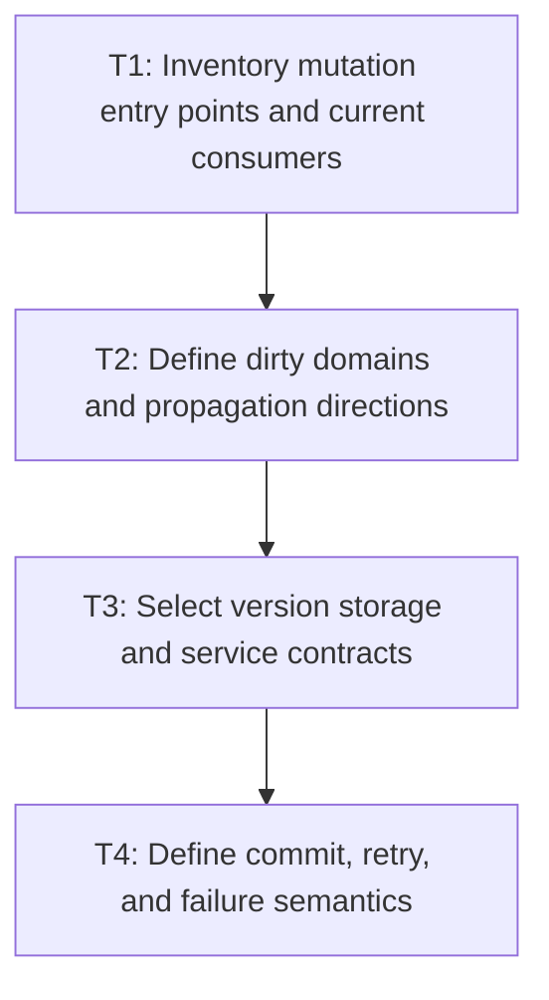

# P1: Define dirty ownership and version contracts

## Goal

Approve explicit dirty-domain owners, mutation mappings, propagation, service orchestration, and
version commit semantics before changing frame execution.

## Non-Goals

- Implementing propagation or frame skipping.
- Full inline-fragment caching, parser cleanup, or general layout optimization.

## Context

- Parent milestone: `docs/work/E5/M7 - Establish dirty style and layout ownership for future retained layout reuse.md`.
- `StyleManagerImpl.recalculate` and `LayoutServiceImpl.layout` currently process whole frames; hosts
  may compose services manually.

## Phase Tasks

### T1: Inventory mutation entry points and current consumers
**Purpose:** Ensure no relevant mutation bypasses the proposed version system.

**Depends on:** M6/P4/T4.
**Enables:** T2.
**Parallelizable with:** None.

**Changes:**
- [ ] Inventory DOM/value, attributes/inline style, stylesheets/inheritance, font generation, viewport/
  containing block, control, scroll, animation/presentation, and scrollbar mutations.
- [ ] Map current style, text, layout, overflow, transform, renderer, event, and manual-host consumers.

**Acceptance Checks:**
- [ ] Each mutation has an owner/API entry point or an explicit unsupported/manual invalidation requirement.
- [ ] M4/M6 reuse inputs and clear paths appear in the inventory.

**Risks:** Stop architecture approval if common direct mutations cannot be observed or documented safely.

### T2: Define dirty domains and propagation directions
**Purpose:** Separate reasons for recomputation without losing transitive effects.

**Depends on:** T1.
**Enables:** T3.
**Parallelizable with:** None.

**Changes:**
- [ ] Define style, text/intrinsic, geometry, overflow, and paint domains with monotonic versions.
- [ ] Specify downward inheritance/containing effects, upward intrinsic/overflow effects, subtree/ancestor scope,
  and paint-only changes that preserve text/layout results.

**Acceptance Checks:**
- [ ] A mutation-to-domain/propagation table covers every T1 entry.
- [ ] Scroll, caret, selection, focus, color/opacity animation, text, font, width, and DOM cases are distinguished.

**Risks:** Avoid domain fragmentation that costs more orchestration than it saves or cannot be tested.

### T3: Select version storage and service contracts
**Purpose:** Preserve node lifecycle and independent service composition.

**Depends on:** T2.
**Enables:** T4.
**Parallelizable with:** None.

**Changes:**
- [ ] Compare node-owned versions with runtime side tables for memory, lifecycle, weak ownership, and manual hosts.
- [ ] Define service inputs/outputs, observed/committed versions, and explicit invalidation for independently composed hosts.

**Acceptance Checks:**
- [ ] Selected storage has deterministic node removal/teardown behavior and no hidden unbounded side table.
- [ ] Hosts can use style/layout services without adopting an undocumented mandatory frame runtime.

**Risks:** Do not make an optional orchestrator the only path to correctness.

### T4: Define commit, retry, and failure semantics
**Purpose:** Prevent skipped work from accepting partial or unconverged results.

**Depends on:** T3.
**Enables:** M7/P2.
**Parallelizable with:** None.

**Changes:**
- [ ] Specify when versions clear/commit after successful style, text, geometry, overflow, and paint work.
- [ ] Define failed passes, exceptions, scrollbar retries/max passes, and mutations during processing.

**Acceptance Checks:**
- [ ] A service never clears dirtiness for work that failed or was superseded.
- [ ] Architecture review records owners, ordering, propagation, and manual-host compatibility.

**Risks:** Stop before implementation if convergence retries cannot be distinguished from persistent dirtiness.

## Verification Strategy

- Review existing `StyleManagerImplTest`, layout/overflow tests, input/textarea tests, and renderer transform tests as contract sources.
- Run `./gradlew :spinygui.core:test --tests '*StyleManager*' --tests '*Layout*' --tests '*Overflow*'` after adding executable contract fixtures.

## Review Boundaries

- Treat the mutation inventory, dirty-domain table, storage decision, and commit/retry contract as
  separate architecture review checkpoints.

## Deferred Work

- Propagation and service changes belong to P2-P3; fragment caching remains outside this milestone.

## Dependency Graph

