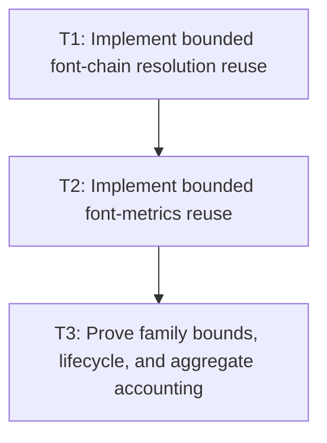

# P2: Add Bounded Font-Chain and Metrics Caches

## Goal

Implement independently bounded font-chain and font-metrics families using exact immutable value
keys and the real M3 semantic generation/lifecycle.

## Non-Goals

- Glyph/advance/kerning caching or width-dependent wrapping.
- Replacing M3 resource ownership with cache ownership.

## Context

- Parent milestone: `docs/work/E5/M7 - Add bounded generation-safe text caches.md`.
- Phase entry gate: M7/P1 cache contracts are approved.
- Phase-level parallelism: reciprocal with M7/P4 and M6/P2-P4 when files/tests remain partitioned.

## Phase Tasks

### T1: Implement bounded font-chain resolution reuse
**Purpose:** Reuse ordered resolver results without bypassing central generation/ownership.

**Depends on:** None.
**Enables:** T2.
**Parallelizable with:** None.

**Changes:**
- [ ] Implement the P1 font-chain key/value under the central M3 resolver owner, copying ordered
  families/effective values and retaining immutable ordered semantic font identities/faces.
- [ ] Apply exact entry/weight/admission/oversized/eviction/diagnostics/clear/close/disabled policies
  and UI-thread checks.
- [ ] Handle empty/missing families, nearest style/weight/stretch selection, no-op/failure generation,
  and successful semantic changes.

**Acceptance Checks:**
- [ ] Exact equivalent requests hit; order/style/weight/stretch/resolver policy/generation changes miss;
  disabled mode performs resolver work and retains nothing.
- [ ] Cached values cannot mutate with caller lists or registry collections.

**Risks / Stop Criteria:** Stop if the cache creates a second resolver/registry owner or if missing
families are generation-unsafe.

### T2: Implement bounded font-metrics reuse
**Purpose:** Reuse vertical/base metrics under every exact metric-affecting input.

**Depends on:** T1.
**Enables:** T3.
**Parallelizable with:** None.

**Changes:**
- [ ] Implement the P1 metrics key/value including semantic identity/generation, size, line height,
  vertical metric policy, and rounding/measurement configuration, excluding width/offset.
- [ ] Apply independent owner/bound/admission/oversized/diagnostics/clear/teardown/disabled policy.
- [ ] Preserve M2 fallback vertical-metric selection and invalid/edge numeric behavior.

**Acceptance Checks:**
- [ ] Each exact metric input changes reuse as specified; width changes never affect this family.
- [ ] Cached immutable metrics survive independent chain-cache clear by value/key without dangling
  entry identity and miss on semantic generation changes.

**Risks / Stop Criteria:** Stop if line-height/rounding identity is implicit in a service object or if
metrics reference released M3 STB info rather than immutable values.

### T3: Prove family bounds, lifecycle, and aggregate accounting
**Purpose:** Complete the first family review before adding lower-level primitive caches.

**Depends on:** T2.
**Enables:** None.
**Parallelizable with:** None.

**Changes:**
- [ ] Run reusable P1 contract tests and churn ordered families/styles/sizes/line heights/generations,
  including oversized/admission rejection and off-thread/use-after-close.
- [ ] Clear each family independently in both orders and verify downstream/value validity.
- [ ] Reconcile retained entries/weight with shared semantic font values and M3 resource diagnostics.

**Acceptance Checks:**
- [ ] Hard bounds, evictions, diagnostics, disabled mode, independent clear, and downstream-to-upstream
  teardown pass deterministically.
- [ ] Aggregate accounting counts shared values/resources according to P1 with no hidden native owner.

**Risks / Stop Criteria:** Do not enable either family by default until its independent churn/clear/
disabled evidence passes.

## Verification Strategy

- Run `./gradlew :spinygui.core:test --tests 'com.spinyowl.spinygui.core.system.font.FontChainResolverTest' --tests 'com.spinyowl.spinygui.core.system.font.impl.FontServiceImplTest'`.
- Run `./gradlew :spinygui.core:test` after lifecycle/composition changes.

## Review Boundaries

- Review font-chain family, then metrics family, then combined bounds/lifecycle/accounting.

## Deferred Work

- Glyph/miss/advance/kerning families belong to P3.
- Aggregate benchmark/default enablement belongs to P7.

## Dependency Graph

