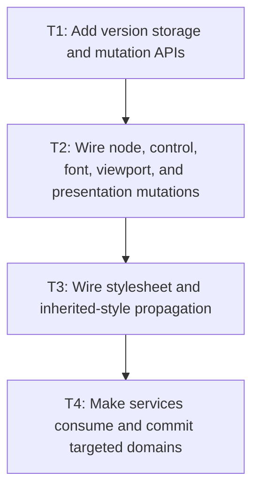

# P2: Propagate mutations and consume targeted dirtiness

## Goal

Wire approved mutation sources and propagation rules, then make services consume and clear only the
dirty domains they successfully process.

## Non-Goals

- Final unchanged-frame orchestration or scrollbar retry optimization.
- Selector dependency indexing beyond the smallest safe first implementation.

## Context

- Parent milestone: `docs/work/E5/M7 - Establish dirty style and layout ownership for future retained layout reuse.md`.
- P1 must approve version storage and manual-host invalidation before this phase changes entry points.

## Phase Tasks

### T1: Add version storage and mutation APIs
**Purpose:** Establish one authoritative way to mark and inspect dirty domains.

**Depends on:** M7/P1/T4.
**Enables:** T2.
**Parallelizable with:** None.

**Changes:**
- [ ] Implement approved monotonic versions/dirty state, inspection, propagation hooks, and lifecycle cleanup.
- [ ] Add explicit host invalidation APIs where mutations cannot be intercepted safely.

**Acceptance Checks:**
- [ ] Versions advance monotonically and removed nodes/owners release side state.
- [ ] Direct/manual host usage can preserve correctness through documented APIs.

**Risks:** Keep the first contract minimal; avoid speculative dependency graphs for every style property.

### T2: Wire node, control, font, viewport, and presentation mutations
**Purpose:** Cover non-stylesheet mutation sources with the approved domain mapping.

**Depends on:** T1.
**Enables:** T3.
**Parallelizable with:** None.

**Changes:**
- [ ] Wire DOM/text/value/control, font generation, viewport/containing-block, scroll, and animation/presentation changes.
- [ ] Preserve M4 exact snapshot invalidation and M6 generation/clear behavior.

**Acceptance Checks:**
- [ ] Mutation tests show exact domain/version changes and propagation scopes.
- [ ] Caret/selection/focus/color/scroll do not discard text snapshots unless another approved input changes.

**Risks:** Node mutation APIs may be broad; instrument tests before refactoring unrelated model code.

### T3: Wire stylesheet and inherited-style propagation
**Purpose:** Recalculate the smallest safe subtree without requiring a full selector dependency index.

**Depends on:** T2.
**Enables:** T4.
**Parallelizable with:** None.

**Changes:**
- [ ] Mark style effects for stylesheet/ruleset, inline style, attributes/selectors, pseudo/control state, and inheritance changes.
- [ ] Choose conservative subtree invalidation where precise selector impact is unavailable and document the boundary.

**Acceptance Checks:**
- [ ] Descendant inherited values and selector-dependent nodes cannot retain stale styles.
- [ ] Unaffected subtrees can remain clean in covered targeted scenarios.

**Risks:** Do not expand into parser/style hot-path cleanup or a full selector index.

### T4: Make services consume and commit targeted domains
**Purpose:** Connect versions to style/text/layout/overflow/paint work with safe commit semantics.

**Depends on:** T3.
**Enables:** M7/P3.
**Parallelizable with:** None.

**Changes:**
- [ ] Teach service boundaries to inspect reasons, process safe subtrees/domains, and commit only completed versions.
- [ ] Add diagnostic reasons for performed/skipped work and tests for failures/mutations during processing.

**Acceptance Checks:**
- [ ] Targeted mutations update required descendants/ancestors and leave unrelated clean work untouched.
- [ ] Failed or superseded work remains dirty and stale geometry cannot be committed.

**Risks:** Stage service adoption so correctness does not depend on all consumers switching atomically.

## Verification Strategy

- Run `./gradlew :spinygui.core:test --tests '*StyleManager*' --tests '*Layout*' --tests '*Overflow*' --tests '*TextInput*' --tests '*Textarea*'`.
- Run `./gradlew :spinygui.core.backend.lwjgl.nanovg:test` for presentation/render consumption.

## Review Boundaries

- Review storage APIs, non-style mutations, style propagation, and service consumption separately;
  keep compatibility tests green at each boundary.

## Deferred Work

- Frame-level skipping and scrollbar convergence integration belong to P3.

## Dependency Graph

