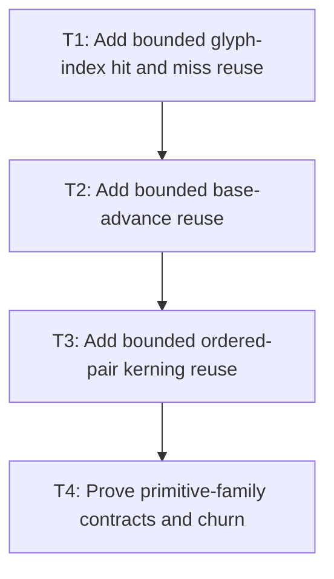

# P3: Add Glyph, Miss, Advance, and Kerning Caches

## Goal

Implement hard-bounded primitive native-call reuse for glyph hits/misses, base advances, and ordered
pair kerning while preserving fallback probe semantics and line-start reset.

## Non-Goals

- Caching logical resolved source sequences or final line/run values.
- Putting width, offset, or wrap policy in primitive keys.

## Context

- Parent milestone: `docs/work/E5/M7 - Add bounded generation-safe text caches.md`.
- Phase entry gate: M7/P2 central chain/metrics cache integration is complete.
- Phase-level parallelism: reciprocal with M7/P4 and M6/P2-P4 while production/test files remain
  partitioned.

## Phase Tasks

### T1: Add bounded glyph-index hit and miss reuse
**Purpose:** Avoid repeated candidate native probes while allowing new fonts after generation changes.

**Depends on:** None.
**Enables:** T2.
**Parallelizable with:** None.

**Changes:**
- [ ] Implement exact semantic font identity/generation/code-point keys and immutable glyph-index
  values that explicitly cache both hit and zero/miss outcomes.
- [ ] Apply P1 hard entry/weight/admission/oversized/diagnostics/clear/teardown/disabled policies and
  UI-thread checks.
- [ ] Keep logical chain resolution separate: each candidate lookup may hit/miss this native-probe
  family, while logical resolution/replacement policy remains M2 behavior.

**Acceptance Checks:**
- [ ] Warm misses avoid native probes under the same generation, and successful semantic mutation
  cannot reuse an old miss.
- [ ] Diagnostics separately report logical resolutions, primitive cache hits/negative hits, and
  actual native glyph-index probes.

**Risks / Stop Criteria:** Stop if zero is indistinguishable from uncached/not-computed or if a miss
key omits semantic generation.

### T2: Add bounded base-advance reuse
**Purpose:** Reuse width-independent glyph advances under exact measurement configuration.

**Depends on:** T1.
**Enables:** T3.
**Parallelizable with:** None.

**Changes:**
- [ ] Implement exact semantic identity/generation/glyph/size/configuration/rounding keys for base
  advances, excluding previous glyph, width, offset, and line state.
- [ ] Apply full P1 family policy and immutable numeric value handling, including approved invalid
  numeric behavior.
- [ ] Integrate M2 primitive creation so cached base advance remains separable from pair kerning and
  final line materialization.

**Acceptance Checks:**
- [ ] Exact equivalent primitives hit; size/configuration/generation changes miss; wrap width/offset
  changes do not affect this family.
- [ ] Disabled output/calls match M2 and retained weight remains bounded under glyph/size churn.

**Risks / Stop Criteria:** Stop if a value includes pair/line contribution or if native rounding
configuration is implicit/unkeyed.

### T3: Add bounded ordered-pair kerning reuse
**Purpose:** Reuse pair inputs without carrying kerning across a line or face boundary.

**Depends on:** T2.
**Enables:** T4.
**Parallelizable with:** None.

**Changes:**
- [ ] Implement ordered previous/current glyph plus same semantic face/generation/size/configuration
  keys and complete P1 family policy.
- [ ] Integrate M2 line materialization so no kerning lookup/contribution is used for a line's first
  primitive or across a selected face transition where M2 resets it.
- [ ] Cover zero-kerning results, pair order, cached misses/zeros, generation, and independent clear.

**Acceptance Checks:**
- [ ] `(A,V)` and `(V,A)` are distinct; warm zero/nonzero pairs reduce native calls; wrapped line
  starts remain kerning-free even when the pair exists in cache.
- [ ] No final run/line width is stored in this family.

**Risks / Stop Criteria:** Stop if lookup presence causes a line-start contribution or pair identity
uses object/native pointer identity that violates M3 lifecycle.

### T4: Prove primitive-family contracts and churn
**Purpose:** Establish exact keys, bounds, negative caching, clear, and disabled behavior before
resolved-sequence reuse.

**Depends on:** T3.
**Enables:** None.
**Parallelizable with:** None.

**Changes:**
- [ ] Run P1 contract tests and churn fonts/generations/code points/misses/sizes/pairs/oversized
  admissions under cold, warm, clear, disabled, off-thread, and close scenarios.
- [ ] Clear glyph, advance, and kerning families independently in all dependency-safe orders and
  verify immutable downstream primitive correctness/misses.
- [ ] Reconcile logical/native/advance/kerning counters and retained weight with P2/M3 owners.

**Acceptance Checks:**
- [ ] Each family stays under hard policy, emits exact diagnostics, and preserves M2 output/linear
  behavior disabled.
- [ ] Negative caching is generation-safe and no cross-cache entry identity prevents independent clear.

**Risks / Stop Criteria:** Do not proceed to P5 if primitive family churn or line-start tests fail.

## Verification Strategy

- Run `./gradlew :spinygui.core:test --tests 'com.spinyowl.spinygui.core.system.font.impl.FontServiceImplTest'`.
- Run `./gradlew :spinygui.benchmark:test` for deterministic cold/warm/churn/disabled fixture support.

## Review Boundaries

- Review glyph hit/miss, then advances, then kerning/line reset, then combined policy proof.

## Deferred Work

- Resolved source sequence reuse belongs to P5; width-keyed wraps to P6; aggregate proof to P7.

## Dependency Graph

