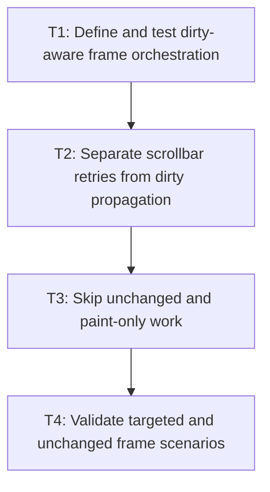

# P3: Orchestrate scrollbar convergence and unchanged-frame skipping

## Goal

Coordinate dirty-aware style/layout execution, distinguish bounded scrollbar retries from persistent
dirtiness, and skip explainable unchanged-frame work.

## Non-Goals

- Full retained inline-fragment/layout caching.
- Removing the existing bounded scrollbar convergence requirement.

## Context

- Parent milestone: `docs/work/E5/M7 - Establish dirty style and layout ownership for future retained layout reuse.md`.
- `LayoutServiceImpl` currently permits up to four passes when scrollbar gutters change.

## Phase Tasks

### T1: Define and test dirty-aware frame orchestration
**Purpose:** Sequence style, text/intrinsic, geometry, overflow, transform, and paint consumers correctly.

**Depends on:** M7/P2/T4.
**Enables:** T2.
**Parallelizable with:** None.

**Changes:**
- [ ] Integrate approved service ordering in the optional frame runtime and document equivalent manual-host calls.
- [ ] Carry mutation reasons/version snapshots across one frame and handle mutations during execution.

**Acceptance Checks:**
- [ ] Full initial frames and independently composed hosts produce current-compatible results.
- [ ] No domain is committed before all consumers required by its contract succeed.

**Risks:** Avoid making rendering responsible for triggering hidden layout work.

### T2: Separate scrollbar retries from dirty propagation
**Purpose:** Preserve bounded convergence without marking the whole frame persistently dirty.

**Depends on:** T1.
**Enables:** T3.
**Parallelizable with:** None.

**Changes:**
- [ ] Represent gutter/client-size changes as internal bounded geometry/overflow retries.
- [ ] Define stable commit after convergence and behavior when maximum passes are reached or work fails.

**Acceptance Checks:**
- [ ] Retry count remains bounded and nested gutter changes propagate safely upward.
- [ ] Unconverged/failed passes cannot clear versions or expose stale committed geometry.

**Risks:** Stop and revisit P1 if retries cannot be represented without conflating dirty ownership.

### T3: Skip unchanged and paint-only work
**Purpose:** Avoid full style/layout execution when versions prove results current.

**Depends on:** T2.
**Enables:** T4.
**Parallelizable with:** None.

**Changes:**
- [ ] Skip style/text/layout/overflow domains on unchanged frames and preserve required presentation/render work.
- [ ] Handle scroll-only, caret/selection/focus, animated color/opacity/transform, and unchanged control snapshots explicitly.

**Acceptance Checks:**
- [ ] Counters identify each skipped/performed domain and its reason.
- [ ] Paint-only changes remain visible without rebuilding text/layout.

**Risks:** Transform/clip/overflow interactions may require conservative geometry work; document rather than guess.

### T4: Validate targeted and unchanged frame scenarios
**Purpose:** Prove skipping is explainable and safe across service boundaries.

**Depends on:** T3.
**Enables:** M7/P4.
**Parallelizable with:** None.

**Changes:**
- [ ] Exercise unchanged, text edit, typography, font generation, resize, DOM, inherited style, scroll,
  animation, and scrollbar-gutter scenarios.
- [ ] Compare cache-enabled/disabled structural output, counters, control behavior, and pixels.

**Acceptance Checks:**
- [ ] Unchanged frames skip style/layout; every targeted mutation performs all and only safely skippable work.
- [ ] No stale style, snapshot, geometry, overflow, transform, clip, or paint output survives.

**Risks:** Local frame timing remains informational and requires equivalent environments/workload shape.

## Verification Strategy

- Run `./gradlew :spinygui.core:test --tests '*StyleManager*' --tests '*Layout*' --tests '*Overflow*' --tests '*Scrollbar*'`.
- Run `./gradlew :spinygui.core.backend.lwjgl.nanovg:test`.
- Run `./gradlew :spinygui.benchmark:jmhCpu` and `./gradlew :spinygui.benchmark:jmhRendering` locally.

## Review Boundaries

- Review orchestration, convergence retry semantics, skipping, and scenario evidence separately.

## Deferred Work

- Full fragment caching remains deferred; P4 only proves and documents prerequisites.

## Dependency Graph

