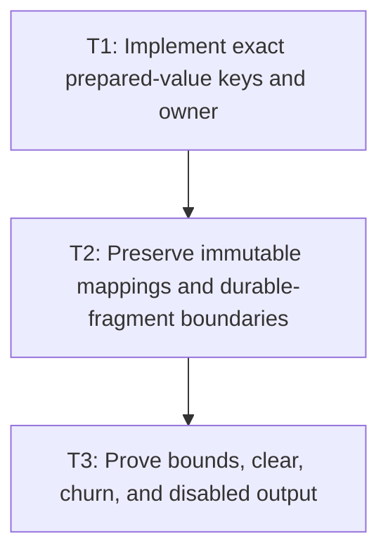

# P4: Add Bounded Prepared-Node Reuse

## Goal

Reuse M4 immutable prepared text/ranges/mappings under exact content/policy keys with node-current or
hard-bounded ownership, complete lazy validation, diagnostics, teardown, and disabled mode.

## Non-Goals

- Caching durable inline fragments or full retained layout.
- Weak-key-only ownership or automatic observation of every content/style alias.

## Context

- Parent milestone: `docs/work/E5/M7 - Add bounded generation-safe text caches.md`.
- Phase entry gate: M7/P1 cache contracts and M4 prepared-value contract are complete.
- Phase-level parallelism: reciprocal with M7/P2, P3, P5, P6 and M6/P2-P4 while shared policy/
  benchmark files remain stable.

## Phase Tasks

### T1: Implement exact prepared-value keys and owner
**Purpose:** Persist only preparation work under all normalization-affecting inputs.

**Depends on:** None.
**Enables:** T2.
**Parallelizable with:** None.

**Changes:**
- [ ] Implement immutable keys from exact original text/content and every effective M4 `white-space`,
  tab-size, CR/LF/normalization/replacement policy input; copy mutable source/policy values.
- [ ] Implement the selected node-current naturally bounded slot or independently hard-bounded owner
  with no reliance on weak reachability alone and no retained historical prepared values per node.
- [ ] Apply P1 entry/weight/admission/oversized/eviction/diagnostics/clear/close/disabled policy and
  UI-thread checks.

**Acceptance Checks:**
- [ ] Exact content/policy matches hit; every policy/content change misses on next query even through
  unobservable aliases; disabled always performs one M4 preparation and retains nothing.
- [ ] Owner retention stays under hard/natural policy without a global unbounded node map.

**Risks / Stop Criteria:** Stop if exact source strings/large mappings bypass weight accounting or if
the owner needs to keep dead DOM nodes strongly reachable.

### T2: Preserve immutable mappings and durable-fragment boundaries
**Purpose:** Reuse only M4 preparation output, not later layout/fragment results.

**Depends on:** T1.
**Enables:** T3.
**Parallelizable with:** None.

**Changes:**
- [ ] Store defensive immutable prepared text/ranges/original mappings and validate all code-point/
  surrogate boundaries on cache publication/retrieval.
- [ ] Route `InlineWhitespace`/preparation consumers to reusable values while `InlineFormattingContext`
  still materializes current durable fragments/runs each layout pass.
- [ ] Preserve pass-local typography/font-chain reuse separately; do not hide M3 generation in a
  preparation key unless a prepared value actually depends on registry state.

**Acceptance Checks:**
- [ ] Cached mapping output equals M4 exactly under tabs/collapse/newline/replacement/supplementary
  fixtures and remains externally immutable.
- [ ] Fragment count/text/owner reference assertions still execute and no `InlineFragment` is retained
  as a cache value.

**Risks / Stop Criteria:** Stop if reuse accidentally stores style/font/layout geometry or changes
the approved key by adding irrelevant font generation.

### T3: Prove bounds, clear, churn, and disabled output
**Purpose:** Validate a prepared-only family under content/policy/node churn.

**Depends on:** T2.
**Enables:** None.
**Parallelizable with:** None.

**Changes:**
- [ ] Run cold/warm/content churn/policy churn/many-node/large-value/oversized/clear/close/disabled and
  direct-alias scenarios using P1 contract tests.
- [ ] Assert normalization scans fall only on exact hits, retained weight/entries stay bounded, and
  admission rejection falls back to uncached M4 output.
- [ ] Clear independently from font/resolved/wrap families and verify no entry-identity/dangling
  references or durable-fragment retention.

**Acceptance Checks:**
- [ ] Warm exact values skip normalization scans; churn/oversized values cannot exceed policy;
  disabled/uncached structure and counters match M4.
- [ ] Diagnostics/reset/teardown and UI-thread/use-after-close behavior satisfy P1.

**Risks / Stop Criteria:** Do not default-enable if typical large prepared mappings are misweighted or
if independent clear changes fragment output.

## Verification Strategy

- Run `./gradlew :spinygui.core:test --tests 'com.spinyowl.spinygui.core.layout.impl.InlineWhitespaceTest' --tests 'com.spinyowl.spinygui.core.layout.impl.InlineFormattingContextTest'`.
- Run `./gradlew :spinygui.core:test --tests 'com.spinyowl.spinygui.core.layout.impl.ParsedInlineWhitespaceLayoutTest'`.
- Run `./gradlew :spinygui.benchmark:test`.

## Review Boundaries

- Review key/owner, then mapping-only integration, then bounds/churn/disabled proof.

## Deferred Work

- Durable fragment/full layout caching remains deferred.
- Aggregate family/default evidence belongs to P7.

## Dependency Graph

