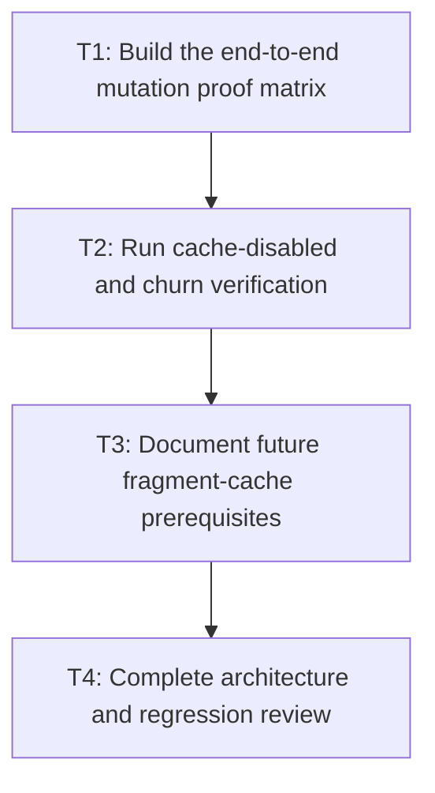

# P4: Prove retained-layout prerequisites and document the gate

## Goal

Demonstrate complete dirty-domain mutation coverage and document the explicit gate for any future
full inline-fragment or retained-layout cache.

## Non-Goals

- Implementing full inline-fragment caching.
- Broad parser/style or layout-object cleanup.

## Context

- Parent milestone: `docs/work/E5/M7 - Establish dirty style and layout ownership for future retained layout reuse.md`.
- M7 completion proves prerequisites only; it must not make earlier M2-M6 work contingent on retained layout.

## Phase Tasks

### T1: Build the end-to-end mutation proof matrix
**Purpose:** Verify every approved producer invalidates every required consumer.

**Depends on:** M7/P3/T4.
**Enables:** T2.
**Parallelizable with:** None.

**Changes:**
- [ ] Cover text/value, typography, font generation, width/viewport, DOM, inline/stylesheet/inherited style,
  overflow, controls, scroll, animation, transforms, clips, and scrollbar gutters.
- [ ] Record expected dirty domains, propagation scope, retries, snapshot/cache effects, and performed/skipped services.

**Acceptance Checks:**
- [ ] Matrix tests fail if any covered mutation leaves stale style/text/geometry/overflow/paint.
- [ ] Manual-host scenarios exercise documented explicit invalidation and service order.

**Risks:** Any unobservable common mutation is a blocker for authorizing future retained fragments.

### T2: Run cache-disabled and churn verification
**Purpose:** Ensure dirty skipping composes with M6 without hiding algorithmic or invalidation faults.

**Depends on:** T1.
**Enables:** T3.
**Parallelizable with:** None.

**Changes:**
- [ ] Run matrix scenarios with caches enabled/disabled and under text/font/width/style churn.
- [ ] Check diagnostics, bounds, eviction, clear/teardown, snapshot identity, and service reasons.

**Acceptance Checks:**
- [ ] Enabled and disabled outputs are equivalent and uncached algorithms remain linear.
- [ ] Retained memory remains bounded and no version permits a stale cache/snapshot hit.

**Risks:** Compare performance only with equivalent environments and identical scenario shape/counters.

### T3: Document future fragment-cache prerequisites
**Purpose:** Prevent M7 completion from being mistaken for fragment-cache implementation approval.

**Depends on:** T2.
**Enables:** T4.
**Parallelizable with:** None.

**Changes:**
- [ ] Document required version inputs, owner/lifetime/bounds, subtree identity, geometry/overflow dependencies,
  font generations, clear/teardown, diagnostics, and cache-disabled comparison for a future plan.
- [ ] Record unresolved selector targeting, host integration, or mutation gaps as explicit blockers/follow-up.

**Acceptance Checks:**
- [ ] The document states full inline-fragment caching remains out of E5 scope.
- [ ] No prerequisite is inferred solely from elapsed-time improvement.

**Risks:** Do not pre-design a concrete fragment cache before ownership evidence warrants it.

### T4: Complete architecture and regression review
**Purpose:** Close E5 with executable ownership evidence and no accidental scope expansion.

**Depends on:** T3.
**Enables:** None.
**Parallelizable with:** None.

**Changes:**
- [ ] Review version owners, mutation entry points, propagation, service order, retry/commit semantics,
  manual hosts, and future gate against executable tests.
- [ ] Run full tests and local benchmark reports while preserving workload shape and counters.

**Acceptance Checks:**
- [ ] Unchanged/targeted scenarios are explainable and stale results cannot survive covered mutations.
- [ ] Parser/style cleanup, shaping/bidi/graphemes/Unicode line breaking, unbounded caches, native per-run
  buffers, and full fragment caching remain deferred.

**Risks:** Do not declare the gate satisfied while any material mutation/host question remains unresolved.

## Verification Strategy

- Run `./gradlew test`.
- Run `./gradlew :spinygui.core:test :spinygui.core.backend.lwjgl.nanovg:test`.
- Run `./gradlew :spinygui.benchmark:jmhCpu`, `./gradlew :spinygui.benchmark:jmhRendering`, and
  `./gradlew :spinygui.benchmark:benchmarkReport` locally in equivalent environments.

## Review Boundaries

- Review mutation proof, cache/churn composition, future-gate documentation, and final regression
  evidence as separate sign-off boundaries.

## Deferred Work

- Full inline-fragment/retained-layout caching requires a new approved plan after this gate is proven.
- Full shaping/HarfBuzz, bidi, grapheme editing, Unicode line breaking, and general parser/style cleanup remain out of scope.

## Dependency Graph

