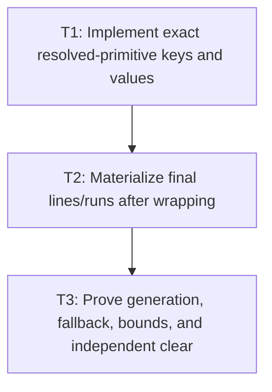

# P5: Add Width-Independent Resolved-Primitive Reuse

**Status:** Complete

## Goal

Cache immutable source-boundary, face/glyph selection, base-advance, and pair-kerning input sequences
without width/offset/final line state, then materialize final runs only after wrapping.

## Non-Goals

- Caching final line-specific `ResolvedTextRun` values.
- Including width, offset, line start, or wrap result in primitive keys.

## Context

- Parent milestone: `docs/work/E5/M7 - Add bounded generation-safe text caches.md`.
- Phase entry gate: M7/P3 primitive native-call families are complete.
- Phase-level parallelism: reciprocal with M7/P4 and M6/P2-P4 while shared files remain disjoint.

## Phase Tasks

### T1: Implement exact resolved-primitive keys and values
**Purpose:** Reuse M2 logical resolution independent of line wrapping.

**Depends on:** None.
**Enables:** T2.
**Parallelizable with:** None.

**Changes:**
- [x] Implement immutable keys from exact UTF-16 source, ordered semantic font identities/
  generations, exact size, measurement configuration/rounding, and approved resolution/replacement
  policy, explicitly excluding width/offset/wrap/line state.
- [x] Store immutable primitives containing original UTF-16 boundaries, source/rendered code point,
  selected font/glyph/replacement, base advance, and ordered pair-kerning inputs/value references as
  approved by P1; store no source-global or final line-local cumulative caret array.
- [x] Apply hard entry/weight/admission/oversized/eviction/diagnostics/clear/teardown/disabled policy
  and UI-thread checks.

**Acceptance Checks:**
- [x] Same exact source/font/configuration with different widths/offsets shares the primitive value;
  source/font/order/size/configuration/generation/policy changes miss.
- [x] Values are code-point safe, immutable, and contain no final line/run x/advance/list.

**Risks / Stop Criteria:** Stop if primitive keys use cache-entry identity or if shared strings/arrays
cannot be weighted under P1.

### T2: Materialize final lines/runs after wrapping
**Purpose:** Preserve M2 wrap and line-start kerning semantics on cache hits.

**Depends on:** T1.
**Enables:** T3.
**Parallelizable with:** None.

**Changes:**
- [x] Route M2 measurement to consume cached/uncached identical primitive values, choose wrapping from
  current width/offset/policy, and build final immutable lines/runs once.
- [x] Reset previous-pair contribution at explicit/wrapped line starts and across approved face
  boundaries even when pair/primitive values are warm.
- [x] Rebase/freeze each final line's cumulative caret-advance array after wrapping/reset exactly as
  M2/P3; never derive it once globally and slice it across lines.
- [x] Keep final run/glyph lists and line-specific advances out of the persistent primitive cache.

**Acceptance Checks:**
- [x] One primitive hit supports multiple exact wrap widths/offsets with correct, independent final
  ranges/advances and line-start kerning reset.
- [x] Warm/disabled paths return structurally equal M2 results and immutable public collections.

**Risks / Stop Criteria:** Stop if cached pair contribution is inseparable from its previous source
line or if final results become shared mutable/cache-retained values.

### T3: Prove generation, fallback, bounds, and independent clear
**Purpose:** Validate primitive reuse under text/font churn and cross-cache lifecycle.

**Depends on:** T2.
**Enables:** None.
**Parallelizable with:** None.

**Changes:**
- [x] Run cold/warm/source churn/font-chain order/fallback/missing-replacement/supplementary/generation/
  large-value/oversized/clear/close/disabled scenarios.
- [x] Assert logical resolutions/native primitive calls fall on warm hits for the intended reasons,
  while widths never create additional primitive entries.
- [x] Clear chain/metrics/glyph/advance/kerning/primitive families independently in allowed orders and
  verify immutable value/key references remain correct and weight accounting is exact.

**Acceptance Checks:**
- [x] Hard bounds/diagnostics/generation/disabled/UI-thread contracts pass and no stale hit crosses a
  semantic font change.
- [x] Width churn leaves primitive entry count unchanged for otherwise equal keys.

**Risks / Stop Criteria:** Do not proceed to wrap caching while line reset, independent clear, or
generation churn produces any stale/dangling primitive result.

## Verification Strategy

## Implemented Evidence (current slice)

`ResolvedPrimitiveKey`, `ResolvedPrimitiveValue`, and `ResolvedPrimitiveCache` provide immutable
source/generation/configuration keys, source-local primitive values, hard entry/weight bounds, LRU
eviction, owner-thread checks, independent clear/close, and true disabled behavior. Characterization
fixtures in `ResolvedPrimitiveCacheTest` cover cold/warm reuse, semantic-generation misses, churn,
oversized admission, and disabled mode. `FontServiceImpl` now consumes the bounded primitive lookup
on the real M2 preparation path; final-line materialization remains owned by the existing M2 builder.

- Run `./gradlew :spinygui.core:test --tests 'com.spinyowl.spinygui.core.system.font.impl.FontServiceImplTest'`.
- Run `./gradlew :spinygui.benchmark:test`.

## Review Boundaries

- Review exact key/value, then hit/miss measurement integration, then churn/clear/weight proof.

## Deferred Work

- Exact width-keyed final wrap reuse belongs to P6.
- Aggregate cache evidence/default policy belongs to P7.

## Dependency Graph

