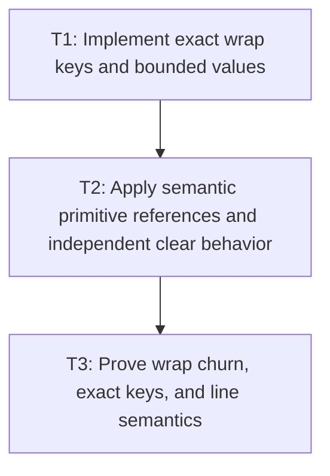

# P6: Add Exact Width-Keyed Wrapped-Layout Reuse

## Goal

Cache immutable final wrapped layout under every exact line-affecting field with a hard width/result
retention policy, independent clear semantics, and disabled mode.

## Non-Goals

- Approximate width bucketing or width in upstream keys.
- Full inline-fragment/control-history/retained layout caching.

## Context

- Parent milestone: `docs/work/E5/M7 - Add bounded generation-safe text caches.md`.
- Phase entry gate: M7/P5 width-independent primitive cache is complete.
- Phase-level parallelism: reciprocal with M7/P4 and M6/P2-P4 while shared files/tests remain
  partitioned.

## Phase Tasks

### T1: Implement exact wrap keys and bounded values
**Purpose:** Retain only exact reusable final line layouts and bound many-width churn.

**Depends on:** None.
**Enables:** T2.
**Parallelizable with:** None.

**Changes:**
- [ ] Implement keys from P1's selected immutable semantic resolved-primitive value key, exact max
  width, first-line offset,
  line-height/vertical-metrics identity, wrap mode, and line-breaking policy; document exact float
  canonicalization including signed zero/NaN/infinity as approved by M2.
- [ ] Store immutable final `TextMetrics`/line/run and per-final-line cumulative caret arrays with
  defensive nested collections and no mutable consumer placement state.
- [ ] Apply hard entry/weight/admission/oversized/eviction/diagnostics/clear/teardown/disabled policy
  that prevents retaining every resize width.

**Acceptance Checks:**
- [ ] Every key field changes reuse exactly; exact equal widths hit; no upstream chain/metric/glyph/
  advance/kerning/prepared/primitive family key contains width.
- [ ] Many unique widths/large layouts cannot exceed hard retained entry/weight policy.

**Risks / Stop Criteria:** Stop if approximate equality can select a layout for the wrong width or if
one oversized result enters despite admission policy.

### T2: Apply semantic primitive references and independent clear behavior
**Purpose:** Prevent wrapped values from depending on evictable primitive entry identity or
double-counting shared data.

**Depends on:** T1.
**Enables:** T3.
**Parallelizable with:** None.

**Changes:**
- [ ] Implement P1's selected semantic primitive value-key/value reference direction and shared-object
  weight accounting; never retain cache-entry identity, nodes, or handles.
- [ ] Verify primitive cache eviction/clear while wrap entries exist, wrap clear while primitives
  exist, and generation transition behavior.
- [ ] Teardown wrapped layouts before primitive/font families and preserve use-after-close/UI-thread
  behavior.

**Acceptance Checks:**
- [ ] Clearing either family independently cannot produce dangling access or require an undocumented
  global clear; results are independently immutable/valid or deterministically missed per P1.
- [ ] Aggregate weight counts shared source/primitive/result storage exactly as specified.

**Risks / Stop Criteria:** Stop if wrap entries pin evicted entry objects/resources or if independent
clear correctness depends on incidental implementation order.

### T3: Prove wrap churn, exact keys, and line semantics
**Purpose:** Validate width reuse without hiding M2 line-start/fallback behavior.

**Depends on:** T2.
**Enables:** None.
**Parallelizable with:** None.

**Changes:**
- [ ] Run cold/warm/alternating-width/unique-resize/offset/line-height/vertical-metric/wrap-policy/
  line-breaking/generation/oversized/clear/close/disabled workloads.
- [ ] Assert exact line ranges/`charCount`, fallback/replacement runs, cumulative carets, and line-start
  kerning across hits/misses.
- [ ] Reconcile wrap hit/miss/eviction/weight with primitive/cache counters and prove disabled invokes
  current M2 wrapping linearly.

**Acceptance Checks:**
- [ ] Warm exact keys skip wrap materialization; unique width churn evicts under hard bounds; disabled
  output/counters remain M2-correct and linear.
- [ ] No test uses a pre-laid-out renderer scene as the only evidence of wrap-cache behavior.

**Risks / Stop Criteria:** Do not approve while resize churn exceeds retention policy or cache hits
alter line-start kerning/source boundaries.

## Verification Strategy

- Run `./gradlew :spinygui.core:test --tests 'com.spinyowl.spinygui.core.system.font.impl.FontServiceImplTest'`.
- Run `./gradlew :spinygui.core:test --tests 'com.spinyowl.spinygui.core.system.input.MultilineTextControlMetricsTest'`.
- Run `./gradlew :spinygui.benchmark:test`.

## Review Boundaries

- Review exact key/value/bounds, then reference/clear/weight, then resize/semantic proof.

## Deferred Work

- Full retained layout/fragments and approximate width buckets remain deferred.
- Aggregate/cache-mode proof belongs to P7.

## Dependency Graph

