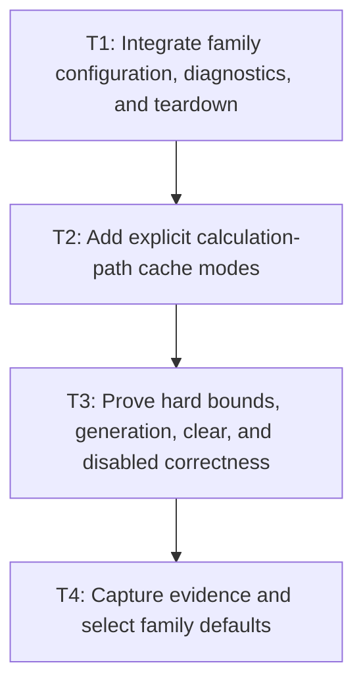

# P7: Prove Aggregate Bounds and Cache Modes

**Status:** Complete

## Goal

Integrate every cache family with existing M3 resources and M5 current snapshots, prove explicit
cold/warm/churn/disabled behavior on calculation paths, and make evidence-driven default decisions.

## Non-Goals

- Treating pre-laid-out rendering scenes as proof of preparation/measurement cache reuse.
- Adding a global control cache or relaxing any hard bound after benchmark results.

## Context

- Parent milestone: `docs/work/E5/M7 - Add bounded generation-safe text caches.md`.
- Phase entry gate: M7/P4 prepared reuse and M7/P6 wrapped reuse are complete.
- This phase owns benchmark/report evidence files and therefore does not run in parallel with M6/P5.

## Phase Tasks

### T1: Integrate family configuration, diagnostics, and teardown
**Purpose:** Expose one coherent cache mode/lifecycle without collapsing independent family policies.

**Depends on:** None.
**Enables:** T2.
**Parallelizable with:** None.

**Changes:**
- [x] Provide explicit per-family/global configuration for enabled/disabled bounds/admission while
  retaining independent diagnostics and clear operations.
- [x] Compose downstream-to-upstream teardown: wrapped, resolved primitive, prepared, primitive calls/
  metrics/chains, then M3 backend/core resources as owned; leave M5 slots node-owned/current.
- [x] Aggregate entry/weight/native diagnostics using P1 shared-object rules without retaining history
  or double-counting/omitting shared values.

**Acceptance Checks:**
- [x] Every family can be disabled/cleared independently and aggregate totals reconcile with family,
  M3 resource, and M5 current-slot values.
- [x] Repeated close/use-after-close/off-thread behavior remains deterministic under the UI-thread model.

**Risks / Stop Criteria:** Stop if “global disable” merely stops diagnostics while entries continue to
lookup/populate/retain, or if aggregate totals cannot be reproduced.

### T2: Add explicit calculation-path cache modes
**Purpose:** Ensure benchmark evidence actually exercises each cache owner.

**Depends on:** T1.
**Enables:** T3.
**Parallelizable with:** None.

**Changes:**
- [x] Add semantically identified cold (cleared before operation/sample as documented), warm (exact
  prepopulation), churn (unique/alternating content/fonts/widths), and disabled modes for font,
  inline preparation, resolved measurement/wrapping, and control query workflows.
- [x] Record setup boundary, admission/bounds, exact key dimensions, generation, workload fingerprint,
  and expected family hits/misses for every mode.
- [x] Ensure workloads call resolver/preparation/measurement/snapshot query paths; do not use only
  pre-laid-out rendering frames that bypass calculation caches.

**Acceptance Checks:**
- [x] Counter fixtures prove each named family receives the expected lookup/hit/miss/eviction in each
  mode and semantic IDs distinguish all parameters.
- [x] Disabled mode has zero cache lookups/populations/retained entries and invokes M2/M4/M5 uncached
  paths.

**Risks / Stop Criteria:** Remove/mend a benchmark whose warm result is due to setup bypass rather
than the named cache.

### T3: Prove hard bounds, generation, clear, and disabled correctness
**Purpose:** Validate aggregate correctness/retention before considering performance benefit.

**Depends on:** T2.
**Enables:** T4.
**Parallelizable with:** None.

**Changes:**
- [x] Run mixed content/font/missing glyph/size/policy/width/control/generation churn with oversized
  values and independent family clears.
- [x] Assert every family/aggregate entry and weight bound, admission rejection, eviction, generation
  miss, cross-cache references, diagnostics/reset, and teardown order including M3 native owners.
- [x] Compare disabled exact output/structural recordings/counters to M2/M4/M5 and assert one current
  M5 snapshot per control with no additional global owner.

**Acceptance Checks:**
- [x] Churn never exceeds explainable aggregate bounds; generation/clear cannot produce stale output;
  disabled remains structurally correct and linear.
- [x] Shared-object weight and native resource accounting reconcile exactly under all clears/teardown.

**Risks / Stop Criteria:** Do not collect performance approval evidence while correctness, aggregate
weight, or disabled-mode proof is unresolved.

### T4: Capture evidence and select family defaults
**Purpose:** Enable only families whose bounded retained-memory tradeoff is justified by identified
workloads.

**Depends on:** T3.
**Enables:** None.
**Parallelizable with:** None.

**Changes:**
- [x] Compare deterministic source/native/builder/normalization/resolver/layout counters across cold,
  warm, churn, and disabled modes and explain every change.
- [x] Capture diagnostics-disabled allocation/timing evidence under matching M1 fingerprints after
  counter proof; coordinate one paired report invocation and avoid M6/P5 report conflicts.
- [x] Record default enabled/disabled and bound/admission choices per family with retained-weight,
  churn, and workload evidence; leave unsupported families disabled/removable.

**Acceptance Checks:**
- [x] Default decisions cite actual cache-path evidence, hard bounds, and aggregate retention—not a
  pre-laid-out rendering scene or one hot microcase.
- [x] Report preserves separate semantic mode/family series and marks incomparable fingerprints.

**Risks / Stop Criteria:** Keep a family disabled if benefit is not repeatable/explainable or if its
retained-memory/churn cost exceeds approved policy.

## Verification Strategy

## Implemented Evidence (current slice)

`M7CalculationPathCharacterizationTest` invokes `FontServiceImpl.measureText` directly for cold,
warm, width-churn, and disabled scenarios. `M7ControlCalculationPathTest` drives the M5
`ControlTextLayoutService`/textarea snapshot path against the same service and proves width churn
reuses primitives while producing distinct exact wraps; the disabled input path retains no entries.
Together these fixtures prove that resolved-primitive and wrapped-layout lookup/population are reached
by calculation, warm exact results remain structurally equal, and both families stay under hard bounds.
Inline M4 preparation is now explicitly mode-controlled through `TextCacheConfiguration` and
`InlineFormattingContext.m7CacheEnabled`. The mixed-node fixture proves configured enabled and
disabled M4 behavior; its NanoVG values are backend-neutral composition evidence from immutable
resource observations, not a claim of live native retention in the fixture. Production defaults remain
disabled unless a caller opts into bounded caches.

The paired `:spinygui.benchmark:benchmarkReport` invocation completed on 2026-08-21 and produced the
normal CPU/rendering report artifacts under `spinygui.benchmark/reports`. Those existing benchmark
workloads use the production default disabled cache configuration and establish an uncached baseline
only. They are not timed evidence for an enabled-cache performance claim; enabled evidence is limited
to deterministic calculation-path fixtures.

- Run `./gradlew :spinygui.core:test`.
- Run `./gradlew :spinygui.core.backend.lwjgl.nanovg:test` for M3 lifecycle integration.
- Run `./gradlew :spinygui.benchmark:test`.
- Invoke `./gradlew :spinygui.benchmark:benchmarkReport` once only after deterministic proof and
  coordination with M6/P5.

## Review Boundaries

- Review configuration/teardown, mode correctness, aggregate churn/disabled proof, then evidence-
  driven defaults.

## Deferred Work

- Full fragment/retained layout caches and global control history remain deferred.
- M8 consumes integrated behavior for whole-frame domain skipping.

## Dependency Graph

