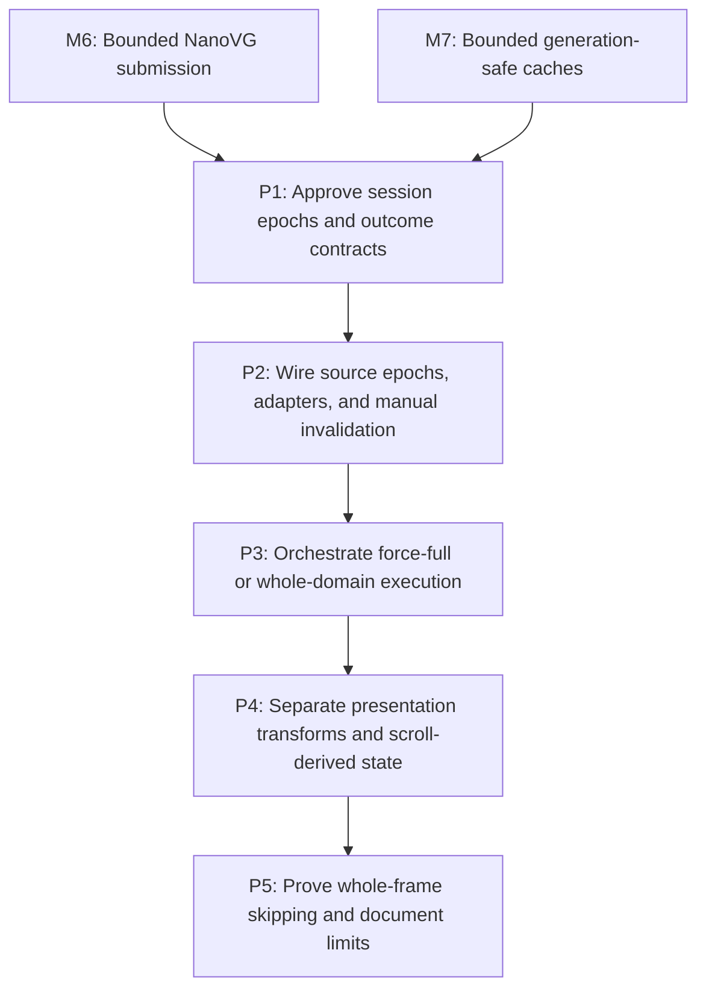

# M8: Add Opt-In Whole-Frame Dirty Orchestration

> **Superseded 2026-08-22:** E2/M2 replaces this experimental session/epoch architecture with
> owner-native phase outcomes, `Frame` revision/invalidation state, and `FramePipeline`. This file
> remains historical design and benchmark evidence; `com.spinyowl.spinygui.core.frame` is removed.

**Status:** Complete

Parent plan: `docs/work/E5 - Text performance improvements.md`

## Goal

Add a backend-neutral, manual-host-compatible opt-in session that can skip complete style or layout
domains for a whole frame when source/output epochs and per-session watermarks prove outputs current,
while existing service methods remain force-full.

## Context

- M6/M7 establish integrated rendering/cache behavior that frame orchestration must preserve.
- E5 does not implement targeted subtree, formatting-context, selector-indexed, or other incremental
  layout and does not require/duplicate the optional E2 runtime.
- Public mutable aliases cannot all be intercepted. Known adapters may mark domains; other direct
  mutations require explicit session invalidation or use of force-full compatibility methods.

## Phases

### P1: Approve session epochs and outcome contracts

**Document:** [P1 - Approve session epochs and outcome contracts](M8/P1%20-%20Approve%20session%20epochs%20and%20outcome%20contracts.md)

**Purpose:** Define backend-neutral ownership, domains, epochs/watermarks, staged transition-tick
supersession semantics, threading/reentrancy, legacy behavior, failure, retry, and renderability.

**Depends on:** M6, M7.
**Enables:** P2.
**Parallelizable with:** None.

**Architectural Proposition:** Monotonic source epochs record causes, output epochs record successful
production, and the single active session for a frame owns consumer watermarks. Nothing globally
clears a dirty flag. Failure invalidates session-managed output until a successful force-full retry;
direct renderer bypass remains an explicit host obligation/unsupported misuse. Expected changes
returned/recorded by the staged transition tick are incorporated through a post-tick snapshot and
same-frame downstream re-decision rather than treated as ordinary in-flight supersession.

**Key Work:**
- Define whole-frame style, layout/geometry/overflow, presentation-transform, and paint source/output
  domains without promising subtree granularity.
- Specify per-session watermarks, session lifecycle, manual invalidation, known adapters, and legacy
  force-full `StyleManager.recalculate`/`LayoutService.layout` behavior.
- Define a non-breaking outcome-capable layout subinterface/adapter and session eligibility: existing
  void/custom `LayoutService` implementations remain force-full but cannot join skip-aware sessions
  without truthful success/convergence adaptation.
- Permit only one active skip-aware session per `Frame`, with deterministic release/replacement rules.
- Define UI-thread confinement and non-reentrant execution. Ordinary in-flight mutations queue and
  supersede publication; the declared transition-tick outcome is the explicit staged exception.
- Define staged/manual host ordering: capture pre-style source state, resolve style, invoke the host
  transition tick, return/record expected presentation-domain changes, capture post-tick state,
  re-decide required layout/presentation-transform/render work for the same frame, then render. E2
  remains optional.
- Define explicit style/layout outcome status, scrollbar convergence/max-pass reporting, success-
  only watermark advancement, no rollback, force-full retry, session-managed render refusal, and the
  direct-renderer bypass obligation.

**Validation:** State/transition tables cover unchanged, success, failure, unconverged, expected same-
frame transition changes, unrelated mutation queued during the tick, explicit invalidation, and
legacy calls without a global clear operation or transition retry loop/one-frame delay.

**Risks / Stop Criteria:** Stop if a failed attempt becomes session-renderable or renders through a
session-managed path, two active sessions can own one frame, or existing service methods become skip-
aware/source-breaking implicitly.

### P2: Wire source epochs, adapters, and manual invalidation

**Document:** [P2 - Wire source epochs adapters and manual invalidation](M8/P2%20-%20Wire%20source%20epochs%20adapters%20and%20manual%20invalidation.md)

**Purpose:** Implement monotonic source ownership and explicit invalidation for known and
unobservable mutation paths without claiming comprehensive interception.

**Depends on:** P1.
**Enables:** P3.
**Parallelizable with:** None.

**Architectural Proposition:** Backend-neutral adapters map known edit, font generation, resize,
DOM/style, hover/focus/active pseudo-state, transition/animation, scroll, transform, and paint causes
to whole-frame domains. Direct aliases remain a documented manual-invalidation responsibility.

**Key Work:**
- Add overflow-safe monotonic epoch sources and per-session consumer watermarks under UI-thread
  checks.
- Add adapters/hooks for observable edit/font/resize/DOM/style/animation sources and an explicit API
  for host or direct-alias invalidation.
- Add a transition-tick outcome hook that distinguishes expected presentation-domain changes from
  unrelated in-tick mutations and supports the same-frame post-tick source snapshot/re-decision.
- Add hover/focus/active pseudo-state adapters because selector changes may alter layout-affecting
  style, not only paint.
- Keep scroll, paint, transform, style, and layout causes distinguishable enough for approved whole-
  domain decisions while avoiding node/subtree dirty state.
- Prove a second active session for the same frame is rejected; after close, a replacement starts from
  a safe full/explicitly adopted state. Legacy calls always execute full work.

**Validation:** Each known scenario increments the documented domain(s); expected transition changes
are consumed in the same frame, unrelated tick mutations supersede publication, and unobservable
mutations require explicit invalidation rather than false automatic-correctness claims.

**Risks / Stop Criteria:** Stop if an adapter introduces backend dependencies in core, if epoch
overflow can look unchanged, or if direct mutation is silently treated as observed.

### P3: Orchestrate force-full or whole-domain execution

**Document:** [P3 - Orchestrate force-full or whole-domain execution](M8/P3%20-%20Orchestrate%20force-full%20or%20whole-domain%20execution.md)

**Purpose:** Implement session decisions, explicit outcomes, convergence, failure quarantine, and
queued-mutation processing for complete style/layout domains.

**Depends on:** P2.
**Enables:** P4.
**Parallelizable with:** None.

**Architectural Proposition:** A session either skips an entire current domain or invokes its full
service path. It never selects a smallest subtree. Output epochs/watermarks advance only after
successful style and converged layout outcomes whose inputs remain current.

**Key Work:**
- Add session execution that compares source/output epochs/watermarks and calls complete style and/or
  layout services when required.
- Use an outcome-capable subinterface/adapter for truthful layout convergence/pass count/failure;
  reject ineligible void/custom implementations from skip-aware sessions without adding a new
  abstract `LayoutService` method.
- Capture pre-style state, run style, invoke the transition tick, collect its declared expected
  presentation-domain changes, capture post-tick state, and re-decide required layout/transform/render
  work for the same frame before session-managed rendering.
- Quarantine failed/unconverged output, require successful force-full retry before renderability, and
  leave consumed watermarks unchanged. Mark the shared frame/session result invalid and refuse only
  session-managed rendering; document direct renderer calls as unsupported bypass.
- Treat only the declared transition outcome as expected staged change; unrelated mutations raised
  during the tick or other non-reentrant execution queue and supersede the current publication rather
  than being cleared by current success.

**Validation:** Unchanged frames skip complete domains; dirty domains execute fully; expected
transition geometry/transform/paint changes re-decide and complete downstream work in the same frame
without retry loops, while max-pass/exception/unrelated queued-mutation scenarios never advance stale
watermarks or render through the session. Ineligible custom layout services remain force-full usable.

**Risks / Stop Criteria:** Stop if successful partial work can mask failed downstream layout, if a
queued mutation is lost, or if any test claims targeted/incremental layout.

### P4: Separate presentation transforms and scroll-derived state

**Document:** [P4 - Separate presentation transforms and scroll-derived state](M8/P4%20-%20Separate%20presentation%20transforms%20and%20scroll-derived%20state.md)

**Purpose:** Support transform-only and scroll-only frames without relayout while respecting
geometry-dependent transform derivation and static/dynamic scrollbar ownership.

**Depends on:** P3.
**Enables:** P5.
**Parallelizable with:** None.

**Architectural Proposition:** Presentation transform resolution is a separate whole-frame pass;
geometry invalidates percentage/origin-dependent derivation. Layout owns static scrollbar track/
gutter/range geometry, while render/input derives thumb position from current scroll under an
explicitly approved `ScrollbarGeometry.Metrics` compatibility strategy.

**Key Work:**
- Extract/invoke presentation transform resolution for transform-only frames and mark it stale after
  geometry changes that affect size/origin/percentage transforms, including expected changes in the
  post-transition-tick snapshot.
- Decide `ScrollbarGeometry.Metrics` compatibility before changing thumb semantics/components:
  derived-on-access current values, a compatible new static/dynamic split, or deliberate documented
  API migration; then update renderer/input and equality/component tests.
- Define paint-clean semantics separately from renderer submission: immediate-mode hosts that clear
  each frame still render even when no paint source changed.
- Cover ancestor transforms/scroll and M5 text-local coordinate conversion without relayout claims.

**Validation:** Transform-only and scroll-only scenarios skip full layout where safe, geometry forces
transform re-resolution, the approved public Metrics semantics/components remain tested, scroll
thumbs remain current, and immediate-mode frames are not dropped.

**Risks / Stop Criteria:** Stop if transform output can remain stale after geometry, if scrollbar
thumb state is frozen in layout output, or if paint cleanliness is treated as universal render skip.

### P5: Prove whole-frame skipping and document limits

**Document:** [P5 - Prove whole-frame skipping and document limits](M8/P5%20-%20Prove%20whole-frame%20skipping%20and%20document%20limits.md)

**Purpose:** Validate the complete manual/session scenario matrix and make E5's whole-frame-only
completion boundary explicit.

**Depends on:** P4.
**Enables:** None.
**Parallelizable with:** None.

**Architectural Proposition:** Completion means explainable skipping of complete style/layout
domains only. Targeted subtree/incremental layout and full fragment/retained layout caching remain
future work; targeted mutations currently cause the required full domain, not “safely skippable”
targeted work.

**Key Work:**
- Validate unchanged, paint-only, scroll-only, transform-only, edit, font generation, resize,
  DOM/style, hover/focus/active pseudo-state, expected transition geometry/transform/paint changes,
  unrelated mutation during a transition tick, scrollbar convergence/max-pass/failure, explicit
  invalidation, legacy/custom force-full eligibility, second-session rejection, session-render
  refusal/direct-render bypass obligation, and queued mutation.
- Add manual-host examples/contract tests and optional adapter guidance without importing or
  duplicating E2 runtime ownership.
- Add deterministic whole-domain call counters and local unchanged-frame evidence; do not use
  targeted-subtree counts as a success criterion.
- Correct all wording that reverses the contract by suggesting targeted mutations perform only
  safely skippable work; list incremental layout/full fragment retention as deferred.

**Validation:** Every scenario has expected pre-style/post-tick snapshots, source/output epochs,
watermarks, service calls, session-managed renderability, bypass obligation, and retry behavior;
expected tick changes have same-frame downstream work without endless retry/latency, unrelated changes
supersede, legacy/custom methods remain force-full, and completion claims only whole-frame skipping.

**Risks / Stop Criteria:** Do not approve if direct/manual invalidation or direct-renderer bypass
obligations are hidden, session-managed failure output can render, E2 becomes required, or any
smallest-subtree promise remains.

## Milestone Validation

- `./gradlew :spinygui.core:test --tests 'com.spinyowl.spinygui.core.style.manager.StyleManagerImplTest'`
- `./gradlew :spinygui.core:test --tests 'com.spinyowl.spinygui.core.layout.impl.LayoutServiceProviderGridTest' --tests 'com.spinyowl.spinygui.core.layout.impl.OverflowLayoutTest'`
- `./gradlew :spinygui.core:test --tests 'com.spinyowl.spinygui.core.system.input.ScrollbarInteractionTest' --tests 'com.spinyowl.spinygui.core.util.ScrollbarGeometryTest'`
- `./gradlew :spinygui.core:test --tests 'com.spinyowl.spinygui.core.animation.TransitionCoordinatorTest' --tests 'com.spinyowl.spinygui.core.animation.TransitionCoordinatorPresentationTest'`
- `./gradlew :spinygui.core:test --tests 'com.spinyowl.spinygui.core.system.event.listener.SystemCursorPosEventListenerTest' --tests 'com.spinyowl.spinygui.core.system.event.listener.SystemMouseClickEventListenerTest'`
- `./gradlew :spinygui.core.backend.lwjgl.nanovg:test --tests 'com.spinyowl.spinygui.core.backend.renderer.lwjgl.nanovg.NvgRendererTransformStateTest'`
- `./gradlew test`

## Dependency Graph

## Implemented Evidence (current slice)

The additive backend-neutral API in `spinygui.core.frame` now provides whole-frame source/output
epochs, one active session per `Frame`, UI-thread and non-reentrant checks, explicit known-cause
invalidation adapters, truthful outcome-capable layout admission, transform-only execution, staged
expected-transition handling, supersession detection, and session-managed failure quarantine.

Layout and style invalidation transitively mark layout, presentation-transform, and paint domains.
Paint output is published only after the managed render consumer returns successfully; a render
exception or mutation during rendering leaves paint output stale and the session unrenderable until
retry. A direct renderer call remains an explicitly unsupported bypass because the session cannot
intercept it. Existing `LayoutService` implementations remain force-full and require an additive
`WholeFrameLayoutService` capability before joining a skip-aware session.

Focused evidence is in `WholeFrameSessionTest` and `WholeFrameInvalidationTest`, covering initial
dirty/current transitions, second-session rejection, overflow, manual cause mapping, transform-only
frames, failed layout/retry, failed render/retry, expected versus unrelated transition changes,
layout-to-transform propagation, queued mutation supersession, owner-thread confinement,
non-reentrancy, close/use-after-close, and whole-frame scrollbar thumb refresh. This evidence does
not claim targeted layout, automatic interception of mutable aliases, or retained-surface rendering.

`WholeFrameScenarioMatrixTest` adds deterministic staged-host ordering (`style → transition → layout
→ transform → render`), expected geometry transition same-frame downstream work, unrelated tick
supersession and retry, explicit convergence/max-pass outcomes, and legacy force-full admission.
The existing `ScrollbarGeometryTest`/NanoVG scrollbar fixtures cover the retained `Metrics` record
components and current-scroll thumb refresh. These fixtures are contract evidence rather than
timing or retained-surface performance approval.
The M5 snapshot, M6 submission, and M7 aggregate-cache owners remain separate host/service concerns;
M8 does not claim to own their cross-milestone integration.
