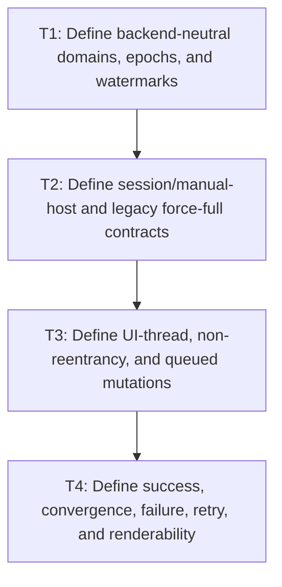

# P1: Approve Session Epochs and Outcome Contracts

**Status:** Complete

## Checklist reconciliation

The supported contract rows are evidenced by the frame-session tests. Remaining unchecked rows in
this approval document are deferred wording/state-table elaborations, not unverified claims of a
different runtime or targeted layout capability; the executable contract is the additive API and
its matrix fixtures.

## Goal

Approve a backend-neutral opt-in session/manual-host API using monotonic source/output epochs and
per-session watermarks, with force-full legacy methods, explicit staged transition-tick semantics,
UI-thread/reentrancy, and unusable failure/unconverged session outcomes.

## Non-Goals

- Targeted subtree/formatting-context/selector-indexed/incremental layout.
- Requiring or duplicating the optional E2 frame runtime.

## Context

- Parent milestone: `docs/work/E5/M8 - Add opt-in whole-frame dirty orchestration.md`.
- Phase entry gate: integrated M6 submission and M7 cache behavior is stable.
- Existing `StyleManager.recalculate` and `LayoutService.layout` remain force-full compatibility
  calls; only a new opt-in session can skip whole domains.

## Phase Tasks

### T1: Define backend-neutral domains, epochs, and watermarks
**Purpose:** Represent dirty causes/results without globally clearing shared flags.

**Depends on:** None.
**Enables:** T2.
**Parallelizable with:** None.

**Changes:**
- [x] Define whole-frame source domains for style, layout/text/intrinsic/geometry/overflow,
  presentation-transform derivation, and paint/presentation as needed for approved skipping.
- [x] Define monotonic source epochs, successful produced/output epochs, per-session consumer
  watermarks, initial values, overflow posture, and comparison rules.
- [x] Permit only one active skip-aware session per `Frame`; define registration, second-session
  rejection, close/replacement, and safe initial watermark/output adoption without a global dirty flag.
- [x] Limit granularity explicitly to complete frame domains; node/subtree dirtiness is absent.

**Acceptance Checks:**
- [x] State examples show one active session consuming epochs, a second active session rejected, and a
  post-close replacement session starting from a safe force-full or explicitly adopted outcome.
- [x] No API/field name or contract implies smallest-subtree/targeted execution.

**Risks / Stop Criteria:** Stop if source and successful output epochs are conflated or if two active
sessions can disagree about one shared frame's validity.

### T2: Define session/manual-host and legacy force-full contracts
**Purpose:** Preserve direct service compatibility while offering explicit opt-in skipping.

**Depends on:** T1.
**Enables:** T3.
**Parallelizable with:** None.

**Changes:**
- [x] Define session creation/ownership/lifecycle, service injection, manual invalidation, current/
  session-renderable output query, and whole-frame execution result without renderer/backend
  dependencies.
- [x] Define a non-breaking outcome-capable layout subinterface/adapter/session eligibility contract:
  existing `LayoutService.layout` remains `void`; custom/legacy services remain force-full and are
  ineligible for skip-aware sessions until adapted with truthful success/convergence outcomes.
- [x] Specify that direct `StyleManager.recalculate` and `LayoutService.layout` always execute full
  work and do not consult/update a session's skipping decisions except explicit output observation as
  documented.
- [x] Define staged manual-host callbacks/order: capture pre-style source state, resolve style targets,
  invoke the host transition/animation tick, return/record its expected presentation-domain changes,
  capture post-tick source state, re-decide required geometry layout/presentation-transform/render work
  for the same frame, then session-managed render. Keep E2 optional.
- [x] Define optional adapter integration points for known hosts/runtimes without importing or
  requiring E2.

**Acceptance Checks:**
- [x] A manual host can compose/use the session with existing service interfaces; a legacy host can
  ignore it and retain force-full correctness.
- [x] Adding session eligibility does not add an abstract method to `LayoutService`; fake/custom
  services must explicitly implement/adapt truthful outcome capability before session use.
- [x] No API makes the optional E2 runtime the owner or prerequisite.
- [x] Expected transition geometry/transform/paint changes are incorporated in the same frame without
  treating them as an ordinary superseding mutation, endless retry, or one-frame delay.

**Risks / Stop Criteria:** Stop if backward compatibility requires changing existing methods to
skip implicitly or if backend rendering types enter the core session.

### T3: Define UI-thread, non-reentrancy, and queued mutations
**Purpose:** Make mutation timing deterministic without concurrent execution snapshots.

**Depends on:** T2.
**Enables:** T4.
**Parallelizable with:** None.

**Changes:**
- [x] Define UI-thread establishment/checks for invalidation/session execution/service calls/output
  consumption and reject unsupported off-thread use.
- [x] Define session execution as non-reentrant; ordinary mutations/invalidation raised during
  processing are queued/epoch-advanced and supersede current publication, not recursively processed
  or cleared.
- [x] Define the sole staged exception: the transition callback returns/records an expected
  presentation-domain change set. Those expected epoch changes feed the post-tick snapshot and same-
  frame downstream re-decision; any unrelated mutation during the callback remains queued and
  supersedes/aborts publication.
- [x] Define ordering for multiple queued mutations and close/use-after-close behavior.

**Acceptance Checks:**
- [x] Transition fixtures cover owner/off-thread calls, recursive execution attempt, expected tick
  changes, unrelated mutation during the tick, mutation during style/layout, multiple queued changes,
  close, and use after close.
- [x] Every ordinary/unrelated mutation raised during processing remains visible and queued after the
  current attempt; each expected tick change remains visible in the post-tick snapshot/output decision.
- [x] Expected tick changes do not enter the ordinary retry queue, while unrelated tick mutations do.

**Risks / Stop Criteria:** Stop if current success can overwrite a source epoch advanced during the
pass or if reentrant behavior depends on call-stack accidents.

### T4: Define success, convergence, failure, retry, and renderability
**Purpose:** Prevent skipped or failed work from becoming session-renderable or being consumed through
session-managed paths.

**Depends on:** T3.
**Enables:** None.
**Parallelizable with:** None.

**Changes:**
- [x] Define explicit style and layout outcomes with success, pass count, scrollbar convergence,
  max-pass/unconverged, exception/failure, produced epochs, and session renderability.
- [x] Advance output epochs/watermarks only after successful/converged work whose input source epochs
  were not superseded, using the post-tick snapshot for downstream domains; expected declared tick
  changes are not supersession, while unrelated queued changes are. Leave watermarks unchanged on
  failure/unconverged/unrelated-superseded work.
- [x] State no transactional rollback: the session marks shared frame/session output invalid, refuses
  to advance watermarks or render through session-managed paths, and requires a successful force-full
  retry. Direct renderer calls bypass quarantine and are documented unsupported host misuse.
- [x] Define the force-full retry path and how success restores renderability.

**Acceptance Checks:**
- [x] State tables cover unchanged skip, full success, style success/layout failure, max-pass,
  exception, expected transition geometry/transform/paint change, unrelated tick supersession, queued
  supersession, retry success/failure, ineligible custom layout service, and direct renderer bypass
  obligation.
- [x] No failure path publishes current session output epochs/watermarks or permits session-managed
  rendering; tests/docs do not claim the session can intercept a host's direct renderer call.

**Risks / Stop Criteria:** Do not start implementation if no truthful outcome adapter exists for the
selected layout service or if quarantine is described as controlling direct renderer bypass.

## Verification Strategy

- Review existing `StyleManager`, `LayoutService`, `LayoutServiceImpl`, overflow/scrollbar tests, and
  optional E2 plan boundaries.
- Run `./gradlew :spinygui.core:test --tests 'com.spinyowl.spinygui.core.style.manager.StyleManagerImplTest' --tests 'com.spinyowl.spinygui.core.layout.impl.OverflowLayoutTest'`.
- No orchestration implementation in this phase.

## Review Boundaries

- Review domain/epoch model, then API/legacy compatibility, then thread/queue, then failure/outcome.

## Deferred Work

- Epoch/adapters belong to P2; execution to P3; transforms/scroll to P4; matrix proof to P5.
- All targeted/incremental layout remains deferred.

## Dependency Graph

