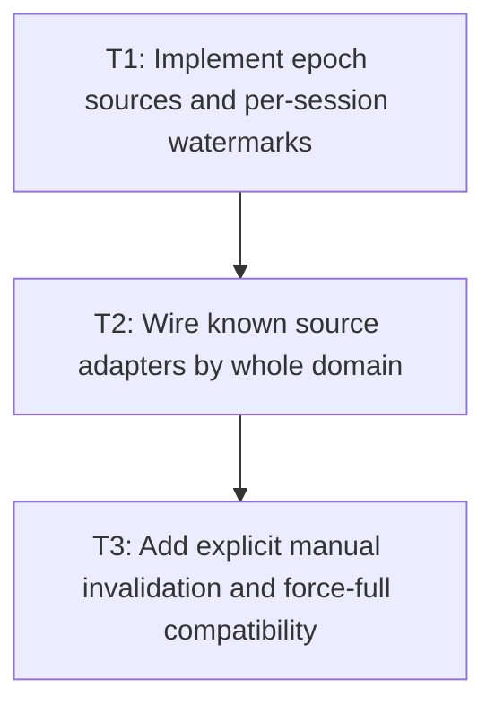

# P2: Wire Source Epochs, Adapters, and Manual Invalidation

**Status:** Complete

## Checklist reconciliation

Known-cause adapters and manual invalidation are covered. Automatic interception of arbitrary mutable
aliases and concrete host/runtime event wiring remain explicitly deferred; callers must use an
adapter or explicit invalidation.

## Goal

Implement monotonic whole-domain source epochs, the single active frame session's watermarks, known
mutation adapters, and explicit manual invalidation for unobservable direct changes without altering
force-full legacy service behavior.

## Non-Goals

- Automatic interception of every public mutable alias.
- Executing/skipping style/layout; P3 owns orchestration.

## Context

- Parent milestone: `docs/work/E5/M8 - Add opt-in whole-frame dirty orchestration.md`.
- Phase entry gate: M8/P1 contracts are approved.
- Known adapters may mark whole domains; direct aliases remain a documented explicit invalidation or
  legacy force-full responsibility.

## Phase Tasks

### T1: Implement epoch sources and per-session watermarks
**Purpose:** Make source/output observations monotonic and consumer-local under UI-thread ownership.

**Depends on:** None.
**Enables:** T2.
**Parallelizable with:** None.

**Changes:**
- [x] Implement overflow-safe monotonic epoch generation/comparison for approved whole-frame domains
  and immutable pre-style/post-transition-tick source snapshots used by one staged execution decision.
- [x] Implement per-session watermarks/output observations with UI-thread/non-reentrant/close checks,
  initial dirty/current semantics, one-active-session-per-frame registration, and no global clear.
- [x] Add second-active-session rejection and post-close replacement tests with safe force-full/
  explicitly adopted initial state.

**Acceptance Checks:**
- [x] Source epochs never move backward/appear equal after a representable change under the selected
  overflow policy, and watermarks are owned by the frame's sole active session.
- [x] A second active session cannot be created; replacement after close cannot inherit unproven
  current output.

**Risks / Stop Criteria:** Stop if wraparound is silently treated as unchanged or if session state is
stored on globally shared dirty flags.

### T2: Wire known source adapters by whole domain
**Purpose:** Mark observable causes precisely enough for approved domain skipping without node scope.

**Depends on:** T1.
**Enables:** T3.
**Parallelizable with:** None.

**Changes:**
- [x] Add backend-neutral adapter/hooks for text/control edit, real M3 font generation, frame/viewport
  resize, known DOM/attribute/stylesheet/style changes, hover/focus/active pseudo-state changes,
  transition/animation ticks, scroll, presentation transform, and paint-only changes.
- [x] Map each cause to all transitively affected whole domains, including geometry effects on
  percentage/origin transform derivation and font/text effects on layout.
- [x] Treat hover/focus/active changes as style causes that may transitively require full layout—not
  paint-only—because pseudo selectors can alter any supported property.
- [x] Define a host transition/tick adapter/hook invoked after style targets are resolved and before
  layout/transform derivation. Require it to return/record the expected geometry/transform/paint
  change set so those epoch changes enter the post-tick snapshot rather than ordinary supersession.
- [x] Tag/record unrelated mutations observed during the tick separately so they remain queued and
  supersede/abort publication under P1 instead of being misclassified as expected transition output.
- [x] Keep adapters optional/composable for manual hosts and avoid a dependency on E2 or NanoVG.

**Acceptance Checks:**
- [x] Scenario fixtures assert exact source-domain epoch changes for each known cause and no targeted
  node/subtree work is implied.
- [x] Font generation and resize/edit/DOM/style causes cannot leave layout output marked current.
- [x] Hover/focus/active fixtures include layout-affecting pseudo styles, and transition ticks include
  geometry, transform-only, and paint-only outcomes with exact domain mapping, post-tick snapshots,
  and same-frame downstream decisions.
- [x] An unrelated edit/style/font/DOM mutation during the tick remains queued/superseding and cannot
  be hidden inside the expected transition change set.

**Risks / Stop Criteria:** Stop if an adapter marks too little for correctness; over-marking may be
accepted/documented but cannot be described as targeted optimization.

### T3: Add explicit manual invalidation and force-full compatibility
**Purpose:** Make unobservable direct mutations safe without false automatic-coverage claims.

**Depends on:** T2.
**Enables:** None.
**Parallelizable with:** None.

**Changes:**
- [x] Add explicit session/manual-host APIs to invalidate one or more complete domains and document
  required use after direct mutable aliases/custom services/adapters.
- [x] Verify direct legacy `StyleManager.recalculate` and `LayoutService.layout` still execute full
  work every call, regardless of epoch/current state.
- [x] Define/document how a manual host re-establishes session output observation after choosing a
  legacy force-full path, without silently advancing success watermarks on exceptions.

**Acceptance Checks:**
- [x] An unobservable direct mutation plus explicit invalidation triggers the same domain causes as a
  known adapter; omission is documented caller error, not claimed automatic correctness.
- [x] Legacy call-count tests always observe full service execution.

**Risks / Stop Criteria:** Stop if public documentation implies sessions notice arbitrary aliases or
if legacy calls begin skipping based on epochs.

## Verification Strategy

- Run `./gradlew :spinygui.core:test --tests 'com.spinyowl.spinygui.core.style.manager.StyleManagerImplTest'`.
- Run `./gradlew :spinygui.core:test --tests 'com.spinyowl.spinygui.core.system.input.TextInputBehaviorTest' --tests 'com.spinyowl.spinygui.core.system.input.TextareaBehaviorTest'`.
- Run `./gradlew :spinygui.core:test --tests 'com.spinyowl.spinygui.core.system.font.impl.FontServiceImplTest'`.
- Run `./gradlew :spinygui.core:test --tests 'com.spinyowl.spinygui.core.system.event.listener.SystemCursorPosEventListenerTest' --tests 'com.spinyowl.spinygui.core.system.event.listener.SystemMouseClickEventListenerTest'`.
- Run `./gradlew :spinygui.core:test --tests 'com.spinyowl.spinygui.core.animation.TransitionCoordinatorTest' --tests 'com.spinyowl.spinygui.core.animation.TransitionCoordinatorPresentationTest'`.

## Review Boundaries

- Review epoch/watermark storage, then known adapter mapping, then manual invalidation/legacy behavior.

## Deferred Work

- Whole-domain execution/outcomes belong to P3.
- Mutation interception beyond known adapters remains deferred.

## Dependency Graph

