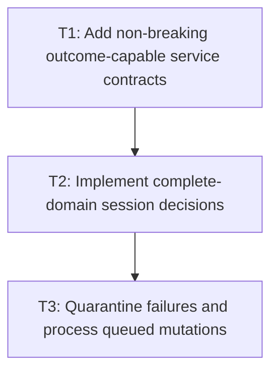

# P3: Orchestrate Force-Full or Whole-Domain Execution

## Goal

Implement opt-in session decisions that either skip a complete current domain or execute its full
service path, publish only successful/converged outcomes, quarantine failures, and preserve queued
mutations.

## Non-Goals

- Targeted subtree/formatting-context/incremental layout.
- Transactional rollback of node/style/layout mutations.

## Context

- Parent milestone: `docs/work/E5/M8 - Add opt-in whole-frame dirty orchestration.md`.
- Phase entry gate: M8/P2 epoch sources/adapters/manual invalidation are complete.
- `LayoutServiceImpl` currently caps scrollbar passes but does not expose an explicit convergence
  outcome; the force-full implementation must make success versus max-pass observable.
- `LayoutService` is a public `void` interface used by custom implementations; session capability
  must be additive through a subinterface/adapter, not a new abstract method.

## Phase Tasks

### T1: Add non-breaking outcome-capable service contracts
**Purpose:** Give orchestration reliable success/convergence/pass/failure information.

**Depends on:** None.
**Enables:** T2.
**Parallelizable with:** None.

**Changes:**
- [ ] Add an outcome-capable `LayoutService` subinterface or explicit adapter/session collaborator
  returning source snapshot, produced epochs, scrollbar pass count, converged/max-pass, and failure
  without adding a new abstract method to `LayoutService`.
- [ ] Keep existing `void`/legacy/custom methods force-full through current compatibility behavior;
  declare them ineligible for skip-aware sessions unless a truthful outcome adapter is supplied.
- [ ] Define equivalent truthful style success/failure adaptation where exceptions alone are
  insufficient for session outcome publication.
- [ ] Add deterministic scrollbar convergence, oscillation/max-pass, and service exception fakes/tests.

**Acceptance Checks:**
- [ ] Full layout distinguishes converged success from max-pass/unconverged and publishes no
  successful session output epoch/watermark on failure.
- [ ] Legacy/custom methods still run full calculations every call and retain documented exception
  behavior; session construction rejects an unadapted void-only layout service.

**Risks / Stop Criteria:** Stop if an adapter fabricates success/convergence, compatibility wrappers
discard required status, or `LayoutService` gains a source-breaking abstract method.

### T2: Implement complete-domain session decisions
**Purpose:** Skip only when source/output/watermark state proves the whole output current.

**Depends on:** T1.
**Enables:** T3.
**Parallelizable with:** None.

**Changes:**
- [ ] Compare current source epochs, successful output epochs, and session watermarks to choose full
  style, full layout, both, or complete-domain skip under the P1 dependency table.
- [ ] Execute the staged host contract: capture pre-style source state, resolve style targets, invoke
  the host transition/animation callback, collect its declared expected presentation-domain changes,
  capture post-tick source state, re-decide required geometry layout/geometry-dependent transform/
  render work for the same frame, then use the session-managed render path.
- [ ] Invoke existing full service implementations for required domains; do not pass a target node/
  subtree or introduce partial traversal APIs.
- [ ] Publish produced epochs and advance consumer watermarks only after all required work succeeds/
  converges against the relevant pre-style/post-tick snapshots. Expected declared tick changes do not
  supersede the attempt; unrelated in-tick mutations do.

**Acceptance Checks:**
- [ ] Unchanged frames can skip complete style/layout; any relevant source change executes the whole
  required domain and records explainable calls.
- [ ] Any source mutation during execution other than the declared expected transition outcome
  prevents publication against superseded inputs.
- [ ] Expected transition geometry/transform/paint changes select same-frame downstream work without
  endless retry/one-frame latency; an unrelated tick mutation aborts publication and stays queued.

**Risks / Stop Criteria:** Stop if decision code infers safety from absence of a known mutation rather
than exact epochs/manual invalidation contract.

### T3: Quarantine failures and process queued mutations
**Purpose:** Ensure failed/unconverged attempts produce no session-renderable output, cannot render
through session-managed paths, and do not lose ordinary in-flight mutations.

**Depends on:** T2.
**Enables:** None.
**Parallelizable with:** None.

**Changes:**
- [ ] Mark output unusable on style/layout exception, max-pass/unconverged, or superseded input;
  mark the shared frame/session state invalid, publish no success epochs/watermarks, and expose the
  required force-full retry.
- [ ] After failure, refuse rendering/output consumption through session-managed paths until a
  successful force-full retry; promise no rollback. Document direct legacy renderer calls on the
  shared frame as unsupported bypass the session cannot intercept.
- [ ] Queue unrelated epoch/invalidation mutations raised during non-reentrant execution and process
  them on a subsequent attempt/frame in deterministic order; do not queue the declared expected
  transition outcome that P1/P2 incorporate through the post-tick snapshot.
- [ ] Cover repeated failure/retry, mutation during style/layout, and close during/after processing as
  approved.

**Acceptance Checks:**
- [ ] Failed/unconverged output cannot render/consume through the session and watermarks remain pre-
  attempt; a successful force-full retry restores session-managed renderability.
- [ ] A direct renderer-bypass test/example is labeled unsupported host misuse and does not claim
  quarantine can prevent the call.
- [ ] Queued mutations remain dirty after current attempt and trigger the next full domain work.
- [ ] Expected transition changes are absent from the retry queue and complete their required
  downstream work in the same frame; unrelated tick mutations remain queued and supersede publication.

**Risks / Stop Criteria:** Stop if a session-managed path bypasses validity checks, documentation
claims control over direct renderer calls, or mutation queues can grow/reenter outside P1 policy.

## Verification Strategy

- Run `./gradlew :spinygui.core:test --tests 'com.spinyowl.spinygui.core.style.manager.StyleManagerImplTest'`.
- Run `./gradlew :spinygui.core:test --tests 'com.spinyowl.spinygui.core.layout.impl.OverflowLayoutTest' --tests 'com.spinyowl.spinygui.core.layout.impl.LayoutServiceProviderGridTest'`.
- Run `./gradlew :spinygui.core:test --tests 'com.spinyowl.spinygui.core.animation.TransitionCoordinatorPresentationTest'` for staged host ordering.
- Run `./gradlew :spinygui.core:test` for session fake-service/outcome tests.

## Review Boundaries

- Review explicit force-full outcomes, then session decisions, then failure/queue/retry behavior.

## Deferred Work

- Presentation-transform/scroll-specific ownership belongs to P4; full matrix/benchmark to P5.
- No targeted/incremental layout API is authorized.

## Dependency Graph

