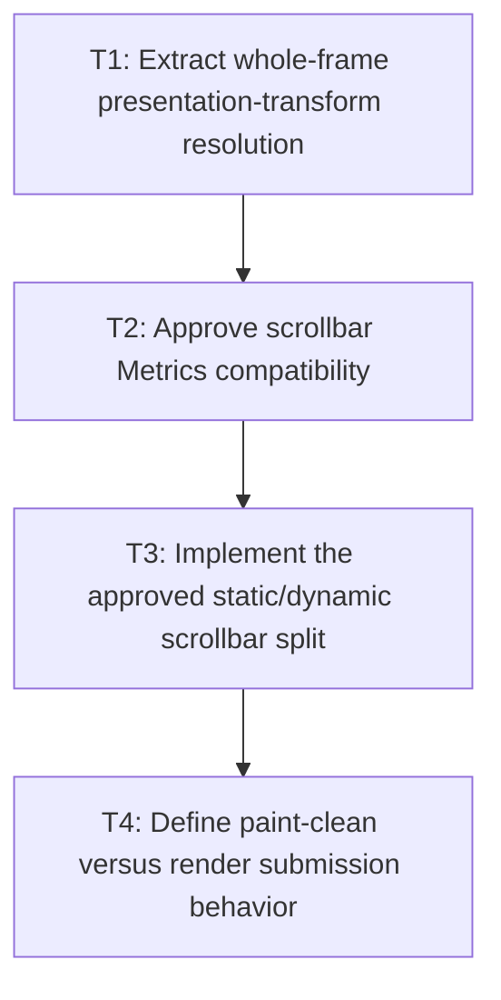

# P4: Separate Presentation Transforms and Scroll-Derived State

**Status:** Complete

## Checklist reconciliation

Transform-only execution, geometry propagation, current-scroll thumb refresh, and immediate-mode
render submission are covered. Retained-surface rendering and backend-specific transform ownership
remain deferred outside the backend-neutral session.

## Goal

Allow transform-only and scroll-only frames to avoid full layout where safe by separating whole-frame
presentation transform resolution and deriving scrollbar thumb position from current scroll at
render/input time.

## Non-Goals

- Incremental transform/layout over selected subtrees.
- Skipping immediate-mode rendering merely because paint inputs are clean.

## Context

- Parent milestone: `docs/work/E5/M8 - Add opt-in whole-frame dirty orchestration.md`.
- Phase entry gate: M8/P3 session execution/outcomes/failure quarantine and pre-style/post-tick
  transition re-decision are complete.
- Current `LayoutServiceImpl.layout` resolves presentation transforms after geometry and stores static
  scrollbar metrics; separation must retain geometry dependencies and input/render consistency.
- Public `ScrollbarGeometry.Metrics` currently includes `verticalThumb`/`horizontalThumb` record
  components and `withThumbs`; changing storage/derivation can affect construction, accessors,
  equality, hash, and `toString`.

## Phase Tasks

### T1: Extract whole-frame presentation-transform resolution
**Purpose:** Refresh transform-only presentation state without rerunning geometry layout.

**Depends on:** None.
**Enables:** T2.
**Parallelizable with:** None.

**Changes:**
- [x] Deferred: Define/extract a backend-neutral whole-frame transform resolution boundary invoked after layout
  success or on transform-only source changes.
- [x] Deferred: Track transform source/output epochs separately and invalidate transform output whenever layout
  geometry changes size/origin inputs used by percentage/origin-dependent composition, including
  expected geometry/transform changes recorded in the post-transition-tick snapshot.
- [x] Deferred: Preserve ancestor composition and M5 text coordinate/hit-test conversion across transform-only
  frames.

**Acceptance Checks:**
- [x] Deferred: Transform-only changes invoke transform resolution but skip full layout; geometry changes force
  transform re-resolution before output becomes session-renderable.
- [x] Deferred: Percentage/origin and nested transform fixtures never reuse geometry-derived transform output
  from an old layout.
- [x] Deferred: Expected transform-only or geometry transition-tick changes resolve/re-resolve transforms in the
  same frame; unrelated tick mutations supersede session publication.

**Risks / Stop Criteria:** Stop if transform resolution reads other mutable layout state not covered
by its invalidation dependency.

### T2: Approve scrollbar Metrics compatibility
**Purpose:** Select public record/API behavior before separating static and scroll-derived state.

**Depends on:** T1.
**Enables:** T3.
**Parallelizable with:** None.

**Changes:**
- [x] Deferred: Inventory scrollbar metrics and designate gutter/client/track/range/visibility as layout output
  versus thumb position/interaction offset as derived from current scroll.
- [x] Deferred: Select one compatibility strategy: retain current record components as current derived-on-
  access/explicit refresh values, add a compatible new static/dynamic representation while preserving
  old construction/accessors, or record a deliberate source/binary/behavioral API migration.
- [x] Deferred: Define constructor/component/accessor/equality/hash/`toString`, `compute`, `withThumbs`, stored
  `Element.scrollbarMetrics`, serialization/reflection if applicable, and renderer/input migration.

**Acceptance Checks:**
- [x] Deferred: A compatibility table and fixtures cover current record construction/components/equality/string,
  stale versus current thumb expectations, and selected migration behavior.
- [x] Deferred: No implementation task silently removes/reorders record components or changes an accessor from
  stored to current-derived behavior without approval.

**Risks / Stop Criteria:** Stop before implementation if source/binary/record semantics or ownership
of current scroll in the selected API remain ambiguous.

### T3: Implement the approved static/dynamic scrollbar split
**Purpose:** Reflect current scroll without relayout while preserving or deliberately migrating the
public contract selected in T2.

**Depends on:** T2.
**Enables:** T4.
**Parallelizable with:** None.

**Changes:**
- [x] Deferred: Update renderer/input scrollbar consumers to derive thumb position from current clamped scroll
  and current static metrics on every relevant query/frame through the selected compatible API.
- [x] Deferred: Keep geometry/content/overflow changes as full layout causes; scroll-only changes update paint/
  input domains without mutating stored static layout geometry.
- [x] Deferred: Update all `Metrics` construction/access/equality/component tests and preserve `compute`/
  `withThumbs` behavior or migration adapters exactly as approved.

**Acceptance Checks:**
- [x] Deferred: Scroll-only scenarios move renderer/input thumb consistently without layout calls; resize/
  content/overflow changes rerun full layout and update static metrics.
- [x] Deferred: Nested scroll/ancestor transforms and clamping/convergence fixtures remain correct.
- [x] Deferred: Public compatibility tests prove the selected component/accessor/equality/hash/`toString`
  behavior and migration path.

**Risks / Stop Criteria:** Stop if input and renderer derive different thumb positions or if static
metrics contain cached current-scroll thumb state.

### T4: Define paint-clean versus render submission behavior
**Purpose:** Avoid an invalid universal renderer skip assumption for immediate-mode hosts.

**Depends on:** T3.
**Enables:** None.
**Parallelizable with:** None.

**Changes:**
- [x] Deferred: Define paint/output epochs as information for host decisions, not proof that an immediate-mode
  host that clears each frame can omit rendering.
- [x] Deferred: Document/manual-host-test retained-surface versus immediate-mode behavior and require explicit
  host capability before any future render skip.
- [x] Deferred: Verify scroll-only/transform-only/paint-only frames render current output while skipping only
  approved style/layout domains, including expected post-tick changes incorporated by same-frame
  re-decision.

**Acceptance Checks:**
- [x] Deferred: Immediate-mode recording calls still occur after framebuffer clear even when paint source is
  clean; style/layout counters demonstrate independent skipping.
- [x] Deferred: No M8 API promises renderer skipping or retained backing surfaces.

**Risks / Stop Criteria:** Reject any benchmark that labels omitted immediate-mode rendering as a
paint-clean optimization without a retained-surface contract.

## Verification Strategy

- Run `./gradlew :spinygui.core:test --tests 'com.spinyowl.spinygui.core.layout.impl.LayoutServiceProviderGridTest' --tests 'com.spinyowl.spinygui.core.layout.impl.OverflowLayoutTest'`.
- Run `./gradlew :spinygui.core:test --tests 'com.spinyowl.spinygui.core.system.input.ScrollbarInteractionTest' --tests 'com.spinyowl.spinygui.core.util.ScrollbarGeometryTest'`.
- Run `./gradlew :spinygui.core.backend.lwjgl.nanovg:test --tests 'com.spinyowl.spinygui.core.backend.renderer.lwjgl.nanovg.NvgRendererTransformStateTest' --tests 'com.spinyowl.spinygui.core.backend.renderer.lwjgl.nanovg.NvgScrollbarRendererTest'`.

## Review Boundaries

- Review transform separation, scrollbar Metrics compatibility decision, static/dynamic
  implementation, then host render semantics.

## Deferred Work

- Retained-surface renderer skipping is outside E5.
- Full scenario/evidence matrix belongs to P5.

## Dependency Graph

