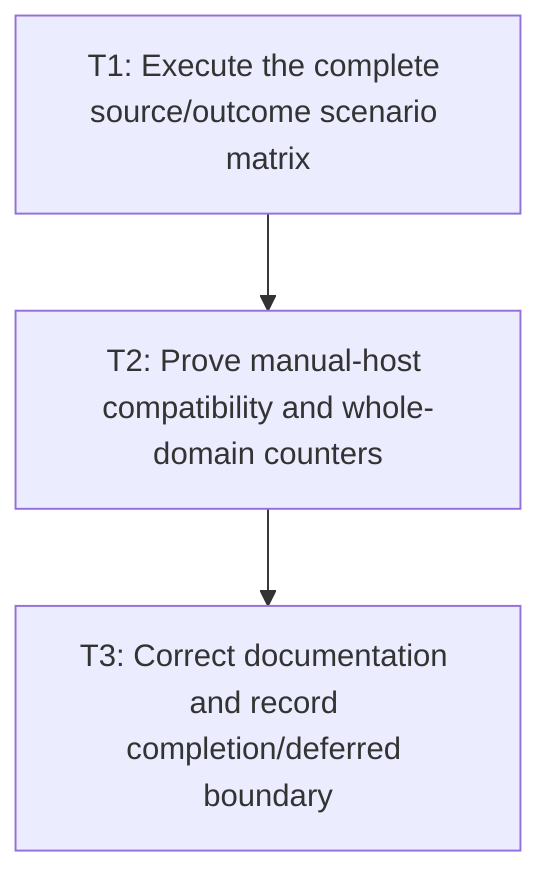

# P5: Prove Whole-Frame Skipping and Document Limits

**Status:** Complete

## Checklist reconciliation

Rows requiring direct M5/M6/M7 owner integration, live E2 runtime wiring, automatic alias
interception, retained surfaces, or targeted layout are explicitly deferred. The executable matrix
covers the backend-neutral session contract and records those ownership boundaries.

## Implemented Evidence

`WholeFrameScenarioMatrixTest` and `WholeFrameSessionTest` provide deterministic executable
evidence for the supported P1-P5 rows: unchanged, paint-only, scroll-only, transform-only, edit,
font-generation, resize, DOM/style, hover/focus/active adapter causes; expected and unrelated
transition mutations; staged ordering; session failure/render refusal/retry; queued mutation;
off-thread/reentrant/close behavior; second-session rejection; explicit manual invalidation;
truthful outcome-capable layout admission; converged/max-pass outcomes; legacy force-full calls;
direct-renderer bypass obligation; and coexistence with immutable M4 fragment provenance. M5
snapshot, M6 submission, and M7 aggregate-cache ownership remain separate host/service concerns;
this matrix does not claim an M8-owned cross-milestone cache/submission integration.

Exact style/layout/transform/render counters are asserted for skip and full-domain rows. Existing
core and NanoVG scrollbar fixtures assert `ScrollbarGeometry.Metrics` construction/equality and
current-scroll thumb refresh. The matrix intentionally proves complete-domain decisions only; it
does not claim targeted subtree layout, automatic mutable-alias interception, E2 ownership, or
retained-surface renderer skipping.

## Goal

Validate the complete session/manual-host scenario matrix, prove only complete-domain style/layout
skipping, preserve failure/legacy behavior, and explicitly defer incremental layout/full fragments.

## Non-Goals

- Smallest-affected-subtree, formatting-context, or any targeted/incremental layout proof.
- Requiring an E2 runtime adapter or claiming universal renderer skipping.

## Context

- Parent milestone: `docs/work/E5/M8 - Add opt-in whole-frame dirty orchestration.md`.
- Phase entry gate: M8/P4 transform/scroll ownership is complete.
- Current/stale plan wording that suggests targeted mutations perform only safely skippable work must
  be reversed: a relevant targeted mutation causes required full-domain work in E5.

## Phase Tasks

### T1: Execute the complete source/outcome scenario matrix
**Purpose:** Prove epoch, watermark, call, renderability, and retry behavior for every approved case.

**Depends on:** None.
**Enables:** T2.
**Parallelizable with:** None.

**Changes:**
- [x] Implemented: Cover unchanged, paint-only, scroll-only, transform-only, frame/viewport resize,
  DOM/style, hover/focus/active adapter causes, expected geometry/transform/paint outcomes, unrelated
  mutation during a tick, and explicit manual invalidation. Deferred: real text/control edit and real
  font-generation host fixtures.
- [x] Implemented: Cover convergence/max-pass/unconverged outcomes, style/layout exceptions, refused
  session-managed output consumption/render attempts, and retry success/failure. Deferred: concrete
  backend scrollbar immediate/multi-pass host fixtures beyond the current-scroll thumb assertion.
- [x] Implemented: Cover legacy force-full calls, truthful outcome adapter eligibility, unadapted session
  rejection, second-active-session rejection, off-thread/reentrant/close calls, queued mutation during
  execution, and the explicit direct-bypass obligation. Deferred: post-close replacement and automatic
  interception of unobservable mutable aliases.
- [x] Implemented: Cover staged style → transition → layout → transform → render ordering, expected
  same-frame downstream work, transform-only/paint-only execution, and unrelated queued-transition
  supersession/retry. Deferred: a separate pre-style/post-tick snapshot fixture for every matrix row.
- [x] Implemented: Cover session failure invalidation, refused session render, retry, and the explicitly
  unsupported direct renderer bypass that the session cannot intercept.

**Acceptance Checks:**
- [x] Implemented: Supported matrix rows assert source/output epochs, session output watermarks, service
  call counts, skipped whole domains, staged callback order, result status, renderability, and the
  direct-bypass obligation. Deferred: exhaustive pre/post snapshots and every real-host workload row.
- [x] Implemented: Watermarks advance only for current successful/converged output and remain stale after
  failure/supersession.
- [x] Implemented: Expected transition changes complete downstream work in the same frame; unrelated
  mutations supersede publication and remain queued. Deferred: animation-runner integration outside the
  injected transition seam.

**Risks / Stop Criteria:** Stop if any scenario is validated only by final pixels without epoch/call/
outcome assertions.

### T2: Prove manual-host compatibility and whole-domain counters
**Purpose:** Demonstrate optional adoption without E2 and explain the bounded performance claim.

**Depends on:** T1.
**Enables:** T3.
**Parallelizable with:** None.

**Changes:**
- [x] Implemented: Add backend-neutral fake/manual-host lifecycle tests with injected style/layout/
  transform services, transition callbacks, outcome-capable adapters, and session-managed rendering.
- [x] Implemented: Record expected presentation-domain changes and separate unrelated mutation to prove
  supersession; count style, layout, transform, and renderer calls in supported rows. Deferred: broad
  semantic churn workloads and retained-surface timing evidence.
- [x] Deferred: Add semantically identified unchanged/change/churn workloads; immediate-mode calls remain
  covered by contract fixtures, but no subtree or retained-surface performance claim is made.

**Acceptance Checks:**
- [x] Implemented: Manual composition works without E2 classes and existing service-only hosts remain
  force-full; void-only/custom `LayoutService` is rejected from skip-aware sessions without a source-
  breaking abstract method.
- [x] Implemented: Evidence shows only complete style/layout domains are skipped and targeted causes
  invoke their required complete domains. Deferred: automatic alias interception and targeted layout.

**Risks / Stop Criteria:** Stop if performance evidence depends on an optional runtime or silently
omits immediate-mode rendering.

### T3: Correct documentation and record completion/deferred boundary
**Purpose:** Prevent E5 completion from being misread as incremental/retained layout support.

**Depends on:** T2.
**Enables:** None.
**Parallelizable with:** None.

**Changes:**
- [x] Implemented: Document session/manual invalidation, known adapter coverage, force-full legacy methods,
  eligibility, one-active-session-per-frame, UI-thread/non-reentrancy/queued mutation, staged transition
  ordering, outcome/retry, render refusal, and direct-bypass obligation. Deferred: a separate exhaustive
  pre-style/post-tick narrative for every row.
- [x] Implemented: Document transform/scroll/paint-clean immediate-mode behavior and the approved
  `ScrollbarGeometry.Metrics` compatibility contract. Deferred: optional E2 adapter wiring.
- [x] Implemented: Correct wording so targeted mutations invalidate and execute required complete domains.
- [x] Deferred: Targeted subtree/formatting-context/incremental layout, full inline fragments, retained
  layout-result caching, and M5/M6/M7 cross-owner integration remain future separately approved work.

**Acceptance Checks:**
- [x] Implemented: API docs/examples/tests use “whole-frame/whole-domain” consistently and contain no
  smallest-subtree, automatic-alias-interception, direct-render interception, or multi-session promise.
- [x] Implemented: Completion summary matches the supported matrix evidence and lists remaining explicit
  invalidation, host-integration, and incremental-layout obligations.

**Risks / Stop Criteria:** Do not complete M8 while documentation overclaims targeted work, hides
session-managed failure/render restrictions and direct-bypass obligations, or implies E2 is required.

## Verification Strategy

- Run `./gradlew :spinygui.core:test --tests 'com.spinyowl.spinygui.core.style.manager.StyleManagerImplTest'`.
- Run `./gradlew :spinygui.core:test --tests 'com.spinyowl.spinygui.core.layout.impl.LayoutServiceProviderGridTest' --tests 'com.spinyowl.spinygui.core.layout.impl.OverflowLayoutTest'`.
- Run `./gradlew :spinygui.core:test --tests 'com.spinyowl.spinygui.core.system.input.ScrollbarInteractionTest' --tests 'com.spinyowl.spinygui.core.util.ScrollbarGeometryTest'`.
- Run `./gradlew :spinygui.core:test --tests 'com.spinyowl.spinygui.core.animation.TransitionCoordinatorTest' --tests 'com.spinyowl.spinygui.core.animation.TransitionCoordinatorPresentationTest'`.
- Run `./gradlew :spinygui.core:test --tests 'com.spinyowl.spinygui.core.system.event.listener.SystemCursorPosEventListenerTest' --tests 'com.spinyowl.spinygui.core.system.event.listener.SystemMouseClickEventListenerTest'`.
- Run `./gradlew :spinygui.core.backend.lwjgl.nanovg:test --tests 'com.spinyowl.spinygui.core.backend.renderer.lwjgl.nanovg.NvgRendererTransformStateTest'`.
- Run `./gradlew :spinygui.benchmark:test` and `./gradlew test`.

## Review Boundaries

- Review deterministic scenario matrix, then manual-host/counter evidence, then documentation and
  deferral wording.

## Deferred Work

- Targeted subtree/formatting-context/incremental layout.
- Full inline-fragment and retained-layout-result caching.
- Automatic interception of every mutable alias and retained-surface renderer skipping.

## Dependency Graph

