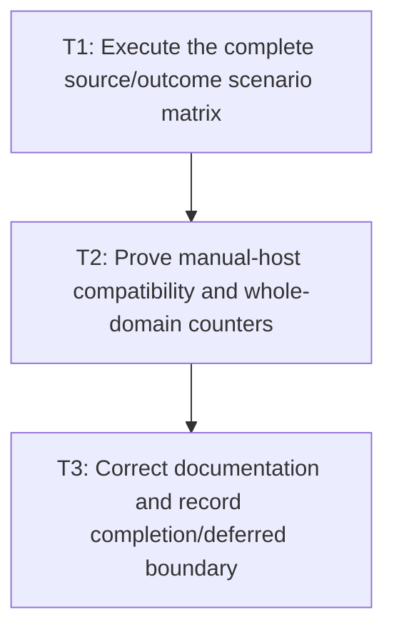

# P5: Prove Whole-Frame Skipping and Document Limits

## Goal

Validate the complete session/manual-host scenario matrix, prove only complete-domain style/layout
skipping, preserve failure/legacy behavior, and explicitly defer incremental layout/full fragments.

## Non-Goals

- Smallest-affected-subtree, formatting-context, or any targeted/incremental layout proof.
- Requiring an E2 runtime adapter or claiming universal renderer skipping.

## Context

- Parent milestone: `docs/work/E5/M8 - Add opt-in whole-frame dirty orchestration.md`.
- Phase entry gate: M8/P4 transform/scroll ownership is complete.
- Current/stale plan wording that suggests targeted mutations perform only safely skippable work must
  be reversed: a relevant targeted mutation causes required full-domain work in E5.

## Phase Tasks

### T1: Execute the complete source/outcome scenario matrix
**Purpose:** Prove epoch, watermark, call, renderability, and retry behavior for every approved case.

**Depends on:** None.
**Enables:** T2.
**Parallelizable with:** None.

**Changes:**
- [ ] Cover unchanged, paint-only, scroll-only, transform-only, text/control edit, real font
  generation, frame/viewport resize, DOM/attribute/style/stylesheet, hover/focus/active pseudo-state,
  expected transition/animation geometry/transform/paint outcomes, unrelated mutation during a tick,
  and explicit manual invalidation.
- [ ] Cover scrollbar immediate convergence, multi-pass convergence, max-pass/unconverged, style/
  layout exceptions, refused session-managed output consumption/render attempts, and force-full retry
  success/failure.
- [ ] Cover direct legacy/custom force-full calls, truthful outcome adapter eligibility, unadapted
  session rejection, second-active-session rejection/post-close replacement, off-thread/reentrant
  calls, mutation queued during style/layout, and direct unobservable mutation with/without explicit
  invalidation as documented caller responsibility.
- [ ] Cover pre-style snapshot → style resolution → host transition tick/outcome → post-tick snapshot
  → same-frame downstream re-decision → required layout/geometry-dependent transform derivation →
  session-managed render ordering for expected geometry, transform-only, paint-only, failed, and
  unrelated queued-transition cases.
- [ ] Cover session failure invalidation/refused session render/force-full retry and an explicitly
  unsupported direct renderer bypass that the session cannot intercept.

**Acceptance Checks:**
- [ ] Each row asserts source epochs, produced/output epochs, per-session watermarks, full service call
  counts, pre-style/post-tick snapshots, expected transition change set, skipped whole domains, staged
  callback order, unrelated queued state, result status, session-managed renderability, and direct-
  bypass obligation.
- [ ] Watermarks advance only for current successful/converged output and never after failure/
  supersession.
- [ ] Expected transition changes complete downstream work in the same frame without retry loops or
  one-frame latency; unrelated mutations during the tick supersede publication and remain queued.

**Risks / Stop Criteria:** Stop if any scenario is validated only by final pixels without epoch/call/
outcome assertions.

### T2: Prove manual-host compatibility and whole-domain counters
**Purpose:** Demonstrate optional adoption without E2 and explain the bounded performance claim.

**Depends on:** T1.
**Enables:** T3.
**Parallelizable with:** None.

**Changes:**
- [ ] Add backend-neutral fake/manual-host lifecycle examples/tests using injected style/layout/
  transform services, a host transition callback, outcome-capable adapters, and a session-managed
  renderer/output consumer.
- [ ] Make the fake transition callback return/record expected presentation-domain changes and expose
  a separate unrelated-mutation channel to prove the supersession distinction.
- [ ] Count complete style recalculations, complete layout/convergence passes, transform passes, and
  renderer submissions separately across scenario rows.
- [ ] Add semantically identified unchanged/change/churn workloads; keep immediate-mode renderer calls
  when the host clears each frame and avoid subtree counters as a success metric.

**Acceptance Checks:**
- [ ] Manual composition works without E2 classes and existing service-only hosts remain force-full.
- [ ] Void-only/custom `LayoutService` remains force-full usable but is rejected from skip-aware
  sessions until truthfully adapted; no source-breaking abstract method is required.
- [ ] Evidence shows only complete style/layout domains are skipped; targeted mutations invoke the
  required complete domain.

**Risks / Stop Criteria:** Stop if performance evidence depends on an optional runtime or silently
omits immediate-mode rendering.

### T3: Correct documentation and record completion/deferred boundary
**Purpose:** Prevent E5 completion from being misread as incremental/retained layout support.

**Depends on:** T2.
**Enables:** None.
**Parallelizable with:** None.

**Changes:**
- [ ] Document session/manual invalidation, known adapter coverage, force-full legacy methods,
  eligibility, one-active-session-per-frame, UI-thread/non-reentrancy/queued mutation, staged
  transition exception/order/pre-style/post-tick re-decision, outcome/retry/no-rollback, session-
  render refusal, and direct bypass obligation.
- [ ] Document transform/scroll/scrollbar/paint-clean immediate-mode behavior and optional E2 adapter
  posture, including the approved `ScrollbarGeometry.Metrics` compatibility/migration contract.
- [ ] Remove/correct reversed wording that targeted mutations “perform safely skippable work”; state
  they invalidate/execute required complete domains in E5.
- [ ] Explicitly defer targeted subtree/formatting-context/incremental layout, full inline fragments,
  and retained layout-result caching to a future separately approved plan.

**Acceptance Checks:**
- [ ] API docs/examples/tests use “whole-frame/whole-domain” consistently and contain no smallest-
  subtree, automatic-alias-interception, direct-render interception, or multi-session promise.
- [ ] Completion summary matches T1/T2 evidence and lists remaining explicit invalidation obligations.

**Risks / Stop Criteria:** Do not complete M8 while documentation overclaims targeted work, hides
session-managed failure/render restrictions and direct-bypass obligations, or implies E2 is required.

## Verification Strategy

- Run `./gradlew :spinygui.core:test --tests 'com.spinyowl.spinygui.core.style.manager.StyleManagerImplTest'`.
- Run `./gradlew :spinygui.core:test --tests 'com.spinyowl.spinygui.core.layout.impl.LayoutServiceProviderGridTest' --tests 'com.spinyowl.spinygui.core.layout.impl.OverflowLayoutTest'`.
- Run `./gradlew :spinygui.core:test --tests 'com.spinyowl.spinygui.core.system.input.ScrollbarInteractionTest' --tests 'com.spinyowl.spinygui.core.util.ScrollbarGeometryTest'`.
- Run `./gradlew :spinygui.core:test --tests 'com.spinyowl.spinygui.core.animation.TransitionCoordinatorTest' --tests 'com.spinyowl.spinygui.core.animation.TransitionCoordinatorPresentationTest'`.
- Run `./gradlew :spinygui.core:test --tests 'com.spinyowl.spinygui.core.system.event.listener.SystemCursorPosEventListenerTest' --tests 'com.spinyowl.spinygui.core.system.event.listener.SystemMouseClickEventListenerTest'`.
- Run `./gradlew :spinygui.core.backend.lwjgl.nanovg:test --tests 'com.spinyowl.spinygui.core.backend.renderer.lwjgl.nanovg.NvgRendererTransformStateTest'`.
- Run `./gradlew :spinygui.benchmark:test` and `./gradlew test`.

## Review Boundaries

- Review deterministic scenario matrix, then manual-host/counter evidence, then documentation and
  deferral wording.

## Deferred Work

- Targeted subtree/formatting-context/incremental layout.
- Full inline-fragment and retained-layout-result caching.
- Automatic interception of every mutable alias and retained-surface renderer skipping.

## Dependency Graph

