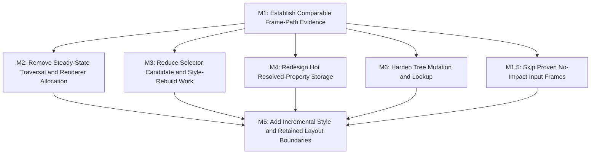

# E6: Frame Pipeline Performance

**Status:** In progress

## Goal

Reduce the CPU time and transient allocation of the non-text frame pipeline without changing the
DOM/CSS/layout/rendering ownership model. The result is allocation-free steady-state traversal where
practical, cheaper selector and property resolution, correct structural mutation, and a separately
validated path toward incremental style and layout work.

## External Prerequisite

- E5 must be accepted and committed before E6 begins. E5 owns text normalization/preparation,
  NanoVG text submission and text caches, plus opt-in whole-frame style/layout skipping. E6 must not
  duplicate or redesign those contracts.

## Relationship to Performance Findings

| Finding | E5 disposition | E6 disposition |
|---|---|---|
| Input with no presentation effect still triggers host refresh | E5 owns whole-frame dirty-session contracts | M1.5 |
| F1 child views and traversal | Not covered | M2 |
| F2 geometry allocation | Not covered outside control coordinates | M2 |
| F3 presentation transform composition | E5/M8 owns whole-frame transform decisions | M2 owns allocation-free renderer composition; M5 may retain validated transform results |
| F4 NanoVG state scopes | Not covered | M2 |
| F5 class matching | Not covered | M3 |
| F6 whitespace normalization | E5/M4 | Excluded |
| F7 full style recalculation | E5/M8 skips only whole domains | M3 and M5 |
| F8 `ResolvedStyle` storage | Not covered | M4 |
| F9 fragment cloning and UTF-8 submission | E5/M4 and M6 | Excluded |
| F10 dirty layout temporary trees | E5/M8 skips only whole domains | M5 |
| F11 ID lookup | Not covered | M6 |
| F12 child mutation | Not covered | M6 |
| F13 XML parsing | Not a measured stable-path priority | Excluded |

## Non-Goals

- Replacing E5 text preparation, text caches, UTF-8 staging, or whole-frame dirty-session contracts.
- Compiled templates, node cloning, or parser optimization without new evidence of expansion cost.
- Broad paint caching or retained display lists.
- Changing public CSS behavior, selector specificity, source order, or duplicate-ID behavior without
  an explicit compatibility decision.
- Frame limiting or VSync policy, which belongs to the hosting application or engine.

## Architecture Constraints

- Core remains backend-neutral; NanoVG-specific state and native calls stay in the NanoVG backend.
- The renderer traverses layout children, not raw DOM children.
- Legacy `StyleManager.recalculate` and `LayoutService.layout` remain force-full unless the E5 session
  contract explicitly manages the frame.
- Caches and retained geometry require UI-thread ownership, clear invalidation causes, bounded
  retention where applicable, and equivalence tests for rendering and hit testing.

## Milestones

### M1: Establish Comparable Frame-Path Evidence

**Status:** Complete

**Document:** [M1 - Establish comparable frame-path evidence](E6/M1%20-%20Establish%20comparable%20frame-path%20evidence.md)

**Purpose:** Turn the JFR findings into repeatable allocation and execution evidence for collapsed,
expanded, pointer-active, scroll, and resize states before changing hot paths.

**Depends on:** Accepted and committed E5 (external).
**Enables:** M1.5, M2, M3, M4, M6.
**Parallelizable with:** None.

**Architectural Proposition:** Use E5's comparability rules and structural counters, supplemented by
matched capped and uncapped recordings. Allocation per frame and per second are both required so a
host frame cap cannot conceal per-frame work.

**Key Work:**
- Define representative non-text scene fixtures and interaction scripts.
- Record baseline evidence for traversal, geometry, transforms, selectors, resolved properties,
  layout passes, lookup, and structural mutation separately from E5 text metrics.
- Establish correctness fixtures for nested transforms/scrolling, selector ordering, layout
  convergence, and tree invariants before optimization.

**Validation:** A reviewer can reproduce a comparable baseline and identify which later milestone
owns each measured category.

### M1.5: Skip Proven No-Impact Input Frames

**Status:** Complete

**Document:** [M1.5 - Skip proven no-impact input frames](E6/M1.5%20-%20Skip%20proven%20no-impact%20input%20frames.md)

**Purpose:** Give hosts a conservative, backend-neutral result that distinguishes input processing
which provably left presentation unchanged from input that requires full style/layout refresh.

**Depends on:** M1.
**Enables:** M5 and host integrations that currently refresh on raw input presence.
**Parallelizable with:** M2, M3, M4, M6 after M1.

**Architectural Proposition:** Input processing returns only `UNCHANGED` when the framework can prove
that no hover, focus, pressed, scroll, edit, listener, shortcut, or structural/style state changed.
Actual effects and unknowns collapse to `FULL_REFRESH_REQUIRED`; finer paint/style/layout outcomes are
deferred until incremental invalidation owns those distinctions.

**Key Work:**
- Define the binary impact contract, conservative fallback, legacy compatibility, and counters.
- Prove same-hit-path pointer motion is unchanged only when no capture/drag/selection/listener or
  interaction state can be affected.
- Prove key/character input is unchanged only when no focused editor, shortcut, listener, or UI state
  consumes it.
- Validate host integration against force-full behavior and matched capped/uncapped evidence.

**Validation:** No-impact pointer and keyboard scenarios stop requesting full refresh, while every
actual or unproven UI effect retains force-full-equivalent presentation.

### M2: Remove Steady-State Traversal and Renderer Allocation

**Status:** Planned

**Document:** [M2 - Remove steady-state traversal and renderer allocation](E6/M2%20-%20Remove%20steady-state%20traversal%20and%20renderer%20allocation.md)

**Purpose:** Eliminate narrow, high-frequency allocation in child access, geometry reads, transform
composition, clipping, and NanoVG state management while preserving immediate-mode paint semantics.

**Depends on:** M1.
**Enables:** M5.
**Parallelizable with:** M3, M4, M6.

**Architectural Proposition:** Public collections remain read-only views; internal traversal and the
renderer consume stable views or primitive values. NanoVG save/restore is balanced with direct
`try/finally` control flow, and transform composition uses primitive coefficients or a confined
accumulator rather than per-element immutable intermediates.

**Key Work:**
- Retain read-only views for node, fragment, and rule collections and add allocation-free internal
  element traversal without exposing mutable backing lists.
- Add primitive box and position accessors for layout, hit testing, and rendering paths.
- Remove per-element NanoVG state-scope allocation and temporary clip geometry.
- Prove nested transform, scroll, clipping, exception, and hit-test equivalence before retaining any
  absolute coordinates or composed transforms.

**Open Questions:**
- Which public vector-returning APIs must remain allocation-compatible, and which internal callers can
  migrate to primitives without widening public API?

**Validation:** Repeated steady-state render traversal has no wrapper/stream/state-scope allocation;
visual and coordinate fixtures remain equivalent.

### M3: Reduce Selector Candidate and Style-Rebuild Work

**Status:** Planned

**Document:** [M3 - Reduce selector candidate and style-rebuild work](E6/M3%20-%20Reduce%20selector%20candidate%20and%20style-rebuild%20work.md)

**Purpose:** Remove repeated regex/tokenization and all-rule matching while preserving CSS matching,
specificity, source order, inheritance, and pseudo-state behavior.

**Depends on:** M1.
**Enables:** M5.
**Parallelizable with:** M2, M4, M6.

**Architectural Proposition:** Class tokens are parsed when the class attribute changes. Stylesheet
candidate indexes are conservative filters by ID, class, tag, pseudo-state, and universal fallback;
the existing selector matcher remains the authority for final matching and ordering.

**Key Work:**
- Replace regex-based class membership with cached, mutation-aware tokens.
- Define stylesheet-owned candidate indexes that cannot omit combinator or fallback selectors.
- Avoid temporary rule/filter/sort collections where a stable reusable buffer has clear ownership.
- Separate static selector-match invalidation from interaction pseudo-state changes only after
  correctness evidence proves the dependency boundary.

**Open Questions:**
- Whether candidate indexes belong to each stylesheet or to one frame-owned aggregate index.

**Validation:** Selector conformance tests cover whitespace, duplicate classes, attribute mutation,
combinators, pseudo-states, specificity, and source ordering; recordings show regex and unrelated-rule
work materially reduced.

### M4: Redesign Hot Resolved-Property Storage

**Status:** Planned

**Document:** [M4 - Redesign hot resolved-property storage](E6/M4%20-%20Redesign%20hot%20resolved-property%20storage.md)

**Purpose:** Reduce string comparison, tree traversal, and allocation in resolved-style reads and
rebuilds without breaking typed accessors or observable ordering assumptions.

**Depends on:** M1.
**Enables:** M5.
**Parallelizable with:** M2, M3, M6.

**Architectural Proposition:** First establish whether deterministic sorted iteration is observable.
If it is not, adopt a faster map as a contained migration; otherwise, introduce private indexed slots
for built-in hot properties while leaving extension/custom properties in a separate compatible store.

**Key Work:**
- Audit dependencies on `ResolvedStyle.styles()` ordering and mutability.
- Compare a map substitution with indexed built-in property slots using matched evidence.
- Avoid rebuilding/copying unchanged properties and listener snapshots when no listener consumes them.

**Validation:** Typed getters, property defaults, declaration application, and listener behavior remain
compatible; benchmarks demonstrate reduced `TreeMap`/`String.compareTo` pressure or reject the change
with evidence.

### M5: Add Incremental Style and Retained Layout Boundaries

**Status:** Planned

**Document:** [M5 - Add incremental style and retained layout boundaries](E6/M5%20-%20Add%20incremental%20style%20and%20retained%20layout%20boundaries.md)

**Purpose:** Progress from E5's proven whole-domain skipping to correctly scoped style and layout work
for changed elements, descendants, and affected ancestors.

**Depends on:** M1.5, M2, M3, M4, M6.
**Enables:** None.
**Parallelizable with:** None.

**Architectural Proposition:** Explicit dirty reasons and dependency propagation identify affected
style/layout roots. Retained layout structures and reusable buffers are updated only after structural
or positioning changes; scrollbar convergence remains bounded and reports failure honestly.

**Key Work:**
- Define invalidation dependencies for DOM/style/class changes, pseudo-state, font generation,
  resize, scroll, transforms, hidden subtrees, and scrollbar geometry.
- Recalculate style for dirty elements plus selector-dependent descendants, retaining full evaluation
as the fallback when completeness is not provable.
- Retain layout-tree membership and recompute only changed subtrees/affected ancestors and scroll
containers.
- Reuse thread-confined layout contexts and temporary buffers only after ownership is explicit.

**Validation:** A scenario matrix proves geometry, overflow, nested scrollbars, transforms, hidden
subtrees, hover/focus/pressed state, resize, and failure/convergence equivalence against force-full
execution.

### M6: Harden Tree Mutation and Lookup

**Status:** Planned

**Document:** [M6 - Harden tree mutation and lookup](E6/M6%20-%20Harden%20tree%20mutation%20and%20lookup.md)

**Purpose:** Make DOM-like structural mutation correct and cheap enough to support dynamic component
composition, then add predictable ID lookup on that foundation.

**Depends on:** M1.
**Enables:** M5.
**Parallelizable with:** M2, M3, M4.

**Architectural Proposition:** One tree owner performs attach, detach, and move bookkeeping atomically.
The initial lookup improvement is an allocation-free early-return DFS; a frame ID index follows only
once attachment, detachment, and ID mutation have reliable ownership and duplicate-ID semantics are
specified.

**Key Work:**
- Repair parent, first/last child, and previous/next sibling invariants and remove re-entrant removal.
- Add identity-preserving move operations only after detach/attach semantics are proven.
- Replace list-producing ID search with early-return traversal, then decide and implement a frame-owned
  index with explicit duplicate-ID behavior.

**Validation:** Mutation-sequence tests cover attach, detach, reattach, move, focus/listener
retention, sibling endpoints, and lookup behavior; indexing never returns a detached or stale element.

## Cross-Cutting Risks

- Selector indexes can silently omit rules or change cascade ordering; use them only as conservative
  candidate filters and retain conformance fixtures.
- Cached transforms and coordinates can become stale after ancestor scroll, percentage origins, or
  presentation changes; introduce them only behind explicit invalidation tests.
- Incremental layout may leave stale geometry; force-full fallback and convergence reporting remain
  mandatory.
- Input-impact classification can miss arbitrary listener or interaction state effects; only proven
  unchanged processing may skip refresh, and unknowns must remain full-refresh-required.
- Property-store changes can break consumers of `styles()` map order or mutability; audit before
  migration.
- Tree changes affect parser output, events, focus, and layout-child ownership; structural invariants
  precede indexing and move APIs.

## Verification / Review Strategy

- Run core and NanoVG backend tests after each narrow milestone; run the full Gradle build before
  integration.
- Compare optimized and force-full/reference behavior using deterministic fixtures and E5-compatible
  recordings.
- Review M1.5, M2, M3, M4, and M6 separately. M5 begins only after their contracts and regression
  suites are accepted.

## Dependency Graph

