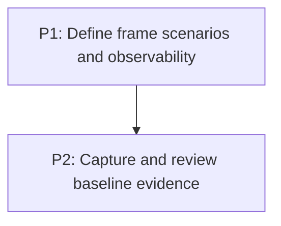

# M1: Establish Comparable Frame-Path Evidence

Parent plan: `docs/work/E6 - Frame pipeline performance.md`

## Goal

Produce repeatable, E5-compatible evidence for non-text frame-path allocation, execution, and
correctness before hot-path changes begin.

## Phases

### P1: Define frame scenarios and observability
**Document:** [P1 - Define frame scenarios and observability](M1/P1%20-%20Define%20frame%20scenarios%20and%20observability.md)
**Depends on:** Accepted E5 (external). **Enables:** P2. **Parallelizable with:** None.
**Purpose:** Freeze comparable scene identities, interaction scripts, counters, and equivalence fixtures.

### P2: Capture and review baseline evidence
**Document:** [P2 - Capture and review baseline evidence](M1/P2%20-%20Capture%20and%20review%20baseline%20evidence.md)
**Depends on:** P1. **Enables:** M1.5, M2, M3, M4, M6. **Parallelizable with:** None.
**Purpose:** Capture capped/uncapped recordings and assign each material cost to one E6 owner.

## Milestone Validation
- Comparable recordings report allocation/frame, allocation/s, CPU, GC, and hot sites for every scenario.
- Baseline fixtures cover nested transforms/scrolling, selector cascade, layout convergence, and tree invariants.

## Dependency Graph

